# Rapport PFE final complet detaille - Devora AI Code Review

> Ce fichier est une version riche et structuree du rapport final. Il conserve l'ordre demande :
>
> 1. Chapitre 1 : Contexte general et etude prealable
> 2. Chapitre 2 : Lancement et conception du projet
> 3. Release 1 : Application web et mobile
> 4. Release 2 : Intelligence artificielle, RAG, GraphRAG et analyse intelligente du code
> 5. Release 3 : Deploiement VPS, HTTPS, monitoring et CI/CD
>
> Le contenu est organise dans l'esprit des chapitres LaTeX fournis : paragraphes rediges, tableaux, figures, workflows, captures, schemas, blocs de commandes et validations. Les chemins d'images correspondent aux chemins cites dans les extraits LaTeX lorsque disponibles. Les figures non encore disponibles peuvent etre creees avec les noms proposes.

---

# Pages preliminaires

## Remerciements

Je tiens a remercier toutes les personnes qui ont contribue a la realisation de ce projet de fin d'etudes. Mes remerciements s'adressent en premier lieu a mon encadrant academique pour ses orientations, ses remarques et son suivi tout au long du projet. Je remercie egalement mon encadrant professionnel ainsi que l'equipe de l'organisme d'accueil pour leur disponibilite, leurs conseils techniques et l'environnement favorable mis a ma disposition.

Je remercie enfin ma famille et mes proches pour leur soutien moral, leur patience et leurs encouragements durant toute la periode de conception, de developpement, de tests et de redaction.

## Resume

Ce projet de fin d'etudes porte sur la conception, la realisation et le deploiement d'une plateforme intelligente de revue de code appelee Devora AI Code Review. La solution vise a assister les developpeurs, les Tech Leads et les administrateurs dans le processus de revue de code, depuis l'import d'un repository jusqu'a l'analyse intelligente d'une pull request.

La plateforme repose sur une application web et mobile, un backend FastAPI, un dashboard Next.js, une orchestration Celery/Redis, une base PostgreSQL, un graphe Neo4j, des mecanismes d'analyse statique, une base de connaissances et un moteur GraphRAG. La partie IA combine chunking, embeddings, retrieval hybride, graph traversal, prompt engineering et generation LLM afin de produire des findings contextualises, traçables et exploitables.

Le projet est organise en trois releases : la premiere construit l'application web et mobile, la deuxieme porte sur l'intelligence artificielle et GraphRAG, et la troisieme realise le deploiement complet sur VPS avec Docker, Nginx, Certbot, Prometheus, Grafana et GitHub Actions.

## Abstract

This final-year project presents the design, implementation and deployment of Devora AI Code Review, an intelligent code review platform. The system assists developers, Tech Leads and administrators throughout the review process, from repository onboarding to intelligent pull request analysis.

The platform includes a web and mobile application, a FastAPI backend, a Next.js dashboard, Celery/Redis orchestration, PostgreSQL, Neo4j, static analysis, a knowledge base and a GraphRAG engine. The AI layer combines chunking, embeddings, hybrid retrieval, graph traversal, prompt engineering and LLM generation to produce contextual, traceable and actionable findings.

The project is structured into three releases: the first delivers the web and mobile application, the second implements AI and GraphRAG analysis, and the third covers VPS deployment with Docker, Nginx, Certbot, Prometheus, Grafana and GitHub Actions.

## Liste des abreviations

| Abreviation | Signification |
|---|---|
| AI | Artificial Intelligence |
| API | Application Programming Interface |
| AST | Abstract Syntax Tree |
| CI/CD | Continuous Integration / Continuous Deployment |
| KB | Knowledge Base |
| LLM | Large Language Model |
| PR | Pull Request |
| RAG | Retrieval-Augmented Generation |
| GraphRAG | Graph Retrieval-Augmented Generation |
| RBAC | Role-Based Access Control |
| VPS | Virtual Private Server |
| UML | Unified Modeling Language |
| TLS | Transport Layer Security |
| DNS | Domain Name System |

---

# Introduction generale

Le developpement logiciel moderne repose sur des cycles de livraison rapides, une collaboration continue et une exigence elevee en matiere de qualite, de securite et de maintenabilite. Dans ce contexte, la revue de code est une etape essentielle : elle permet de verifier la qualite des changements, de detecter les erreurs, d'assurer la coherence architecturale et de diffuser les bonnes pratiques au sein de l'equipe.

Cependant, la revue de code manuelle presente des limites importantes. Elle depend fortement de la disponibilite du Tech Lead, de son niveau de charge et de sa connaissance implicite du projet. Les outils d'analyse statique automatisent certaines verifications, mais restent insuffisants pour comprendre le contexte global d'une modification, ses dependances ou sa conformite avec les regles internes de l'organisation.

Devora AI Code Review propose une reponse a ces limites. La plateforme combine une application web et mobile, une integration GitHub, un pipeline d'analyse statique, une base de connaissances, un moteur GraphRAG et des modeles de langage. L'objectif n'est pas de remplacer le Tech Lead, mais de l'assister en produisant des retours automatiques, contextualises, traçables et exploitables.

Le rapport suit une progression logique. Le premier chapitre presente le contexte general et l'etude prealable. Le deuxieme chapitre detaille le lancement et la conception du projet. La Release 1 presente l'application web et mobile. La Release 2 regroupe toute la partie intelligence artificielle, RAG, GraphRAG, Neo4j, LLM et analyse intelligente du code. La Release 3 presente la mise en production sur VPS avec containerisation, HTTPS, monitoring et CI/CD.

---

# Chapitre 1 - Contexte general et etude prealable

## Sommaire du chapitre

| Section | Titre |
|---|---|
| 1.1 | Introduction |
| 1.2 | Organisme d'accueil |
| 1.3 | Etude et critique de l'existant |
| 1.4 | Solution proposee |
| 1.5 | Choix methodologique |
| 1.6 | Scrum et organisation du travail |
| 1.7 | Product Backlog et planification |
| 1.8 | Conclusion |

## 1.1 Introduction

Ce chapitre constitue l'etude prealable du projet. Il introduit le contexte de la revue de code dans les environnements de developpement actuels et met en evidence les limites des pratiques existantes. Il presente ensuite la solution proposee, la methodologie adoptee et la planification globale du travail.

L'objectif est de clarifier les enjeux du projet Devora : automatiser une partie du processus de revue de code, reduire la charge du Tech Lead, ameliorer la coherence des retours et apporter une analyse contextuelle plus riche que celle fournie par les outils classiques.

## 1.2 Organisme d'accueil

Avant d'aborder l'etude de l'existant, il est necessaire de presenter l'organisme d'accueil dans lequel le projet a ete realise. Cette presentation permet de situer le cadre professionnel, les domaines d'intervention et les besoins metier auxquels la solution repond.

**DnD Serv**, Digital & Data Services, est une societe situee a Bizerte en Tunisie. Elle accompagne ses clients dans leur transformation numerique a travers plusieurs activites : brand design, marketing numerique, gestion de communaute, developpement de sites web et developpement logiciel.


**Figure 1.1 - Logo de la societe DnD Serv.**

Dans ce contexte, la qualite logicielle, la rapidite de livraison et la fiabilite du code sont des enjeux importants. La plateforme Devora s'inscrit dans cette logique en proposant un outil d'assistance a la revue de code pour les equipes techniques.

## 1.3 Etude et critique de l'existant

### 1.3.1 Description de l'existant

Dans la majorite des organisations, la revue de code repose principalement sur le Tech Lead. Celui-ci examine les pull requests avant leur integration dans la branche principale. Le developpeur soumet son code, le reviewer examine les changements, formule des remarques, puis le developpeur effectue les corrections necessaires avant validation.


**Figure 1.2 - Processus de revue de code traditionnelle.**

Le processus classique peut etre resume comme suit :

| Etape | Description |
|---|---|
| Soumission de PR | Le developpeur soumet ses changements via une pull request. |
| Revue manuelle | Le Tech Lead examine les fichiers modifies, la coherence et les conventions. |
| Corrections | Le developpeur applique les remarques et met a jour la PR. |
| Validation | Le Tech Lead approuve et la PR est fusionnee. |

### 1.3.2 Critique de l'existant

L'analyse du fonctionnement actuel met en evidence plusieurs limites importantes.

| Probleme | Description | Impact |
|---|---|---|
| Goulot d'etranglement humain | Le Tech Lead devient le point de passage obligatoire. | Ralentissement du cycle de livraison. |
| Variabilite des retours | La qualite depend de la disponibilite et de la charge du reviewer. | Incoherence entre les revues. |
| Connaissances implicites | Les regles internes restent dans l'experience du Tech Lead. | Difficulte a automatiser les standards. |
| Absence de contexte | Les outils statiques ne comprennent pas l'architecture globale. | Findings parfois locaux et incomplets. |
| Absence de memoire | Les decisions passees sont difficiles a reutiliser. | Perte de capitalisation technique. |

### 1.3.3 Comparaison des approches existantes

| Critere | Revue par le Tech Lead | Analyse statique |
|---|---:|---:|
| Comprehension du contexte architectural | Oui | Non |
| Verification des regles internes implicites | Oui | Non |
| Disponibilite a fort volume de PR | Limitee | Oui |
| Objectivite et homogeneite | Variable | Oui |
| Retours qualitatifs et actionnables | Oui | Limite |
| Integration CI/CD | Manuelle | Oui |
| Lecture de documentation interne | Non outillee | Non |

Cette comparaison montre que les deux approches sont utiles mais incompletes. La revue humaine comprend le contexte mais ne passe pas facilement a l'echelle. L'analyse statique passe a l'echelle mais reste limitee dans sa comprehension.

## 1.4 Solution proposee

Pour repondre a ces limites, nous proposons la plateforme **Devora AI Code Review**. Elle s'integre au workflow des developpeurs et se declenche autour des pull requests ou d'analyses initiees depuis l'interface.

La solution repose sur plusieurs niveaux :

| Niveau | Role |
|---|---|
| Integration GitHub | Recuperer les repositories, branches, commits et pull requests. |
| Analyse statique | Detecter les erreurs formelles, problemes de qualite et secrets. |
| Base de connaissances | Stocker les regles internes, documents, anciens codes et standards. |
| GraphRAG | Construire un contexte structure a partir du code et du graphe. |
| LLM | Generer des explications et suggestions contextualisees. |
| Dashboard | Afficher les findings, decisions, historiques et analytics. |
| Mobile | Permettre la consultation rapide des PRs, notifications et resumes. |

### Workflow general propose

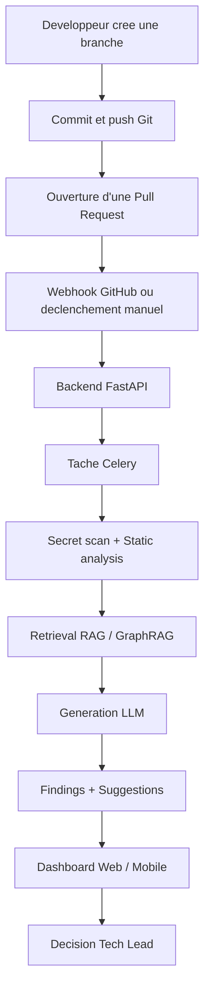

**Figure 1.3 - Workflow general de la solution proposee.**

## 1.5 Apports de la solution

La plateforme apporte une reduction de la charge du Tech Lead, une meilleure homogeneite des retours, une analyse contextualisee et une meilleure traçabilite. Elle fournit egalement une base pour l'observabilite de la qualite logicielle.

| Apport | Explication |
|---|---|
| Reduction de charge | Les verifications repetitives sont automatisees. |
| Homogeneite | Les regles internes peuvent etre formalisees. |
| Contextualisation | Le moteur GraphRAG exploite repository, graphe et KB. |
| Traçabilite | Les findings sont lies a des fichiers, lignes, regles ou references. |
| Supervision humaine | Le Tech Lead garde la decision finale. |

## 1.6 Choix methodologique

Le projet a ete realise selon une approche Agile inspiree de Scrum. Ce choix est motive par la complexite du projet et la diversite des modules a developper : web, mobile, GitHub, IA, base de connaissances, GraphRAG, monitoring et deploiement.


**Figure 1.4 - Cadre Scrum adopte pour le projet.**

### Comparaison Cycle en V / Scrum

| Critere | Cycle en V | Scrum |
|---|---|---|
| Adaptabilite aux changements | Faible | Elevee |
| Validation continue des resultats IA | Tardive | A chaque sprint |
| Gestion des delais contraints | Risquee | Maitrisee |
| Livraison progressive | Non | Oui |
| Adequation a une petite equipe | Lourde | Legere et flexible |

## 1.7 Scrum et organisation du travail

Les roles Scrum sont adaptes au contexte du projet.

| Role | Responsabilite dans le projet |
|---|---|
| Product Owner | Priorise les besoins de la plateforme. |
| Scrum Master | Facilite le travail et leve les obstacles. |
| Equipe de developpement | Concoit, implemente, teste et integre les modules. |

Le projet est decoupe en releases puis en sprints. Chaque sprint livre une partie coherent du produit.

## 1.8 Product Backlog et planification

Le backlog couvre les grands axes suivants :

| Release | Contenu principal |
|---|---|
| Release 1 | Application web et mobile : roles, workspace, PRs, reviews, analytics, mobile. |
| Release 2 | Intelligence artificielle : RAG, GraphRAG, Neo4j, LLM, retrieval, findings. |
| Release 3 | Deploiement : Docker, VPS, HTTPS, monitoring, CI/CD. |

### Planning previsionnel

| Phase | Fevrier | Mars | Avril | Mai |
|---|---|---|---|---|
| Analyse et specification | X |  |  |  |
| Conception |  | X | X |  |
| Implementation |  |  | X | X |
| Deploiement et finalisation |  |  |  | X |

## 1.9 Conclusion

Ce chapitre a presente le contexte general, l'organisme d'accueil, les limites de l'existant, la solution proposee et la methodologie adoptee. Il montre que Devora repond a un besoin concret : augmenter la revue de code par une approche intelligente, automatisee et contextualisee.

---

# Chapitre 2 - Lancement et conception du projet

## Sommaire du chapitre

| Section | Titre |
|---|---|
| 2.1 | Introduction |
| 2.2 | Identification des acteurs |
| 2.3 | Besoins fonctionnels |
| 2.4 | Besoins non fonctionnels |
| 2.5 | Environnement materiel |
| 2.6 | Architecture logique |
| 2.7 | Architecture physique |
| 2.8 | Technologies utilisees |
| 2.9 | Conclusion |

## 2.1 Introduction

Ce chapitre analyse les besoins de la plateforme Devora et formalise sa conception globale. Il identifie les acteurs, decrit les besoins fonctionnels et non fonctionnels, presente l'environnement de developpement et expose les architectures logique et physique.

## 2.2 Identification des acteurs

| Acteur | Role |
|---|---|
| Developer | Ecrit le code, cree des PRs, consulte les retours IA, applique les corrections. |
| Reviewer / Tech Lead | Supervise les decisions, valide ou invalide les findings, approuve ou bloque les PRs. |
| Admin | Configure la plateforme, gere les utilisateurs, roles, integrations, KB et monitoring. |
| GraphRAG System | Execute le parsing, le retrieval, l'analyse, la generation et l'historisation. |
| GitHub | Systeme externe fournissant repositories, branches, commits, PRs et webhooks. |

## 2.3 Besoins fonctionnels

### 2.3.1 Analyse et revue automatique

| Code | Besoin |
|---|---|
| BF-01 | Recevoir un diff Git via webhook ou API. |
| BF-02 | Parser le format unified diff. |
| BF-03 | Generer un resume automatique de la PR. |
| BF-04 | Classifier la PR : bugfix, feature ou refactoring. |
| BF-05 | Scanner et masquer les secrets sensibles. |
| BF-06 | Executer Semgrep, ESLint, Ruff et SQLFluff sur les lignes modifiees. |
| BF-07 | Produire une revue IA enrichie par le contexte RAG/GraphRAG. |
| BF-08 | Attacher chaque finding a une ligne precise lorsque possible. |
| BF-09 | Produire des remarques globales de synthese. |
| BF-10 | Attribuer les severites INFO, WARNING ou BLOCKER. |
| BF-11 | Classer les findings en Security, Performance, Quality, Style et Documentation. |
| BF-12 | Generer des suggestions de correction. |
| BF-13 | Dedoublonner les findings. |
| BF-14 | Limiter le nombre de commentaires pour eviter la saturation. |
| BF-15 | Gerer le cycle RECEIVED -> QUEUED -> RUNNING -> COMPLETED / FAILED. |

### 2.3.2 Base de connaissances RAG et GraphRAG

| Code | Besoin |
|---|---|
| BF-16 | Gerer l'index de connaissances et les standards. |
| BF-17 | Ingerer des documents PDF, DOCX et Markdown. |
| BF-18 | Indexer les README et dossiers docs. |
| BF-19 | Importer des tickets Jira CSV/JSON. |
| BF-20 | Decouper les documents en chunks. |
| BF-21 | Generer des embeddings avec cache Redis lorsque possible. |
| BF-22 | Stocker les representations vectorielles. |
| BF-23 | Combiner recherche semantique, recherche symbolique et re-ranking. |
| BF-24 | Restreindre le retrieval au perimetre du projet. |
| BF-25 | Attacher les sources et citations aux findings. |
| BF-26 | Gerer versioning et reindexation. |
| BF-27 | Detecter l'absence de contexte pertinent afin de limiter les hallucinations. |

### 2.3.3 Dashboard, collaboration et notifications

| Code | Besoin |
|---|---|
| BF-28 | Fournir des dashboards par role. |
| BF-29 | Afficher les annotations directement dans le diff. |
| BF-30 | Presenter la review queue du Tech Lead. |
| BF-31 | Gerer les transitions de review. |
| BF-32 | Proposer des patchs ou suggestions IA. |
| BF-33 | Permettre une interaction contextuelle avec l'IA. |
| BF-34 | Historiser les analyses. |
| BF-35 | Exporter les rapports. |
| BF-36 | Envoyer des notifications temps reel. |
| BF-37 | Envoyer des emails pour les severites critiques. |
| BF-38 | Integrer Slack et Teams. |
| BF-39 | Exploiter une boucle de feedback. |

### 2.3.4 Administration et securite

| Code | Besoin |
|---|---|
| BF-40 | Assurer l'authentification Clerk. |
| BF-41 | Verifier les signatures HMAC des webhooks GitHub. |
| BF-42 | Appliquer le RBAC. |
| BF-43 | Chiffrer les secrets. |
| BF-44 | Journaliser les actions administratives. |
| BF-45 | Monitorer couts et latence LLM. |
| BF-46 | Executer le pipeline GraphRAG automatiquement. |
| BF-47 | Produire une synthese consultable dans le dashboard. |
| BF-48 | Verifier JWT/JWKS. |
| BF-49 | Suivre les tendances de qualite. |

## 2.4 Besoins non fonctionnels

| Categorie | Code | Exigence |
|---|---|---|
| Performance | BNF-01 | Le pipeline complet doit rester compatible avec un usage interactif. |
| Performance | BNF-02 | Les endpoints REST doivent repondre rapidement. |
| Performance | BNF-03 | Le retrieval doit rester limite en temps et en volume. |
| Securite | BNF-04 | Les communications publiques doivent utiliser HTTPS/TLS. |
| Securite | BNF-05 | Les secrets doivent etre masques avant traitement LLM. |
| Maintenabilite | BNF-06 | L'architecture doit etre separee en couches API, Core, Data et Workers. |
| Maintenabilite | BNF-07 | Le systeme doit etre testable et modulaire. |
| Scalabilite | BNF-08 | Les analyses longues doivent etre executees en asynchrone. |
| Observabilite | BNF-09 | Les metriques doivent etre exposees pour Prometheus/Grafana. |

## 2.5 Environnement materiel

### Environnement de developpement

| Element | Specification |
|---|---|
| Proprietaire | Ahmed Amin Bejaoui |
| Marque | HP |
| RAM | 32 GB |
| Stockage | HDD 1 TB + SSD 512 GB |
| CPU | Intel Core i7-1165G7 11th Gen |
| Systeme | Windows 11 Professionnel 64 bits |

### Configuration de production recommandee

| Composant | Specification |
|---|---|
| Serveur | VPS / Cloud OVH |
| CPU | 2 vCPU minimum |
| RAM | 4 GB minimum |
| Stockage | 50 GB SSD minimum |
| Reseau | 100 Mbps minimum |

## 2.6 Architecture logique

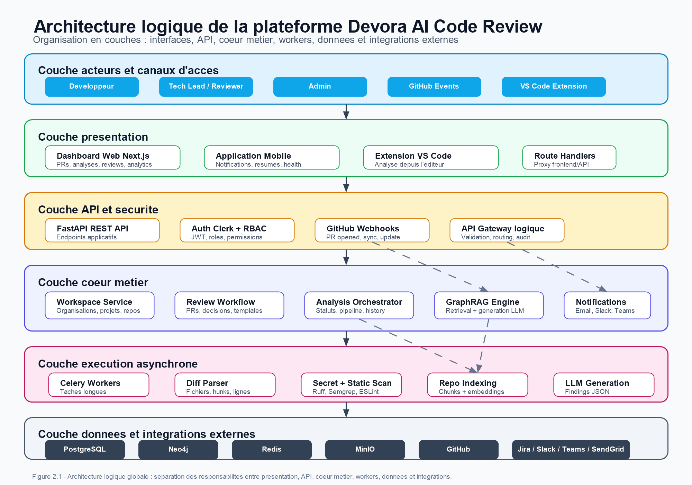

**Figure 2.1 - Architecture logique globale de la solution.**

L'architecture logique est organisee autour de plusieurs couches :

| Couche | Role |
|---|---|
| Frontend Web | Dashboard Next.js pour les utilisateurs. |
| Mobile | Consultation des PRs, notifications et resumes. |
| API | FastAPI expose les endpoints applicatifs. |
| Core | Logique metier : review, GraphRAG, generation, orchestration. |
| Workers | Celery execute les analyses longues. |
| Data | PostgreSQL, Neo4j, Redis, MinIO. |
| Integrations | GitHub, Jira, Slack, Teams, SendGrid. |

## 2.7 Architecture physique


**Figure 2.2 - Architecture physique de la plateforme.**

En production, les services sont deployes sous Docker sur VPS. Nginx expose les sous-domaines, Certbot fournit HTTPS, Docker Compose orchestre les conteneurs et Prometheus/Grafana assurent le monitoring.

## 2.8 Diagramme de cas d'utilisation global


**Figure 2.3 - Diagramme de cas d'utilisation general.**

## 2.9 Diagramme de classes global


**Figure 2.4 - Diagramme de classes general.**

## 2.10 Technologies utilisees

| Technologie | Role dans le projet |
|---|---|
| GitHub | Source des repositories, PRs et webhooks. |
| Clerk | Authentification, sessions et roles. |
| FastAPI | Backend et endpoints d'analyse. |
| Next.js | Dashboard web. |
| TypeScript | Typage du frontend. |
| Celery | Execution asynchrone des analyses. |
| Redis | Broker Celery et cache. |
| PostgreSQL | Base de donnees principale. |
| Neo4j | Graphe de code et recherche vectorielle GraphRAG. |
| LangGraph | Orchestration du pipeline IA. |
| Ollama | Execution locale de modeles LLM. |
| OpenAI / Anthropic | Providers LLM cloud possibles. |
| Docker | Containerisation. |
| VPS OVH | Hebergement production. |
| Nginx | Reverse proxy. |
| Certbot | Certificats HTTPS. |
| Prometheus | Collecte de metriques. |
| Grafana | Dashboards de monitoring. |
| MinIO | Stockage objet. |
| Slack / Teams | Notifications. |
| Jira | Gestion des tickets et contexte projet. |

## 2.11 Conclusion

Ce chapitre a transforme le contexte du projet en besoins precis et en architecture globale. Il constitue la base de la presentation des trois releases qui structurent la realisation.

---

# Release 1 - Application web et mobile

## Vue globale de la Release 1

La Release 1 construit la partie fonctionnelle visible de Devora. Elle met en place l'application web, les roles, le workspace, les repositories, les pull requests, les analyses visibles, le workflow de review, les analytics, les integrations, les notifications et l'experience mobile.

## Tableau de synthese des sprints

| Sprint | Nom | Objectif principal | Acteurs |
|---|---|---|---|
| Sprint 1 | Gestion des acces, workspace et repositories | Authentification, roles, organisations, projets, repositories et equipes. | Admin, Developer, Tech Lead |
| Sprint 2 | Analyses IA et workflow de review | PRs, analyses, rapports, diff annote et decisions de review. | Developer, Tech Lead |
| Sprint 3 | Pilotage, integrations et mobile | Analytics, notifications, mobile, administration, integrations et observabilite. | Admin, Developer, Tech Lead |

## Sprint 1 - Gestion des acces, du workspace et des repositories

### Introduction

Le premier sprint etablit les fondations fonctionnelles du systeme. Il couvre l'authentification, le controle d'acces, la synchronisation des roles, la creation des organisations, la structuration des projets, l'import des repositories GitHub et la consultation du contexte projet.

### Specification fonctionnelle

| Fonctionnalite | Description |
|---|---|
| Inscription et connexion | Connexion securisee via Clerk. |
| Synchronisation des roles | Alignement entre Clerk, backend et RBAC. |
| Redirection par role | Espace Developer, Tech Lead ou Admin. |
| Gestion utilisateurs | Consultation et administration des roles. |
| Organisation | Creation ou import depuis GitHub. |
| Projet | Creation rattachee a une organisation. |
| Repository | Import GitHub rattache a un projet. |
| Fiche projet/repository | Branches, equipes, langage, commits, statut et health score. |

### Cas d'utilisation principal

| Element | Contenu |
|---|---|
| Titre | Gestion des acces, du workspace et des repositories |
| Acteurs | Developer, Tech Lead, Admin |
| Precondition | L'utilisateur dispose d'un compte valide. |
| Scenario nominal | Authentification, synchronisation du role, redirection, creation organisation, creation projet, import repository, consultation fiche. |
| Scenarios alternatifs | Echec connexion, session expiree, role manquant, droits GitHub insuffisants, acces interdit. |
| Post-condition | Workspace structure et exploitable. |

### Diagrammes du Sprint 1


**Figure R1.1 - Diagramme de cas d'utilisation du Sprint 1.**


**Figure R1.2 - Diagramme de classes du Sprint 1.**


**Figure R1.3 - Diagramme de sequence du Sprint 1.**


**Figure R1.4 - Diagramme d'activite du Sprint 1.**

### Workflow fonctionnel

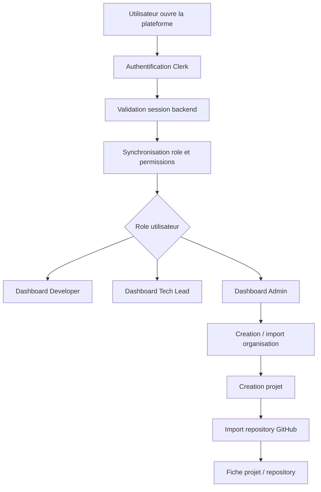

**Figure R1.5 - Workflow du Sprint 1.**

### Interfaces realisees

| Interface | Capture | Description |
|---|---|---|
| Inscription et connexion | `figures/auth.png` | Point d'entree securise. |
| Redirection selon role | `figures/dashboard1.png` | Navigation adaptee au profil. |
| Erreur d'acces | `figures/access_error_light.png` | Gestion session expiree ou ressource interdite. |
| Dashboard initial | `figures/role_dashboard_light.png` | Vue d'accueil personnalisee. |
| Roles et permissions | `figures/users_roles_permissions_light.png` | Administration des acces. |
| Organisation | `figures/create_import_organization_light.png` | Creation/import organisation. |
| Equipes | `figures/team_management_light.png` | Gestion des membres. |
| Projet | `figures/create_project_light.png` | Creation projet. |
| Repository GitHub | `figures/import_github_repository_light.png` | Assistant d'import repository. |
| Detail projet/repository | `figures/project_repository_detail_light.png` | Fiche de contexte. |


**Figure R1.6 - Interface d'inscription et de connexion.**


**Figure R1.7 - Page de redirection selon le role utilisateur.**


**Figure R1.8 - Interface de gestion des utilisateurs, roles et permissions.**


**Figure R1.9 - Assistant d'import de repository GitHub.**

### Tests du Sprint 1

| Test | Resultat attendu |
|---|---|
| Connexion Developer | Acces au dashboard Developer. |
| Connexion Tech Lead | Acces a l'espace de supervision. |
| Connexion Admin | Acces aux vues d'administration. |
| Route interdite | Refus d'acces. |
| Creation organisation | Organisation visible et persistante. |
| Creation projet | Projet rattache a une organisation. |
| Import repository | Repository rattache a un projet. |
| Fiche repository | Branches, langage, statut et metriques affiches. |

### Conclusion du Sprint 1

Ce sprint pose le socle operationnel de la plateforme. Sans authentification, roles, organisations, projets et repositories, les modules d'analyse et de review ne peuvent pas fonctionner correctement.

## Sprint 2 - Gestion des analyses IA et du workflow de review

### Introduction

Le Sprint 2 construit le coeur fonctionnel visible de la plateforme. Il relie les pull requests, les analyses, les rapports, le diff annote et les decisions de review.

### Specification fonctionnelle

| Fonctionnalite | Description |
|---|---|
| Liste All PRs | Consultation centralisee des pull requests. |
| Filtres | Statuts Draft, Waiting, Approved, Return, Needs review. |
| Detail PR | Informations synchronisees avec GitHub. |
| Lancement analyse | Demarrage manuel ou automatique. |
| Liste analyses | Filtres par statut, projet, repository, equipe et date. |
| Rapport structure | Resume, risque, findings, suggestions. |
| Diff annote | Findings rattaches aux lignes. |
| Commentaires inline | Collaboration ligne par ligne. |
| Review queue | Traitement par le Tech Lead. |
| Decisions | Approuver, bloquer, assigner ou retourner a l'auteur. |

### Cas d'utilisation principal

| Element | Contenu |
|---|---|
| Titre | Gestion des analyses IA et du workflow de review |
| Acteurs | Developer, Tech Lead |
| Precondition | Projet, repository et PR synchronisee existent. |
| Scenario nominal | Developer ouvre PR, lance analyse, consulte rapport, Tech Lead consulte queue et applique decision. |
| Scenarios alternatifs | PR introuvable, analyse en echec, timeout IA, droits insuffisants. |
| Post-condition | PR dispose d'une analyse, d'un rapport, d'un diff annote et d'une decision traçable. |

### Diagrammes du Sprint 2


**Figure R1.10 - Diagramme de cas d'utilisation du Sprint 2.**


**Figure R1.11 - Diagramme de classes du Sprint 2.**


**Figure R1.12 - Diagramme de sequence du Sprint 2.**


**Figure R1.13 - Diagramme d'activite du Sprint 2.**

### Workflow Pull Request et Review

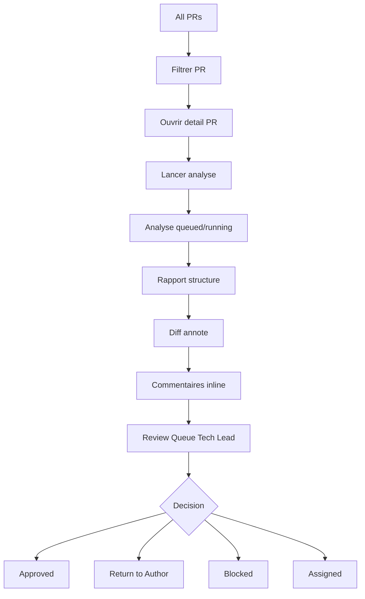

**Figure R1.14 - Workflow de review du Sprint 2.**

### Interfaces a integrer

| Interface | Objectif |
|---|---|
| Page All PRs | Centraliser les pull requests. |
| Detail PR | Afficher contexte complet de la PR. |
| Bouton analyse | Declencher une analyse IA. |
| Liste analyses | Suivre les executions. |
| Detail analyse | Lire resultat et statut. |
| Rapport | Comprendre risques et findings. |
| Diff annote | Relier finding et ligne modifiee. |
| Review queue | Prioriser les PRs a traiter. |
| Decision Tech Lead | Approuver, bloquer, retourner ou assigner. |

### Tests du Sprint 2

| Test | Resultat attendu |
|---|---|
| Affichage All PRs | Liste correcte des PRs. |
| Filtrage | PRs filtrees par statut. |
| Detail PR | Contexte conserve. |
| Lancement analyse | Analyse creee et suivie. |
| Statuts analyse | Queued, running, completed, failed visibles. |
| Rapport | Findings associes a la bonne PR. |
| Diff annote | Findings affiches sur les lignes. |
| Decision Tech Lead | Decision historisee. |

### Conclusion du Sprint 2

Ce sprint transforme un repository importe en espace de review outille. Il constitue le pont entre l'application web et le moteur d'analyse intelligent de la Release 2.

## Sprint 3 - Pilotage, integrations et experience mobile

### Introduction

Le Sprint 3 finalise la partie produit avec analytics, integrations, notifications, administration, mobile et observabilite fonctionnelle.

### Specification fonctionnelle

| Domaine | Fonctionnalites |
|---|---|
| Analytics | Team analytics, my analytics, trends, SLA, leaderboard, workload. |
| Engineering insights | PR merged, lines modified, median PR size, time to first review. |
| Administration | Users, roles, permissions, organisations, integrations. |
| Knowledge Base | Ancien code, Markdown, PDF, pages web, sources indexees. |
| RAG evaluation | Comparaison avec/sans GraphRAG, precision, recall, F1. |
| Integrations | GitHub, Jira, Slack, Microsoft Teams. |
| Notifications | In-app, email, Slack, Teams, web push, mobile push. |
| Mobile | Login, All PRs, resume d'analyse, health, notifications. |
| Observability | Services, alertes, CPU, memory, API, database, Redis, jobs. |

### Cas d'utilisation principal

| Element | Contenu |
|---|---|
| Titre | Gestion du pilotage, integrations et experience mobile |
| Acteurs | Admin, Tech Lead, Developer |
| Precondition | Acces, workspace, PRs et analyses disponibles. |
| Scenario nominal | Admin configure integrations et KB, Tech Lead consulte analytics, Developer recoit notifications et utilise mobile. |
| Scenarios alternatifs | Token invalide, source non indexable, notification non distribuee, metrique indisponible. |
| Post-condition | Plateforme pilotable, integree, observable et utilisable sur web/mobile. |

### Diagrammes du Sprint 3


**Figure R1.15 - Diagramme de cas d'utilisation du Sprint 3.**


**Figure R1.16 - Diagramme de classes du Sprint 3.**


**Figure R1.17 - Diagramme de sequence du Sprint 3.**


**Figure R1.18 - Diagramme d'activite du Sprint 3.**

### Workflow Mobile et Notifications

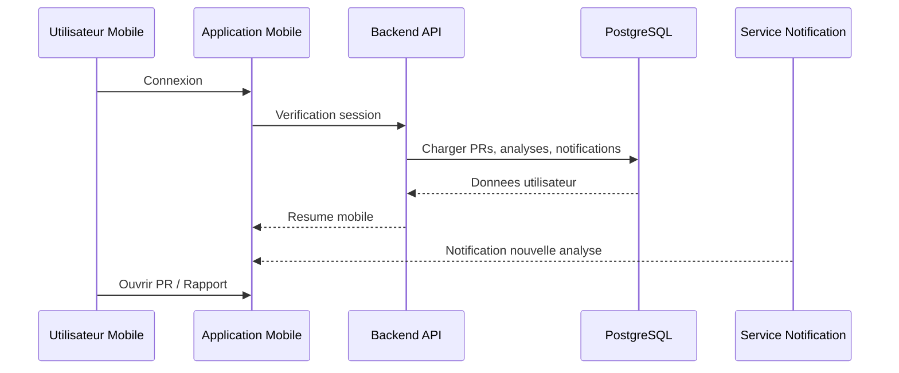

**Figure R1.19 - Workflow mobile et notifications.**

### Tests du Sprint 3

| Test | Resultat attendu |
|---|---|
| Analytics equipe | Indicateurs visibles. |
| Analytics personnel | Donnees propres a l'utilisateur. |
| Integration Jira | Connexion validee. |
| Slack / Teams | Notification test recue. |
| Knowledge Base | Source indexee. |
| Mobile login | Connexion reussie. |
| Mobile PRs | Liste synchronisee. |
| Observability | Etat services visible. |

### Conclusion de la Release 1

La Release 1 livre la partie applicative web et mobile. Elle prepare le terrain pour la Release 2, qui ajoute la couche IA avancee et le moteur GraphRAG.

---

# Release 2 - Intelligence artificielle, RAG, GraphRAG et analyse intelligente du code

## Vue globale de la Release 2

La Release 2 regroupe toute la partie intelligence artificielle de la plateforme. Elle inclut l'etat de l'art utile, la conception, la realisation, l'orchestration, les tests, le scenario A-Z, l'evaluation qualitative, les limites et les perspectives.

## Objectif general

L'objectif est de produire une revue de code intelligente, contextualisee et traçable. Le systeme ne doit pas seulement signaler des erreurs locales : il doit comprendre le diff, recuperer le contexte du repository, exploiter les regles internes, traverser le graphe de code et generer des findings justifies.

## Architecture globale de la Release 2

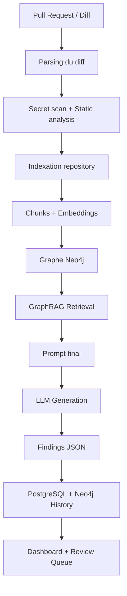

**Figure R2.1 - Architecture globale de la Release 2.**

## 2.1 Etat de l'art integre

### Analyse statique classique

L'analyse statique permet d'examiner le code sans l'executer. Elle detecte des problemes de style, de securite, de complexite et de conformite. Dans Devora, elle joue un role complementaire au moteur IA.

| Outil | Role |
|---|---|
| Ruff | Analyse Python et qualite de code. |
| Semgrep | Patterns de securite et bonnes pratiques. |
| ESLint | Analyse JavaScript/TypeScript. |
| SQLFluff | Analyse SQL. |
| Secret scan | Detection et redaction des secrets. |

### Limites de l'analyse statique

L'analyse statique est rapide et objective, mais elle reste limitee par ses regles. Elle ne lit pas les documents internes, ne comprend pas toujours l'architecture et ne sait pas raisonner sur les dependances complexes.

### LLM pour la revue de code

Les LLM permettent de generer des explications, des suggestions et des resumes. Ils peuvent rendre les retours plus lisibles pour les developpeurs. Cependant, ils peuvent halluciner si le contexte est insuffisant.

### Tokens et fenetre de contexte

| Concept | Description | Impact projet |
|---|---|---|
| Token | Unite de texte traitee par le modele. | Cout et taille du prompt. |
| Context window | Nombre maximal de tokens traites. | Necessite de selectionner le contexte. |
| Latence | Temps de reponse LLM. | Influence l'experience utilisateur. |
| Cout | Facturation selon tokens ou infrastructure. | Necessite d'optimiser le retrieval. |

### Comparaison des modeles LLM

| Modele / Provider | Usage possible | Avantages | Limites |
|---|---|---|---|
| Ollama local | Dev/test local | Controle local, pas de dependance cloud. | Qualite variable, ressources locales. |
| OpenAI | Production ou evaluation | Bonne qualite, integration simple. | Cout et dependance externe. |
| Anthropic | Analyse complexe | Bon raisonnement et grands contextes. | Cout, dependance fournisseur. |
| Modeles open-source | Souverainete et experimentation | Deployable localement. | Tuning et performance variables. |

## 2.2 RAG et limites du RAG simple

### Principe du RAG

Le RAG consiste a recuperer du contexte depuis une base externe avant de demander au LLM de generer une reponse. Il ameliore la precision car le modele ne depend plus uniquement de ses connaissances internes.

### Pipeline RAG classique

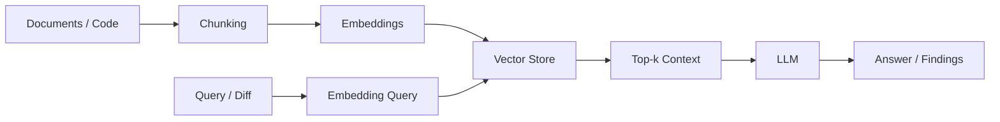

**Figure R2.2 - Pipeline RAG classique.**

### Limites du RAG simple pour le code

| Limite | Explication |
|---|---|
| Fragmentation contextuelle | Un chunk peut etre recupere sans son contexte d'appel. |
| Perte des relations structurelles | La similarite cosinus ne represente pas un call graph. |
| Raisonnement multi-hop limite | Le RAG simple ne suit pas naturellement les dependances. |
| Risque d'hallucination | Le LLM peut inferer des relations non presentes. |
| Traçabilite insuffisante | Les sources sont parfois faibles ou incompletes. |

## 2.3 Strategies de chunking

| Type de contenu | Strategie de chunking | Objectif |
|---|---|---|
| Code source | Fonctions, classes, modules, AST/code-aware. | Conserver la coherence logique. |
| Markdown | Titres, sections, paragraphes. | Respecter la structure documentaire. |
| PDF | Extraction texte, sections, blocs. | Recuperer les standards internes. |
| Jira | Titre, description, commentaires, metadata. | Exploiter l'historique fonctionnel. |
| Pages web | Nettoyage HTML, sections utiles. | Eviter le bruit de navigation. |
| Ancien code | Fichiers, symboles, modules. | Capitaliser les pratiques existantes. |

### Workflow de chunking multi-source

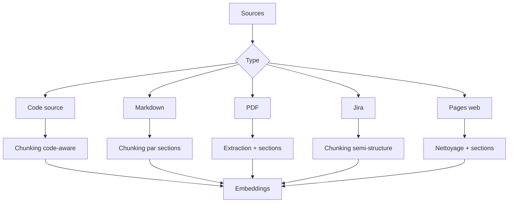

**Figure R2.3 - Strategie de chunking selon le type de source.**

## 2.4 Strategies d'embedding

| Contenu | Representation | Usage |
|---|---|---|
| Code source | Embedding de chunks de code. | Retrouver du code similaire au diff. |
| Regles KB | Embedding de regles. | Prioriser les violations internes. |
| Documents techniques | Embedding texte. | Recuperer guidelines et standards. |
| Tickets Jira | Embedding semi-structure. | Apporter historique et contexte metier. |

Le choix d'un modele d'embedding doit tenir compte de la dimension vectorielle, de la vitesse, de la qualite de similarite et de la compatibilite avec Neo4j.

## 2.5 Knowledge Graph et carte de connaissances

### Carte de connaissances

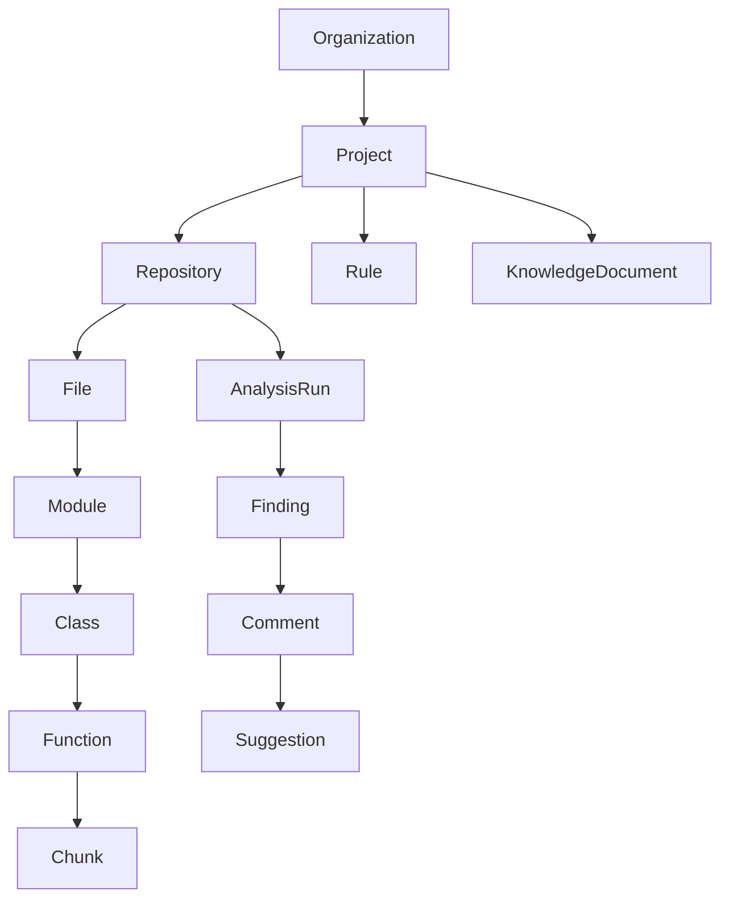

**Figure R2.4 - Carte de connaissances de la plateforme.**

### Noeuds du graphe Neo4j

| Noeud | Role |
|---|---|
| Organization | Perimetre organisationnel. |
| Project | Projet rattache a une organisation. |
| Repository | Depot de code analyse. |
| File | Fichier source. |
| Module | Module logique. |
| Class | Classe definie dans le code. |
| Function | Fonction ou methode. |
| Chunk | Fragment indexe et vectorise. |
| Rule | Regle interne ou template. |
| KnowledgeDocument | Document technique. |
| AnalysisRun | Execution d'analyse. |
| Finding | Probleme detecte. |
| Comment | Commentaire genere. |
| Suggestion | Proposition de correction. |

### Relations du graphe

| Relation | Description |
|---|---|
| CONTAINS | Organisation, projet, repository, fichier, chunk. |
| DEFINES | Fichier definit classe ou fonction. |
| IMPORTS | Fichier importe un autre fichier/module. |
| CALLS | Fonction appelle une autre fonction. |
| DEPENDS_ON | Relation de dependance. |
| CHUNKED_FROM | Chunk rattache a son origine. |
| HAS_FINDING | AnalysisRun contient un finding. |
| HAS_COMMENT | Finding contient un commentaire. |
| HAS_SUGGESTION | Commentaire contient une suggestion. |
| REFERENCES | Finding reference une entite de code. |
| HAS_HISTORY | Repository relie aux analyses passees. |

## 2.6 GraphRAG

### Definition

GraphRAG combine la generation augmentee par retrieval avec l'exploitation d'un graphe de connaissances. Il permet de recuperer a la fois des fragments semantiquement proches et des elements structurellement lies.

### Comparaison RAG vs GraphRAG

| Aspect | RAG simple | GraphRAG |
|---|---|---|
| Retrieval | Vecteurs principalement. | Vecteurs + graphe + symboles. |
| Structure code | Faible. | Forte. |
| Multi-hop | Non naturel. | Supporte via traversals Neo4j. |
| Regles internes | Injection manuelle. | Regles comme entites recuperables. |
| Traçabilite | Variable. | References graphe/documents. |
| Hallucination | Reduite par contexte. | Reduite par contexte structure. |
| Mise a jour | Reindexation souvent large. | Upsert et indexation incrementale. |

### Architecture GraphRAG dans Devora

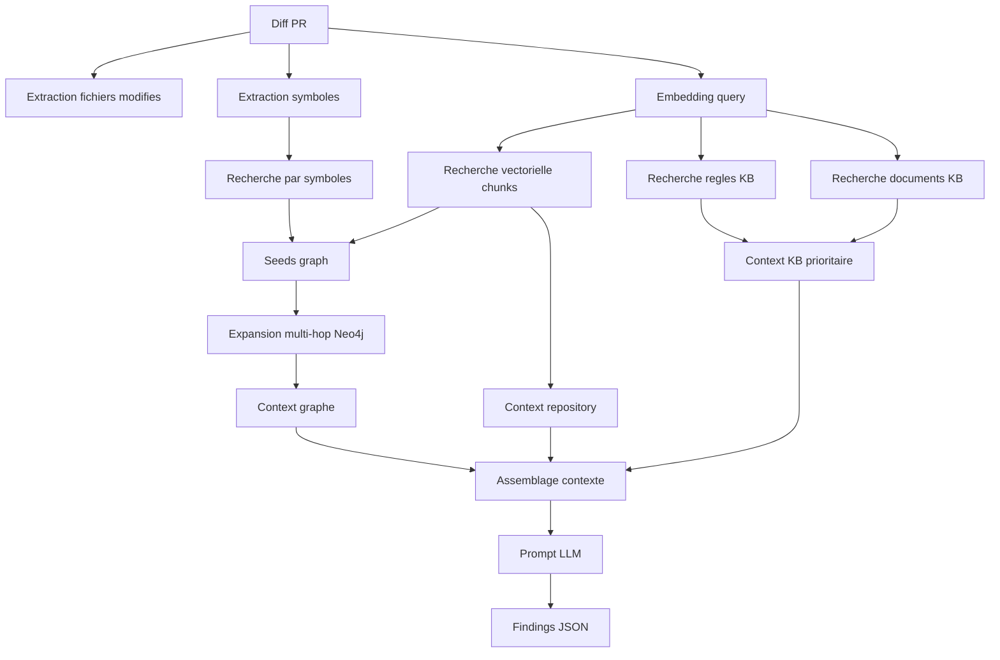

**Figure R2.5 - Architecture GraphRAG du pipeline d'analyse.**

## 2.7 Prompt engineering et guardrails

### Structure du prompt final

| Bloc | Contenu | Priorite |
|---|---|---|
| Systeme | Role du reviewer, JSON only, pas d'hallucination. | Haute |
| KB Rules | Regles strictes internes. | 1 |
| KB Docs | Guides, standards, documents. | 2 |
| Graph Context | Dependances, imports, appels. | 3 |
| Repo Context | Chunks de code pertinents. | 4 |
| Static Findings | Ruff, Semgrep, ESLint, secret scan. | 5 |
| Diff | Changement a analyser. | Central |
| Output schema | Format JSON attendu. | Obligatoire |

### Exemple de structure JSON attendue

```json
{
  "summary": "Resume de la revue",
  "findings": [
    {
      "severity": "WARN",
      "category": "quality",
      "message": "Message court",
      "suggestion": "Suggestion actionnable",
      "confidence": 0.78,
      "file_path": "src/file.py",
      "line_start": 42,
      "line_end": 42,
      "references": ["src/file.py:42", "kb/rules/R-001"],
      "auto_fix": null,
      "rule_ref": "R-001"
    }
  ]
}
```

### Guardrails anti-hallucination

| Guardrail | Role |
|---|---|
| Sortie JSON stricte | Faciliter parsing et validation. |
| References obligatoires | Eviter les affirmations non ancrees. |
| Seuil de confiance | Filtrer les findings faibles. |
| Priorite KB | Respecter les regles internes. |
| Limitation aux fichiers modifies | Eviter commentaires hors PR. |
| Deduplication | Reduire le bruit. |

## 2.8 Sprint 1 - Indexation repository et construction du graphe

### Objectif

Construire la representation GraphRAG du repository : scan, chunking, embeddings, stockage Neo4j et relations de code.

### Besoins

| Type | Besoin |
|---|---|
| Fonctionnel | Importer repository GitHub. |
| Fonctionnel | Identifier fichiers source modifies. |
| Fonctionnel | Decouper le code en chunks. |
| Fonctionnel | Generer embeddings. |
| Fonctionnel | Construire graphe Neo4j. |
| Non fonctionnel | Supporter indexation incrementale. |
| Non fonctionnel | Eviter reindexation complete. |
| Non fonctionnel | Garder traçabilite par org/projet/repo. |

### Sequence d'indexation

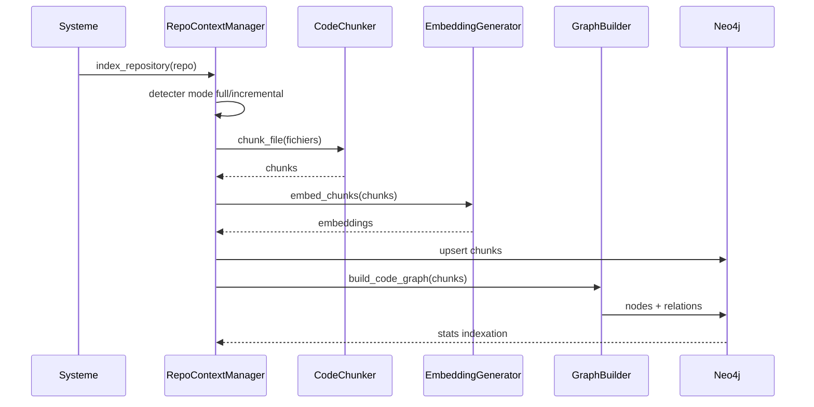

**Figure R2.6 - Sequence d'indexation du repository.**

### Fichiers lies

| Fichier | Role |
|---|---|
| `apps/backend/app/core/analysis/context/repo_context_manager.py` | Orchestration indexation. |
| `apps/backend/app/core/analysis/graph/builder.py` | Construction des noeuds et relations. |
| `apps/backend/app/core/analysis/graph/schema.py` | Definition des types de noeuds et relations. |
| `apps/backend/app/integrations/graph_database/neo4j_client.py` | Client Neo4j et vector search. |

### Tests

| Test | Validation |
|---|---|
| Indexation full | Repository jamais indexe. |
| Indexation incrementale | Fichiers modifies uniquement. |
| Noeuds Neo4j | Repository, File, Chunk, Function, Class. |
| Relations | CONTAINS, IMPORTS, CALLS, DEPENDS_ON. |
| Embeddings | Vecteurs presents et interrogeables. |

## 2.9 Sprint 2 - Retrieval hybride et generation LLM

### Objectif

Recuperer le contexte utile a partir d'un diff et generer des findings structures avec un LLM.

### Retrieval hybride en couches

| Couche | Description |
|---|---|
| 1. Symboles | Recherche par symboles extraits du diff. |
| 2. Vector search chunks | Recherche semantique dans les chunks de code. |
| 3. Graph expansion | Expansion multi-hop par imports/dependances. |
| 4. KB rules | Recuperation des regles prioritaires. |
| 5. KB docs | Recuperation des documents techniques. |
| 6. Re-ranking | Fusion et classement final. |

### Workflow retrieval -> generation

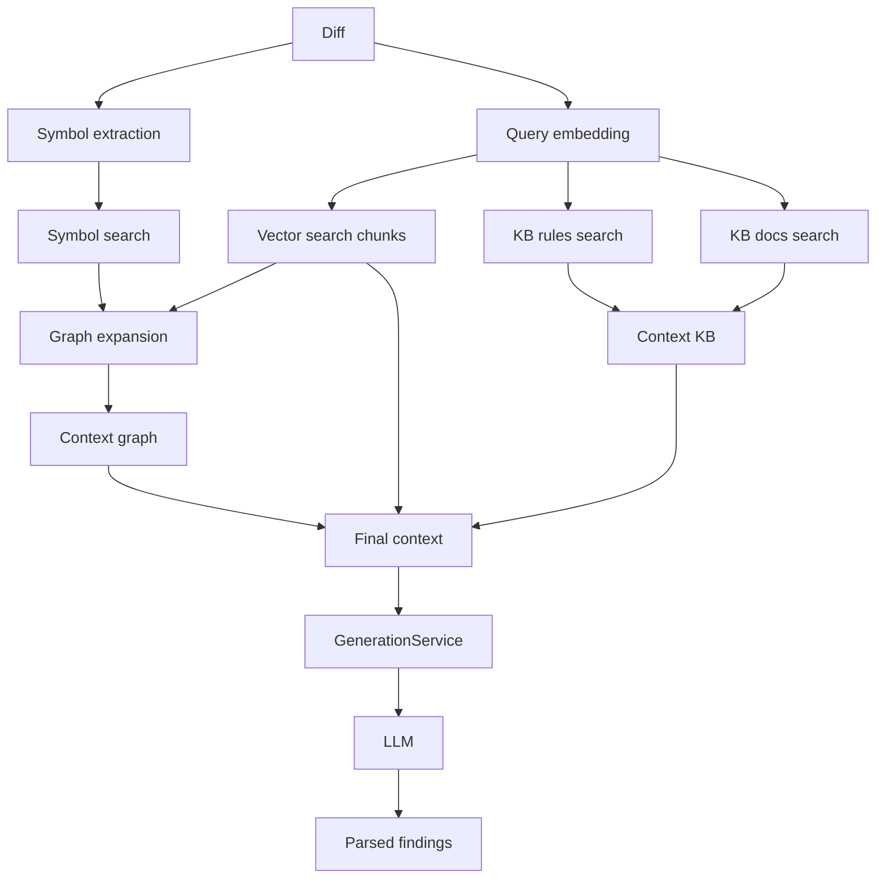

**Figure R2.7 - Workflow retrieval et generation.**

### Fichiers lies

| Fichier | Role |
|---|---|
| `apps/backend/app/core/analysis/retrieval/hybrid_retriever.py` | Retrieval hybride vector + graphe + KB. |
| `apps/backend/analysis/langGraph/raggraph/retriever.py` | GraphRAGRetriever Neo4j natif. |
| `apps/backend/app/core/analysis/generation/generation_service.py` | Prompt et generation findings. |
| `apps/backend/analysis/langGraph/raggraph/llm_service.py` | Providers LLM et parsing strict. |

### Tests

| Test | Validation |
|---|---|
| Diff simple | Findings pertinents et limites. |
| Diff multi-fichiers | Expansion graphe utile. |
| KB prioritaire | Regles remontees avant repo context. |
| JSON strict | Sortie parseable. |
| LLM indisponible | Fallback ou statut failed controle. |

## 2.10 Sprint 3 - Orchestration AI, historique et scenario A-Z

### Objectif

Industrialiser le moteur GraphRAG dans le workflow produit : Celery, LangGraph, historique, reanalyse, dashboard et feedback.

### Orchestration Celery

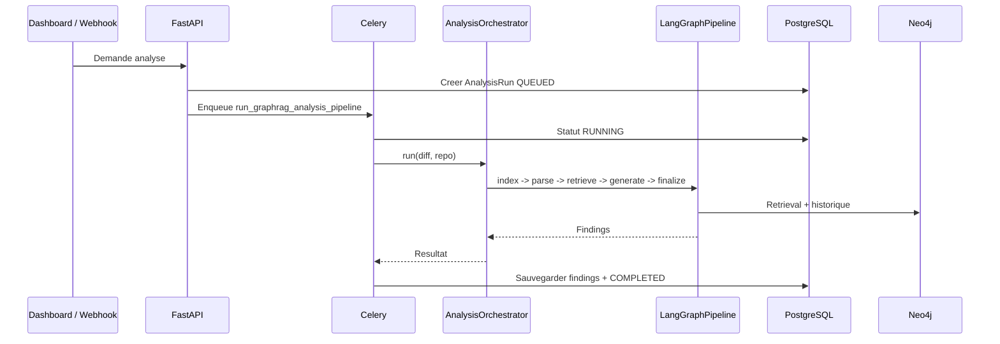

**Figure R2.8 - Orchestration de l'analyse GraphRAG.**

### Fichiers lies

| Fichier | Role |
|---|---|
| `apps/backend/app/workers/tasks/analyze_graphrag.py` | Tache Celery de pipeline GraphRAG. |
| `apps/backend/app/core/analysis/orchestrator.py` | Orchestrateur d'analyse. |
| `apps/backend/analysis/langGraph/pipeline.py` | Pipeline LangGraph. |
| `apps/backend/app/core/analysis/history/history_service.py` | Historique et comparaison de runs. |
| `apps/dashboard/app/dashboard/lead/templates/page.tsx` | Interface templates Tech Lead. |

### Scenario complet A-Z

| Etape | Description |
|---|---|
| 0. Configuration | Admin configure organisation, projet, integrations et KB. |
| 1. Onboarding | Repository connecte et indexe. |
| 2. Pull Request | Developpeur pousse une branche et ouvre une PR. |
| 3. Declenchement | Webhook GitHub ou action dashboard lance l'analyse. |
| 4. Pre-traitement | Diff parse, secrets detectes et rediges. |
| 5. Double analyse | Analyse statique + GraphRAG. |
| 6. Generation | LLM genere findings structures. |
| 7. Restitution | Dashboard affiche rapport, diff annote et suggestions. |
| 8. Decision | Tech Lead approuve, bloque, assigne ou retourne a l'auteur. |
| 9. Reanalyse | Apres correction, une nouvelle analyse compare les runs. |

### Captures a integrer

| Capture | Chemin propose | Role |
|---|---|---|
| Liste PRs | `figures/release2/all-prs.png` | Montrer les PRs a analyser. |
| Detail analyse | `figures/release2/analysis-detail.png` | Montrer le rapport. |
| Diff annote | `figures/release2/annotated-diff.png` | Montrer les findings inline. |
| Neo4j graph | `figures/release2/neo4j-graph.png` | Montrer le graphe. |
| Templates Tech Lead | `figures/release2/templates-techlead.png` | Montrer les regles/templates. |
| Historique | `figures/release2/analysis-history.png` | Montrer les runs. |


**Figure R2.9 - Liste des pull requests a analyser.**


**Figure R2.10 - Visualisation du graphe Neo4j du repository.**

## 2.11 Evaluation de la Release 2

### Evaluation qualitative

| Critere | Evaluation attendue |
|---|---|
| Pertinence | Findings lies au changement reel. |
| Traçabilite | References fichier, ligne, regle ou document. |
| Reduction hallucination | Contexte priorise et references obligatoires. |
| Utilite Tech Lead | Aide a la decision. |
| Robustesse | Fallback lorsque LLM indisponible. |

### RAGAS et metriques possibles

| Metrique | Role | Statut dans le rapport |
|---|---|---|
| Context Recall | Mesurer si le contexte recupere couvre les evidences attendues. | Etat de l'art / perspective si non calculee. |
| Faithfulness | Verifier que les claims sont inferables du contexte. | Etat de l'art / perspective. |
| Answer Relevancy | Mesurer la pertinence de la reponse par rapport a la question. | Etat de l'art / perspective. |

### Points implementes vs perspectives

| Element | Statut correct dans le rapport |
|---|---|
| Neo4j vector search | Implemente. |
| Recherche par symboles | Implemente. |
| Expansion graphe via imports/dependances | Implemente partiellement selon le graphe disponible. |
| KB rules priority | Implemente dans la logique de retrieval/generation. |
| Few-shot historique | Perspective si non visible dans le code. |
| Auto-critique explicite | Perspective si non industrialisee. |
| RLHF complet | Ne pas presenter comme implemente ; parler de feedback loop. |
| RAGAS complet | Perspective/evaluation future si pas de resultats reels. |

## Conclusion de la Release 2

La Release 2 constitue le coeur intelligent de Devora. Elle montre que l'analyse de code ne peut pas reposer uniquement sur un LLM ou sur un analyseur statique. La combinaison GraphRAG permet de recuperer un contexte plus riche, d'exploiter les relations du code, de prioriser les regles internes et de produire des findings plus traçables.

---

# Release 3 - Deploiement VPS, HTTPS, monitoring et CI/CD

## Vue globale de la Release 3

La Release 3 transforme la plateforme en solution deployee en production. Elle reprend l'organisation en deux sprints que tu as definie : containerisation et publication Docker, puis deploiement VPS complet.

## Organisation en deux sprints

| Sprint | Titre | Objectif |
|---|---|---|
| Sprint 1 | Containerisation et publication des images Docker | Preparer Dockerfiles, construire backend/frontend et publier sur Docker Hub. |
| Sprint 2 | Deploiement VPS, HTTPS, monitoring et CI/CD | Deployer sur VPS, configurer DNS/Nginx/Certbot, monitoring et GitHub Actions. |

## Architecture globale du deploiement

| Element | Valeur |
|---|---|
| VPS | Ubuntu 25.04 |
| IP | `135.125.100.150` |
| Domaine | `dev-ora.tn` |
| Sous-domaines | `app`, `api`, `yjs`, `pgadmin`, `qdrant`, `minio`, `storage`, `grafana`, `flower` |
| Reseau Docker | `ai-review-network` |
| Reverse proxy | Nginx |
| Certificats | Certbot / Let's Encrypt |
| CI/CD | GitHub Actions |


**Figure R3.1 - Architecture globale : developpeur, Docker Hub, VPS et utilisateurs.**


**Figure R3.2 - Topologie Docker en trois couches.**


**Figure R3.3 - Routage Nginx des sous-domaines.**

## Sprint 1 - Containerisation et publication Docker

### Besoins

| Besoins fonctionnels | Besoins non fonctionnels |
|---|---|
| Preparer Git et Docker Desktop. | Images portables et reproductibles. |
| Creer organisation GitHub `devora-platform`. | Secrets et `.env` exclus des images. |
| Creer depots backend, frontend, infra. | Backend expose `/healthz`. |
| Ajouter Dockerfile backend FastAPI. | Backend expose `/metrics`. |
| Ajouter Dockerfile multi-stage Next.js. | Frontend compile avec URLs production. |
| Publier images sur Docker Hub. | Tags `1.0.0` et `latest`. |

### Cas d'utilisation principal

| Element | Contenu |
|---|---|
| Titre | Containerisation et publication des images Docker |
| Acteur | Developpeur |
| Precondition | Docker Desktop, Git et Docker Hub disponibles. |
| Scenario | Preparer Dockerfiles, build images, tagger, push Docker Hub. |
| Post-condition | Images backend et frontend disponibles sur Docker Hub. |

### Diagrammes Sprint 1 Deploiement


**Figure R3.4 - Cas d'utilisation du Sprint 1 deploiement.**


**Figure R3.5 - Diagramme de classes du Sprint 1 deploiement.**


**Figure R3.6 - Sequence build et push backend.**


**Figure R3.7 - Sequence build et push dashboard.**


**Figure R3.8 - Diagramme d'activite du Sprint 1 deploiement.**

### Preparation du poste Windows

```bash
git --version
docker --version
docker compose version
```


**Figure R3.9 - Verification de Git sous Windows.**


**Figure R3.10 - Docker Desktop actif.**

### Dockerfile backend


**Figure R3.11 - Dockerfile backend FastAPI.**

### Dockerfile frontend


**Figure R3.12 - Dockerfile multi-stage frontend Next.js.**

### Build et push Docker

```bash
docker login

docker build -f apps/backend/Dockerfile \
  -t bejaouiahmed/ai-review-api:1.0.0 \
  -t bejaouiahmed/ai-review-api:latest \
  apps/backend

docker push bejaouiahmed/ai-review-api:1.0.0
docker push bejaouiahmed/ai-review-api:latest

docker build -f apps/dashboard/Dockerfile \
  --build-arg NEXT_PUBLIC_API_URL=https://app.dev-ora.tn \
  --build-arg NEXT_PUBLIC_APP_URL=https://app.dev-ora.tn \
  --build-arg NEXT_PUBLIC_BACKEND_URL=https://api.dev-ora.tn \
  --build-arg NEXT_PUBLIC_Y_WEBSOCKET_URL=wss://yjs.dev-ora.tn \
  -t bejaouiahmed/ai-review-dashboard:1.0.0 \
  -t bejaouiahmed/ai-review-dashboard:latest \
  apps/dashboard

docker push bejaouiahmed/ai-review-dashboard:1.0.0
docker push bejaouiahmed/ai-review-dashboard:latest
```


**Figure R3.13 - Connexion a Docker Hub.**


**Figure R3.14 - Build reussi de l'image backend.**


**Figure R3.15 - Build reussi de l'image frontend.**


**Figure R3.16 - Images publiees sur Docker Hub.**

### Conclusion Sprint 1

Le Sprint 1 prepare les artefacts de deploiement. Les images backend et frontend sont construites, versionnees et publiees sur Docker Hub.

## Sprint 2 - Deploiement VPS, HTTPS, monitoring et CI/CD

### Besoins

| Besoins fonctionnels | Besoins non fonctionnels |
|---|---|
| Preparer VPS Ubuntu 25.04. | Communication par DNS Docker interne. |
| Installer Docker, Compose, Nginx, Certbot, UFW. | Donnees persistantes via volumes. |
| Creer `/opt/ai-review`. | Ports publics limites a 22, 80, 443. |
| Deployer PostgreSQL, Redis, Qdrant, Neo4j, MinIO. | Services sensibles proteges. |
| Deployer API, worker, dashboard et YJS. | Monitoring CPU, memoire, conteneurs et API. |
| Configurer DNS OVH et sous-domaines. | HTTPS obligatoire. |
| Configurer GitHub Actions. | Deploiement reproductible. |

### Diagrammes Sprint 2 Deploiement


**Figure R3.17 - Cas d'utilisation provisionnement VPS.**


**Figure R3.18 - Cas d'utilisation HTTPS, Nginx et CI/CD.**


**Figure R3.19 - Diagramme de classes deploiement VPS.**


**Figure R3.20 - Diagramme de classes Nginx, HTTPS et CI/CD.**


**Figure R3.21 - Sequence de provisionnement VPS.**


**Figure R3.22 - Sequence de lancement des services.**


**Figure R3.23 - Sequence configuration Nginx et Certbot.**


**Figure R3.24 - Sequence pipeline CI/CD.**

### Configuration DNS OVH


**Figure R3.25 - Zone DNS OVH avec les entrees A.**

### Preparation du VPS

```bash
ssh ubuntu@135.125.100.150
sudo -i

apt update && apt upgrade -y
apt install -y curl git ufw nano htop dnsutils apache2-utils openssl ca-certificates
curl -fsSL https://get.docker.com | sh
systemctl enable docker
systemctl start docker
apt install -y nginx certbot python3-certbot-nginx
systemctl enable nginx
systemctl start nginx
ufw allow OpenSSH
ufw allow 80/tcp
ufw allow 443/tcp
ufw --force enable
```


**Figure R3.26 - Connexion SSH au VPS.**


**Figure R3.27 - Nginx actif sur le VPS.**

### Structure projet VPS

```bash
mkdir -p /opt/ai-review/infra/prometheus
mkdir -p /opt/ai-review/infra/grafana/provisioning/datasources
mkdir -p /opt/ai-review/backend
mkdir -p /opt/ai-review/frontend
```


**Figure R3.28 - Structure `/opt/ai-review` sur le VPS.**

### Docker Compose

| Fichier | Role |
|---|---|
| `/opt/ai-review/infra/docker-compose.yml` | Infrastructure. |
| `/opt/ai-review/backend/docker-compose.yml` | API et worker. |
| `/opt/ai-review/frontend/docker-compose.yml` | Dashboard et YJS. |

```yaml
networks:
  ai-review-network:
    name: ai-review-network
    driver: bridge

services:
  postgres:
    image: postgres:15
    container_name: ai-review-postgres
    restart: unless-stopped
    networks:
      - ai-review-network
    ports:
      - "127.0.0.1:5432:5432"

  redis:
    image: redis:7-alpine
    container_name: ai-review-redis
    restart: unless-stopped
    networks:
      - ai-review-network
```


**Figure R3.29 - Fichier Docker Compose infrastructure.**

### Lancement services

```bash
cd /opt/ai-review/infra
docker compose --env-file .env up -d

cd /opt/ai-review/backend
docker pull bejaouiahmed/ai-review-api:latest
docker compose up -d

cd /opt/ai-review/frontend
docker pull bejaouiahmed/ai-review-dashboard:latest
docker compose up -d
```


**Figure R3.30 - Infrastructure Docker en etat Up.**


**Figure R3.31 - Backend API et worker en etat Up.**


**Figure R3.32 - Frontend Next.js et YJS en etat Up.**


**Figure R3.33 - Liste finale des conteneurs Docker.**

### Nginx reverse proxy

```nginx
server {
    listen 80;
    server_name app.dev-ora.tn;

    location / {
        proxy_pass http://127.0.0.1:3001;
        proxy_http_version 1.1;
        proxy_set_header Host $host;
        proxy_set_header X-Real-IP $remote_addr;
        proxy_set_header X-Forwarded-For $proxy_add_x_forwarded_for;
        proxy_set_header X-Forwarded-Proto $scheme;
        proxy_buffering off;
        proxy_read_timeout 300s;
    }
}
```

```nginx
server {
    listen 80;
    server_name api.dev-ora.tn;

    location /metrics {
        deny all;
        return 403;
    }

    location / {
        proxy_pass http://127.0.0.1:8000;
        proxy_http_version 1.1;
        proxy_set_header Host $host;
        proxy_set_header X-Real-IP $remote_addr;
        proxy_set_header X-Forwarded-For $proxy_add_x_forwarded_for;
        proxy_set_header X-Forwarded-Proto $scheme;
    }
}
```


**Figure R3.34 - Fichiers Nginx dans sites-available.**


**Figure R3.35 - Validation de la syntaxe Nginx.**

### Certbot HTTPS

```bash
certbot --nginx \
  -d app.dev-ora.tn \
  -d api.dev-ora.tn \
  -d yjs.dev-ora.tn \
  -d pgadmin.dev-ora.tn \
  -d qdrant.dev-ora.tn \
  -d minio.dev-ora.tn \
  -d storage.dev-ora.tn \
  -d grafana.dev-ora.tn \
  -d flower.dev-ora.tn \
  --email bejaouiahmed053@gmail.com \
  --agree-tos \
  --non-interactive \
  --redirect

certbot renew --dry-run
```


**Figure R3.36 - Certificat HTTPS deploye avec succes.**


**Figure R3.37 - Test de renouvellement Certbot.**

### Monitoring Prometheus et Grafana

```yaml
scrape_configs:
  - job_name: "prometheus"
    static_configs:
      - targets: ["prometheus:9090"]
  - job_name: "vps-node-exporter"
    static_configs:
      - targets: ["node-exporter:9100"]
  - job_name: "docker-cadvisor"
    static_configs:
      - targets: ["cadvisor:8080"]
  - job_name: "ai-review-api"
    metrics_path: "/metrics"
    static_configs:
      - targets: ["ai-review-api:8000"]
```


**Figure R3.38 - Prometheus requete `up`.**


**Figure R3.39 - Dashboard Grafana de supervision VPS.**


**Figure R3.40 - Dashboard Grafana des conteneurs Docker.**

### CI/CD GitHub Actions

```yaml
name: Deploy Backend to VPS
on:
  push:
    branches: [ main ]

jobs:
  build-and-push:
    runs-on: ubuntu-latest
    steps:
      - uses: actions/checkout@v4
      - uses: docker/login-action@v3
        with:
          username: ${{ secrets.DOCKERHUB_USERNAME }}
          password: ${{ secrets.DOCKERHUB_TOKEN }}
      - uses: docker/build-push-action@v5
        with:
          context: .
          file: ./Dockerfile
          push: true
          tags: |
            ${{ secrets.DOCKERHUB_USERNAME }}/ai-review-api:latest
            ${{ secrets.DOCKERHUB_USERNAME }}/ai-review-api:${{ github.sha }}

  deploy:
    needs: build-and-push
    runs-on: ubuntu-latest
    steps:
      - uses: appleboy/ssh-action@v1
        with:
          host: ${{ secrets.VPS_HOST }}
          username: ${{ secrets.VPS_USER }}
          key: ${{ secrets.VPS_SSH_KEY }}
          script: |
            cd /opt/ai-review/backend
            docker pull ${{ secrets.DOCKERHUB_USERNAME }}/ai-review-api:latest
            docker compose up -d --force-recreate
            curl -sf http://127.0.0.1:8000/healthz
```


**Figure R3.41 - Workflow GitHub Actions backend.**


**Figure R3.42 - Workflow GitHub Actions frontend.**

### Securite finale

```bash
ufw status
# 22/tcp  ALLOW
# 80/tcp  ALLOW
# 443/tcp ALLOW
```


**Figure R3.43 - Firewall final : seuls 22, 80 et 443 ouverts.**

### Tests de validation finale

```bash
curl -s https://api.dev-ora.tn/healthz
curl -I https://app.dev-ora.tn
certbot certificates
nginx -t
docker ps --format "table {{.Names}}\t{{.Status}}\t{{.Ports}}"
```


**Figure R3.44 - Dashboard accessible en HTTPS.**


**Figure R3.45 - API accessible via `/healthz` en HTTPS.**

## Conclusion de la Release 3

La Release 3 finalise l'industrialisation du projet. Elle transforme les images Docker en une plateforme complete, exposee en HTTPS, surveillee, securisee et redeployable automatiquement. Elle montre que Devora est non seulement developpee, mais egalement exploitable dans un environnement de production.

---

# Conclusion generale

Ce projet a permis de concevoir, implementer et deployer Devora AI Code Review, une plateforme intelligente de revue de code. Le travail a commence par une etude prealable montrant les limites de la revue traditionnelle et de l'analyse statique. Il s'est poursuivi par la conception globale de la plateforme, puis par trois releases complementaires.

La Release 1 a apporte les fondations produit : application web et mobile, roles, workspace, repositories, pull requests, reviews, analytics et notifications. La Release 2 a constitue le coeur intelligent du projet avec RAG, GraphRAG, Neo4j, embeddings, LLM, prompt engineering, orchestration et historique. La Release 3 a permis la mise en production avec Docker, VPS, HTTPS, monitoring et CI/CD.

La principale valeur de Devora est de combiner automatisation et supervision humaine. Le systeme assiste le Tech Lead, reduit la charge repetitive, structure les retours, exploite le contexte du repository et conserve la decision finale dans les mains du reviewer.

---

# Annexes recommandees

| Annexe | Contenu |
|---|---|
| Annexe A | Diagrammes UML globaux. |
| Annexe B | Captures de la Release 1. |
| Annexe C | Schema Neo4j et requetes Cypher. |
| Annexe D | Prompt final GraphRAG. |
| Annexe E | Exemple de sortie JSON des findings. |
| Annexe F | Docker Compose, Nginx, Certbot, GitHub Actions. |
| Annexe G | Captures VPS, monitoring et HTTPS. |
| Annexe H | Extraits de code : RepoContextManager, Retriever, GenerationService, Celery task. |
