# Chapitre 3 : Analyse et mise en œuvre des Sprints
## Plateforme AI Code Review

---

## Introduction générale

Dans l'optique de concevoir et de mettre en service la plateforme **AI Code Review**, ce chapitre détaille l'analyse, la conception et la réalisation des trois sprints constituant la Release 1. La plateforme est un système multi-acteurs (Developer, Tech Lead, Admin) permettant l'analyse automatisée de Pull Requests par intelligence artificielle, la revue collaborative du code et le pilotage de la qualité logicielle.

Le découpage en trois sprints reflète une progression logique et pédagogique :

| Sprint | Titre | Objectif principal | Acteurs |
|--------|-------|--------------------|---------|
| Sprint 1 | Gestion des accès, du workspace et des repositories | Construire le socle : auth, rôles, organisations, projets et repositories | Admin, Developer, Tech Lead |
| Sprint 2 | Gestion des analyses IA et du workflow de review | Permettre l'analyse de code, la consultation du rapport, le diff annoté et les décisions de review | Developer, Tech Lead |
| Sprint 3 | Gestion du pilotage, des intégrations et de l'expérience mobile | Finaliser la solution avec analytics, notifications, administration avancée, intégrations et observabilité | Admin, Developer, Tech Lead |

Chaque sprint est présenté selon la structure suivante : spécification fonctionnelle, analyse des cas d'utilisation, conception détaillée (diagrammes de classes, de séquence et d'activité) et réalisation avec tests.

---

---

# Analyse et mise en œuvre du Sprint 1
## Gestion des accès, du workspace et des repositories

### Introduction

Ce premier sprint établit les fondations d'accès et d'organisation de la plateforme. Il est indispensable car l'ensemble des fonctionnalités ultérieures repose sur un contexte organisationnel valide : sans authentification fiable, sans organisation, sans projet et sans repository, aucune analyse ne peut être déclenchée. Ce sprint couvre l'inscription et la connexion via Clerk, la synchronisation des comptes et des rôles, la redirection par rôle (RBAC), ainsi que la création et l'import de l'environnement de travail (organisations, projets, repositories, équipes).

---

### 3.1 Spécification Fonctionnelle

La question ouvrant cette phase d'analyse est : « Que doit réaliser le système pour permettre l'entrée contrôlée dans la plateforme et la structuration du contexte de travail ? »

**Fonctionnalités à réaliser durant ce sprint :**

*Authentification et contrôle d'accès (Epic AUTH)*
- Inscription et connexion via Clerk (US-AUTH-01)
- Redirection automatique vers l'espace Developer, Tech Lead ou Admin selon le rôle (US-AUTH-02)
- Gestion des rôles globaux par l'Admin (US-AUTH-03)
- Synchronisation Clerk → backend (US-AUTH-04)
- Application du RBAC sur les routes et endpoints critiques (US-AUTH-05)

*Workspace et organisation (Epic WORKSPACE)*
- Création d'organisation dans la plateforme (US-WS-04)
- Liaison ou import d'une organisation GitHub (US-WS-09)
- Synchronisation entre plateforme, Clerk et GitHub
- Détection des membres, collaborateurs et contributeurs GitHub
- Import de dépôts GitHub dans un projet (US-WS-01)
- Création d'un projet lié à un dépôt (US-WS-02)
- Hiérarchie obligatoire : organisation → projet → repository
- Configuration des branches cibles (US-WS-03)
- Workspace centralisé exposant tous les contextes disponibles (US-WS-05)
- Définition des politiques de branches (US-WS-06)
- Fiches détaillées projet/repo : branches, équipes, langage, health score, auto-analyse, dernière analyse (US-WS-08)

**Fonctionnalités volontairement simplifiées :**
- Création automatique complète d'une organisation GitHub depuis la plateforme
- Gestion avancée des policies par branche
- Édition avancée des permissions par action fine

**Résultat attendu :** À la fin du sprint, un utilisateur peut se connecter, accéder au bon espace, créer ou importer une organisation, créer un projet, rattacher un repository GitHub et consulter son contexte de travail.

---

### 3.2 Analyse des Cas d'Utilisation

#### Diagramme de cas d'utilisation du Sprint 1

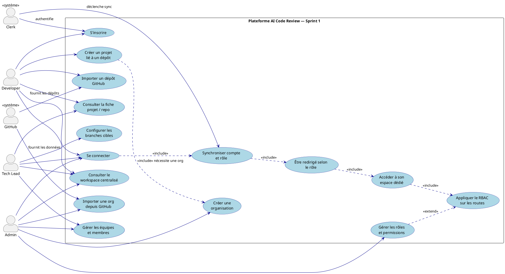

#### Description textuelle des cas d'utilisation du Sprint 1

**Cas principal : Gestion de l'authentification et des accès**

| Élément | Contenu |
|---------|---------|
| **Titre** | Gestion de l'authentification et des accès |
| **Acteurs principaux** | Developer, Tech Lead, Admin |
| **Résumé** | L'utilisateur accède à la plateforme, est authentifié via Clerk, synchronisé vers le backend, redirigé selon son rôle et autorisé uniquement sur les ressources qui lui correspondent. |
| **Pré-condition** | L'utilisateur dispose d'un compte ou d'un mécanisme d'inscription Clerk. |
| **Scénario nominal** | 1. L'utilisateur ouvre l'interface de connexion. 2. Il s'authentifie via Clerk. 3. Le système synchronise les données d'identité et le rôle vers le backend. 4. Le système détermine l'espace cible. 5. L'utilisateur est redirigé. 6. Le RBAC est appliqué sur toutes les actions. |
| **Scénarios alternatifs** | Échec de connexion, session expirée, rôle manquant, compte désactivé, accès interdit à une ressource. |
| **Post-condition** | Une session valide et un périmètre d'accès cohérent sont établis. |

**Cas secondaire : Gestion du workspace, des organisations et des dépôts**

| Élément | Contenu |
|---------|---------|
| **Titre** | Gestion du workspace, des organisations et des dépôts |
| **Acteurs principaux** | Developer, Tech Lead, Admin |
| **Résumé** | Le système permet d'importer des dépôts, créer des projets, gérer les organisations et centraliser l'ensemble dans un workspace unique respectant la hiérarchie organisation → projet → repository. |
| **Pré-condition** | Utilisateur authentifié et autorisé. |
| **Scénario nominal** | 1. L'utilisateur ouvre le workspace. 2. Il crée ou importe une organisation. 3. Il crée un projet rattaché à cette organisation. 4. Il importe un repository GitHub dans le projet. 5. Le Tech Lead configure les branches cibles. 6. Le workspace expose tous les contextes disponibles. |
| **Scénarios alternatifs** | Dépôt introuvable, organisation absente, droits GitHub insuffisants, branche cible invalide. |
| **Post-condition** | Le périmètre de travail est créé, rattaché et visible dans le workspace. |

---

### 3.3 Conception des Cas d'Utilisation

#### Diagramme de classes

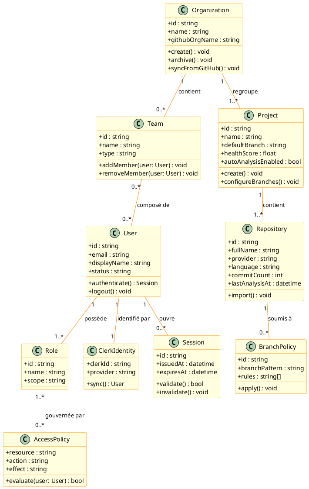

#### Diagramme de séquence

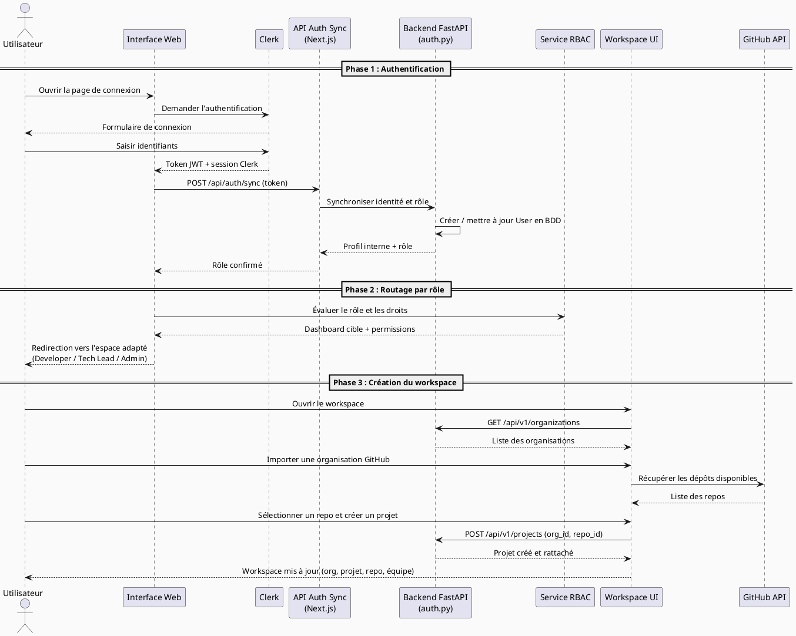

#### Diagramme d'activité

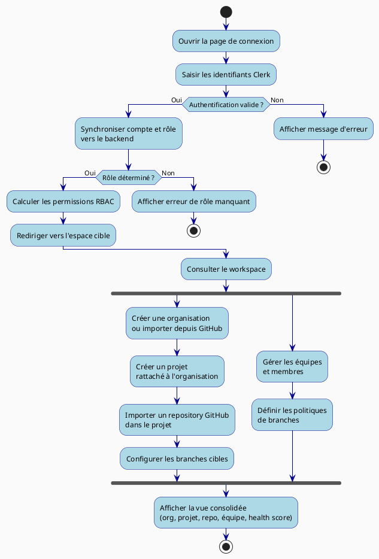

---

### 3.4 Réalisation et Tests

#### Interfaces réalisées

Ce sprint a donné lieu à la mise en place des composants suivants dans le code source :

**Authentification et synchronisation :**
- [`apps/dashboard/middleware.ts`](apps/dashboard/middleware.ts) — Middleware `clerkMiddleware` protégeant toutes les routes `/dashboard/*` ; applique le RBAC en vérifiant le rôle depuis `publicMetadata.role`
- [`apps/dashboard/app/api/auth/sync/route.ts`](apps/dashboard/app/api/auth/sync/route.ts) — Route de synchronisation Clerk → backend ; transmet l'identité et le rôle à l'API FastAPI
- [`apps/backend/app/api/middleware/auth.py`](apps/backend/app/api/middleware/auth.py) — Validation JWT Clerk, cache de 60 secondes du principal authentifié, vérification RBAC
- [`apps/dashboard/lib/auth.ts`](apps/dashboard/lib/auth.ts) — Utilitaires d'authentification côté dashboard

**Gestion des organisations, projets et repositories :**
- [`apps/dashboard/app/api/dashboard/admin/organizations/route.ts`](apps/dashboard/app/api/dashboard/admin/organizations/route.ts) — CRUD organisations (liste, création, archivage)
- [`apps/dashboard/app/api/dashboard/github/import/route.ts`](apps/dashboard/app/api/dashboard/github/import/route.ts) — Import de dépôts GitHub dans la plateforme
- [`apps/dashboard/app/api/dashboard/github/repos/collaborators/route.ts`](apps/dashboard/app/api/dashboard/github/repos/collaborators/route.ts) — Détection des collaborateurs GitHub
- [`apps/dashboard/app/api/dashboard/projects/route.ts`](apps/dashboard/app/api/dashboard/projects/route.ts) — CRUD projets avec rattachement organisation/repository
- [`apps/dashboard/app/api/dashboard/repositories/route.ts`](apps/dashboard/app/api/dashboard/repositories/route.ts) — Gestion des repositories liés aux projets
- [`apps/backend/app/api/http/organizations.py`](apps/backend/app/api/http/organizations.py) — Endpoints FastAPI pour la gestion des organisations
- [`apps/backend/app/api/http/projects.py`](apps/backend/app/api/http/projects.py) — Endpoints FastAPI pour les projets
- [`apps/backend/app/api/http/teams.py`](apps/backend/app/api/http/teams.py) — Endpoints FastAPI pour la gestion des équipes

**Modèles de données :**
- [`apps/backend/app/data/models/rbac.py`](apps/backend/app/data/models/rbac.py) — Modèles Role, Permission, RoleAssignment
- [`apps/backend/app/data/models/org_structure.py`](apps/backend/app/data/models/org_structure.py) — Modèle Organisation et hiérarchie
- [`apps/backend/app/data/models/team.py`](apps/backend/app/data/models/team.py) — Modèle Team et membres
- [`apps/backend/app/data/models/repo_profile.py`](apps/backend/app/data/models/repo_profile.py) — Profil repository avec health score et métriques

#### Tests attendus

| Scénario de test | Critère d'acceptation |
|------------------|-----------------------|
| Connexion réussie pour chaque rôle (Developer, Tech Lead, Admin) | Redirection vers le bon espace, session valide |
| Refus d'accès sur une route interdite au rôle | Code HTTP 403 retourné, message explicite |
| Session expirée | Redirection automatique vers la page de connexion |
| Utilisateur désactivé | Accès refusé à toutes les fonctionnalités |
| Synchronisation correcte de l'identité backend | User créé/mis à jour en BDD avec le bon rôle |
| Import réussi d'un dépôt GitHub | Repository visible dans le workspace avec ses métadonnées |
| Création d'un projet rattaché à une organisation | Projet visible dans la hiérarchie org → projet → repo |
| Ajout et retrait d'un membre d'équipe | Membres et affectations visibles et persistants |
| Affichage cohérent du workspace centralisé | Tous les contextes disponibles sont visibles |
| Violation de la hiérarchie (projet sans org) | Erreur 404 retournée par le backend |

---

### Conclusion

Ce premier sprint a permis d'établir les fondations indispensables de la plateforme. Il garantit que chaque acteur accède au bon espace, avec le bon niveau de droits, dans un cadre sécurisé et structuré. La hiérarchie organisation → projet → repository, imposée dès ce sprint, constitue le contexte organisationnel sur lequel reposent les sprints suivants. Sans cette base, aucun cycle d'analyse ni de revue ne peut être déclenché de façon cohérente.

---

---

# Analyse et mise en œuvre du Sprint 2
## Gestion des analyses IA et du workflow de review

### Introduction

Ce deuxième sprint constitue le cœur fonctionnel de la plateforme AI Code Review. Il couvre le cycle complet allant d'une Pull Request à une analyse automatisée par intelligence artificielle, puis à une review exploitable par le Tech Lead. Le Developer soumet ou consulte ses PRs, déclenche une analyse et lit le rapport produit. Le Tech Lead prend en charge la file de revues, consulte le diff annoté enrichi par l'IA, émet des commentaires ligne par ligne, formule des suggestions de correction et prend les décisions métier (approbation, blocage, assignation, délégation).

---

### 3.1 Spécification Fonctionnelle

**Fonctionnalités à réaliser durant ce sprint :**

*Pull Requests (Epic PR)*
- Page All PRs centralisée avec liste paginée et tri (US-PR-01)
- Filtrage par état métier : `Draft`, `Waiting`, `Approved`, `Return`, `Needs review` (US-PR-02, US-PR-03)
- Accès aux rapports récents liés à une PR (US-PR-04)
- Vue détaillée d'une PR avec contexte complet (US-PR-05)
- Historique des merges, discussions, fichiers modifiés et PRs par repo GitHub (US-PR-06)

*Lancement et suivi des analyses (Epic ANALYSIS)*
- Soumission d'une PR pour analyse (US-ANA-01)
- Suivi de l'état de l'analyse en temps réel : `RECEIVED → QUEUED → RUNNING → COMPLETED/FAILED` (US-ANA-06)
- Liste des analyses avec filtres par statut, projet, repo, équipe et date (US-ANA-07)
- Vue détaillée d'une analyse : overview, rapport, diff, projet associé et métadonnées (US-ANA-08)
- Gestion de l'auto-analyse, suppression et actions de suivi (US-ANA-09)
- Import d'analyse depuis une organisation GitHub ou un repository simple

*Rapport et diff*
- Vue d'ensemble de l'analyse avec résumé du risque
- Findings principaux classés par sévérité
- Rapport structuré et diff annoté
- Vue diff dans un éditeur inline

*Review Tech Lead (Epic REVIEW)*
- Reviews queue avec priorités (US-REV-02, US-REV-09)
- Décisions de review : approuver, bloquer, assigner, déléguer (US-REV-04)
- Historique des revues filtrable (US-REV-05)
- Diff annoté consultable dans l'éditeur (US-REV-03)
- Commentaires ligne par ligne, change request, révision, signal (US-REV-13)
- Suggestions IA basées sur les règles internes, Fix with AI (US-REV-14)
- Review Status Center avec timeline et progression (US-REV-12)
- Templates et paramètres de review (US-REV-07)
- Export et partage des rapports de review (US-REV-11)

**Fonctionnalités volontairement simplifiées :**
- Merge automatique complet vers `main`
- Éditeur GitHub complet avec création/suppression de fichiers et dossiers
- Évaluation RAG avancée
- Graphe 3D complet
- Auto-fix multi-fichiers avancé

---

### 3.2 Analyse des Cas d'Utilisation

#### Diagramme de cas d'utilisation du Sprint 2

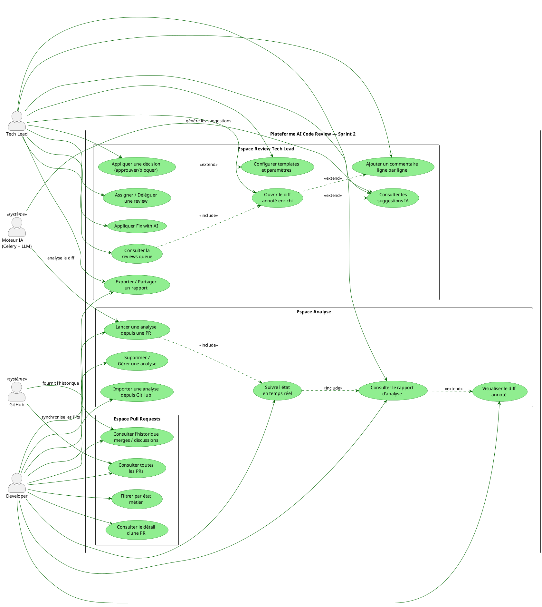

#### Description textuelle des cas d'utilisation du Sprint 2

**Cas 1 : Lancement et suivi des analyses**

| Élément | Contenu |
|---------|---------|
| **Titre** | Gestion du déclenchement et du suivi des analyses |
| **Acteurs principaux** | Developer, Tech Lead |
| **Résumé** | Le Developer déclenche l'analyse d'une PR. Le système crée une exécution, fait progresser l'état en temps réel et expose le résumé ainsi que le rapport de sortie. |
| **Pré-condition** | PR existante dans un projet valide avec un `project_id` reconnu par le backend. |
| **Scénario nominal** | 1. Le Developer ouvre une PR. 2. Il clique sur « Lancer l'analyse ». 3. Le système crée un `AnalysisRun` et enfile la tâche Celery. 4. L'état évolue de `RECEIVED` à `COMPLETED`. 5. Le résumé et le rapport sont disponibles. |
| **Scénarios alternatifs** | PR non rattachée à un projet (404), pipeline Celery saturé, analyse expirée, LLM indisponible. |
| **Post-condition** | Une analyse est associée à la PR et consultable par le Developer et le Tech Lead. |

**Cas 2 : Workflow de review Tech Lead**

| Élément | Contenu |
|---------|---------|
| **Titre** | Gestion des revues et des décisions Tech Lead |
| **Acteur principal** | Tech Lead |
| **Résumé** | Le Tech Lead consulte la file de revues, lit le rapport et le diff annoté, interagit avec les suggestions IA et prend les décisions nécessaires pour faire avancer le workflow. |
| **Pré-condition** | Analyses disponibles dans le périmètre du Tech Lead avec une review assignée. |
| **Scénario nominal** | 1. Le Tech Lead ouvre la reviews queue. 2. Il choisit une review prioritaire. 3. Il consulte le diff annoté et les findings. 4. Il lit les suggestions IA. 5. Il applique une décision (approuver, bloquer, assigner). 6. Le système met à jour l'état et historise l'action. |
| **Scénarios alternatifs** | Analyse non terminée, conflit de review simultanée, suggestion IA rejetée, délégation refusée. |
| **Post-condition** | La review change d'état et le suivi reste traçable dans l'historique. |

---

### 3.3 Conception des Cas d'Utilisation

#### Diagramme de classes

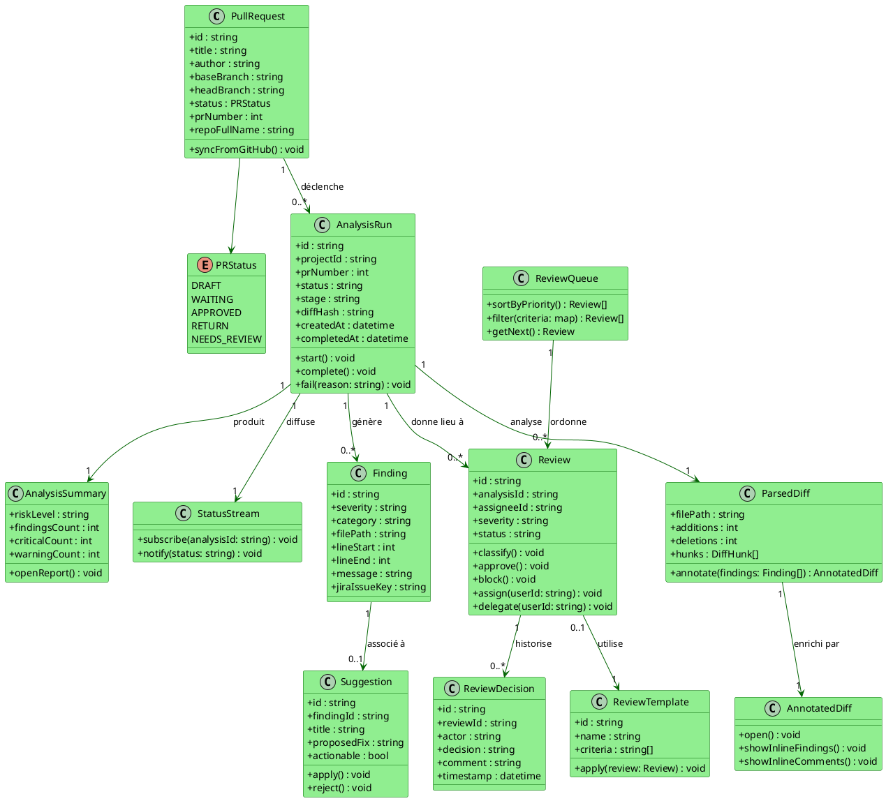

#### Diagramme de séquence

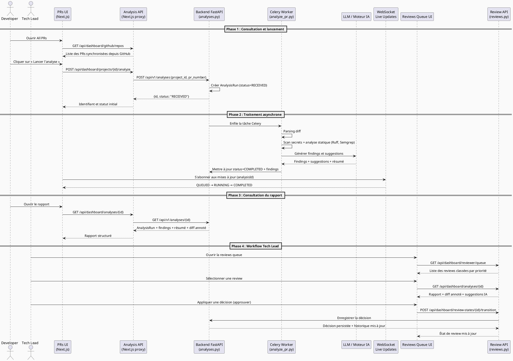

#### Diagramme d'activité

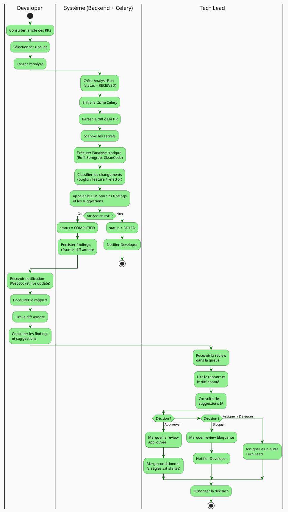

---

### 3.4 Réalisation et Tests

#### Interfaces réalisées

**Pipeline d'analyse (backend) :**
- [`apps/backend/app/api/http/analyses.py`](apps/backend/app/api/http/analyses.py) — Endpoints FastAPI : `POST /v1/analyses`, `GET /v1/analyses/{id}`, liste avec filtres, suppression
- [`apps/backend/app/workers/tasks/analyze_pr.py`](apps/backend/app/workers/tasks/analyze_pr.py) — Tâche Celery principale orchestrant le pipeline complet (parsing → secrets → statique → LLM → persistance)
- [`apps/backend/app/data/models/analysis.py`](apps/backend/app/data/models/analysis.py) — Modèle `Analysis` avec statut, stage, diff_hash, findings counts
- [`apps/backend/app/data/models/finding.py`](apps/backend/app/data/models/finding.py) — Modèle `Finding` avec sévérité, catégorie, position dans le fichier
- [`apps/backend/app/data/models/parsed_diff.py`](apps/backend/app/data/models/parsed_diff.py) — Modèle de diff parsé avec hunks

**Reviews et décisions (backend) :**
- [`apps/backend/app/api/http/reviews.py`](apps/backend/app/api/http/reviews.py) — Endpoints de review : soumission, commentaires, décisions
- [`apps/backend/app/api/http/review_queue.py`](apps/backend/app/api/http/review_queue.py) — Gestion de la file de revues et des assignations
- [`apps/backend/app/api/http/review_states.py`](apps/backend/app/api/http/review_states.py) — Transitions d'état du workflow de review
- [`apps/backend/app/api/http/suggestions.py`](apps/backend/app/api/http/suggestions.py) — Suggestions IA et application de Fix with AI
- [`apps/backend/app/data/models/review_state.py`](apps/backend/app/data/models/review_state.py) — Machine à états du workflow de review

**Interfaces proxy dashboard (Next.js) :**
- [`apps/dashboard/app/api/dashboard/analyses/route.ts`](apps/dashboard/app/api/dashboard/analyses/route.ts) — Proxy vers le backend pour la liste et le détail des analyses
- [`apps/dashboard/app/api/dashboard/projects/[repoId]/analyze/route.ts`](apps/dashboard/app/api/dashboard/projects/[repoId]/analyze/route.ts) — Déclenchement d'une analyse depuis une PR
- [`apps/dashboard/app/api/dashboard/reviewer/metrics/route.ts`](apps/dashboard/app/api/dashboard/reviewer/metrics/route.ts) — Métriques du reviewer et leaderboard
- [`apps/dashboard/app/api/dashboard/rag/impact/route.ts`](apps/dashboard/app/api/dashboard/rag/impact/route.ts) — Analyse d'impact RAG sur le diff

#### Tests attendus

| Scénario de test | Critère d'acceptation |
|------------------|-----------------------|
| Déclenchement réussi d'une analyse sur une PR valide | AnalysisRun créé, statut RECEIVED visible immédiatement |
| Suivi en temps réel de l'état | WebSocket diffuse QUEUED → RUNNING → COMPLETED sans rechargement |
| Consultation du résumé sans rechargement | Rapport accessible dès COMPLETED, findings et risque visibles |
| Lien cohérent PR ↔ analyse ↔ rapport | Navigation PR → analyse → rapport sans rupture de contexte |
| Affichage ordonné de la reviews queue | Liste triée par priorité et ancienneté |
| Ouverture cohérente du diff annoté | Findings alignés sur les bonnes lignes du diff |
| Persistance des décisions de review | Décision stockée, historique accessible et filtrable |
| Application correcte d'un template de review | Critères du template appliqués à la review |
| Filtrage des analyses par statut, projet, repo | Tableau filtré, résultats cohérents |
| Suppression d'une analyse | Analyse supprimée, rapport inaccessible |

---

### Conclusion

Ce sprint constitue la valeur centrale de la plateforme. Il fait le pont entre un dépôt GitHub et une décision de qualité humaine enrichie par l'IA. Le cycle PR → analyse → rapport → review → décision est désormais opérationnel et traçable. La plateforme passe ainsi d'un simple outil d'hébergement à un véritable système d'intelligence de revue. Le sprint suivant capitalise sur ce cœur pour y ajouter la dimension collective, les intégrations externes et l'accessibilité mobile.

---

---

# Analyse et mise en œuvre du Sprint 3
## Gestion du pilotage, des intégrations et de l'expérience mobile

### Introduction

Ce troisième sprint finalise la plateforme en ajoutant les dimensions de pilotage managérial, de gouvernance administrative, d'intégration avec les outils tiers (Jira, Slack, GitHub avancé) et d'accessibilité mobile. Il transforme le cœur fonctionnel construit dans les deux premiers sprints en une solution exploitable dans un environnement d'équipe réel. À l'issue de ce sprint, un Admin peut gouverner la plateforme, configurer la base de connaissances et superviser l'observabilité ; un Tech Lead dispose d'analytics d'équipe et d'indicateurs de performance ; un Developer reçoit des notifications ciblées et peut suivre ses PRs depuis un mobile.

---

### 3.1 Spécification Fonctionnelle

**Fonctionnalités à réaliser durant ce sprint :**

*Analytics et insights (Epic TEAM_ANALYTICS)*
- Team analytics : SLA, throughput, leaderboard, review activity trend (US-TA-01, US-TA-03)
- My analytics : KPIs personnels, qualityScore, findingsRate (US-TA-02)
- Vue consolidée : vue analytics multi-dimension (US-TA-04)
- Historique d'activité par projet, équipe et utilisateur (US-TA-05)
- Insights engineering : PR merged per engineer, median PR size, time to first review, lines modified (US-TA-06)
- Export CSV, filtrage, invitation de teammates (US-TA-07)

*Administration (Epic ADMIN_PLATFORM)*
- Dashboard admin : KB, policy, users, integrations, observabilité, organisations (US-ADM-06)
- Gestion des utilisateurs et des rôles (US-ADM-01)
- Gestion des secrets chiffrés par projet (US-ADM-02)
- Gestion des politiques et règles de branches (US-ADM-03)
- Gestion des intégrations (GitHub, Jira, Slack, CI) (US-ADM-04)
- Piste d'audit consultable (US-ADM-05)

*Knowledge Base et RAG simplifié (Epic KNOWLEDGE)*
- Import de documents (ancien code, Markdown, PDF, pages web) (US-KB-01, US-KB-07)
- Administration de la base de connaissances (US-KB-04)
- Priorisation des règles d'organisation (US-KB-03)
- Règles appliquées visibles dans le contexte de revue (US-KB-05)
- Évaluation RAG simplifiée : comparaison avec/sans GraphRAG, précision, recall, F1 (US-KB-08)

*Intégrations*
- Jira : domain, email, API token, board, issues, analytics (US-JIRA-01)
- GitHub (étendu)
- Slack et Microsoft Teams

*Observabilité (Epic OBS_JIRA)*
- Dashboard d'observabilité : services, alertes, CPU, memory, system health (US-OBS-01)
- Pilotage visuel de l'activité et de la vélocité de review (US-OBS-02)
- État API, base de données, Redis et jobs en arrière-plan

*Notifications et expérience mobile (Epic NOTIF_MOBILE)*
- Notifications in-app en temps réel (US-NM-01)
- Notifications email critiques (US-NM-02)
- Notifications Slack pour Tech Lead (US-NM-03)
- Application mobile : authentification, All PRs, résumé d'analyse, health indicators (US-NM-04, US-NM-05)
- Préférences de notification par canal (US-NM-06)
- Centre d'activité synchronisé web-mobile (US-NM-07)

**Fonctionnalités volontairement simplifiées :**
- Personnalisation fine de toutes les préférences
- Export PDF de tous les dashboards
- Observabilité avancée type SRE
- Automatisation CI/CD complète

---

### 3.2 Analyse des Cas d'Utilisation

#### Diagramme de cas d'utilisation du Sprint 3

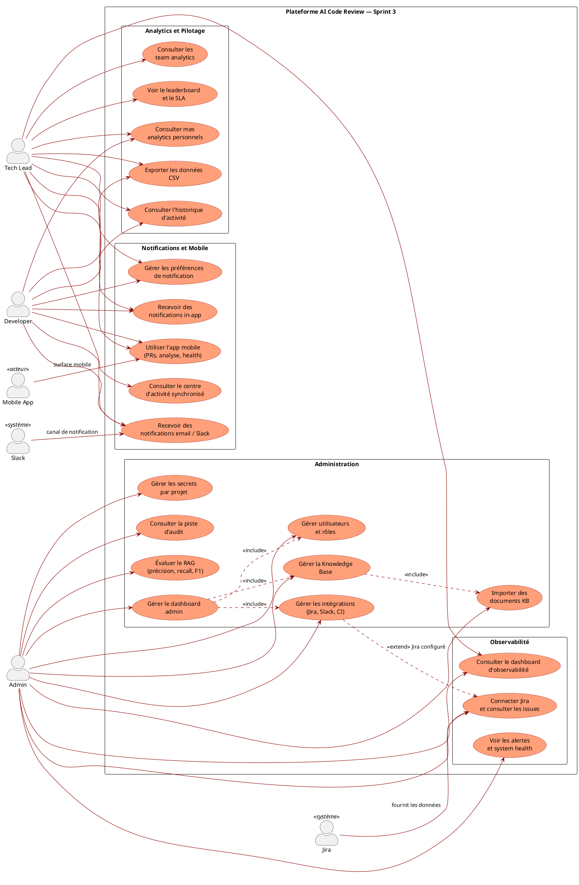

#### Description textuelle des cas d'utilisation du Sprint 3

**Cas 1 : Gestion des équipes, des affectations et des analytics**

| Élément | Contenu |
|---------|---------|
| **Titre** | Gestion des équipes, des affectations et des analytics |
| **Acteurs principaux** | Tech Lead, Developer |
| **Résumé** | Le Tech Lead pilote ses membres, suit l'historique et mesure la performance collective et individuelle grâce aux dashboards analytics. |
| **Pré-condition** | Organisations et équipes existantes, reviews et analyses effectuées. |
| **Scénario nominal** | 1. Le Tech Lead consulte son équipe. 2. Il gère les membres et les affectations. 3. Il ouvre l'historique des reviews. 4. Il consulte les analytics individuels et d'équipe. 5. Il exporte les données en CSV. |
| **Post-condition** | Le suivi collectif et individuel devient exploitable pour le pilotage. |

**Cas 2 : Gestion de l'administration, des politiques et des intégrations**

| Élément | Contenu |
|---------|---------|
| **Titre** | Gestion de l'administration, des politiques et des intégrations |
| **Acteur principal** | Admin |
| **Résumé** | L'Admin gouverne les paramètres sensibles, les intégrations (Jira, Slack), la base de connaissances et la traçabilité de la plateforme depuis un dashboard unifié. |
| **Pré-condition** | Accès admin valide et projets existants. |
| **Scénario nominal** | 1. L'Admin ouvre le panneau d'administration. 2. Il importe des documents dans la KB. 3. Il configure ou teste une intégration (Jira, Slack). 4. Il ajuste une policy. 5. Il consulte la piste d'audit. |
| **Post-condition** | La plateforme est gouvernée et reliée à ses systèmes externes. |

**Cas 3 : Gestion des notifications et de l'expérience mobile**

| Élément | Contenu |
|---------|---------|
| **Titre** | Gestion des notifications et de l'expérience mobile |
| **Acteurs principaux** | Developer, Tech Lead |
| **Résumé** | Le système informe les utilisateurs sur les bons canaux et leur permet de prolonger les parcours prioritaires sur mobile. |
| **Pré-condition** | Utilisateur authentifié, PRs et analyses existantes. |
| **Scénario nominal** | 1. Le système émet une notification (nouvelle review, analyse terminée). 2. L'utilisateur la reçoit sur le canal adapté (in-app, email, Slack, push mobile). 3. Il ouvre l'application web ou mobile. 4. Il consulte l'information ou agit. |
| **Post-condition** | La plateforme reste utilisable et réactive sur tous les supports prioritaires. |

---

### 3.3 Conception des Cas d'Utilisation

#### Diagramme de classes

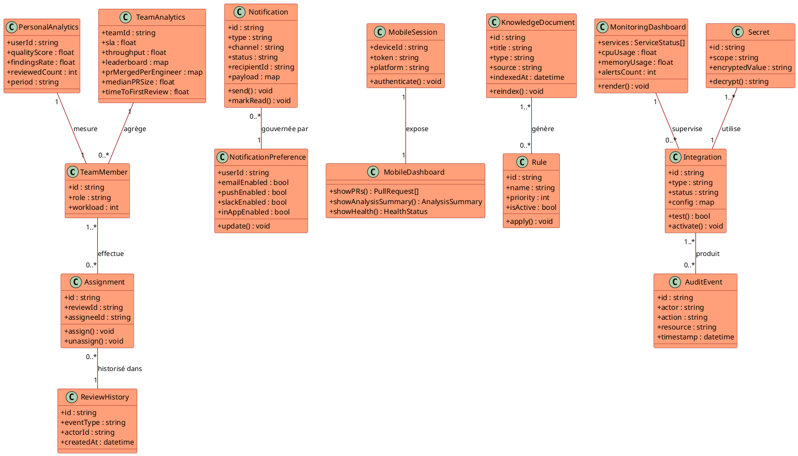

#### Diagramme de séquence

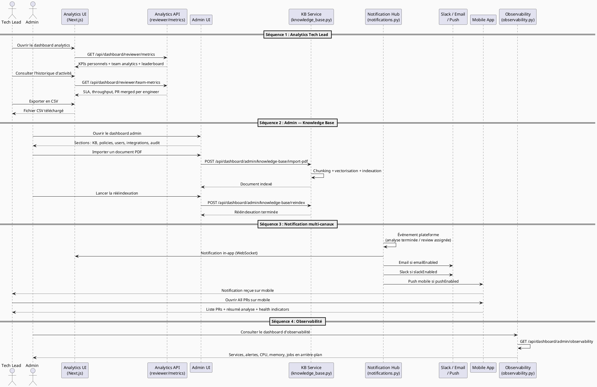

#### Diagramme d'activité

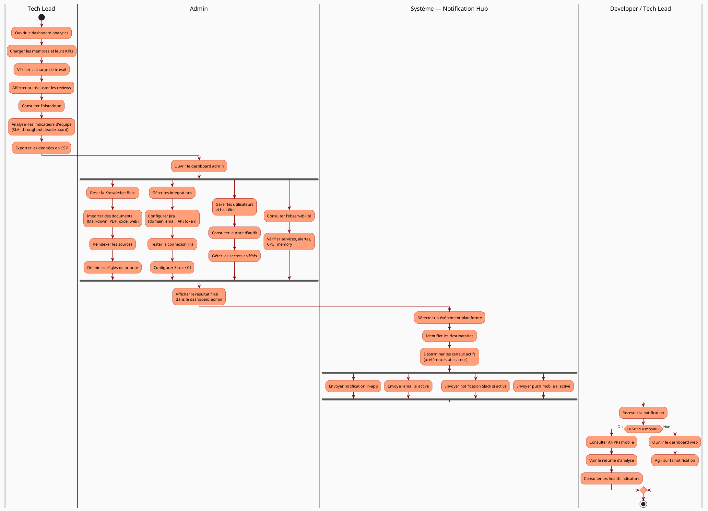

---

### 3.4 Réalisation et Tests

#### Interfaces réalisées

**Analytics et métriques (backend) :**
- [`apps/backend/app/api/http/reviewer_metrics.py`](apps/backend/app/api/http/reviewer_metrics.py) — KPIs reviewer, team analytics, leaderboard, throughput, SLA
- [`apps/backend/app/api/http/statistics.py`](apps/backend/app/api/http/statistics.py) — Métriques globales, tendances et rapports statistiques
- [`apps/backend/app/data/repos/reviewer_metrics_repo.py`](apps/backend/app/data/repos/reviewer_metrics_repo.py) — Persistance des métriques de performance

**Administration et gouvernance (backend) :**
- [`apps/backend/app/api/http/knowledge_base.py`](apps/backend/app/api/http/knowledge_base.py) — Import, indexation, réindexation et gestion de la KB
- [`apps/backend/app/api/http/observability.py`](apps/backend/app/api/http/observability.py) — État des services, alertes, métriques système
- [`apps/backend/app/api/http/jira_integration.py`](apps/backend/app/api/http/jira_integration.py) — Connexion Jira, synchronisation tickets, analytics
- [`apps/backend/app/api/http/integrations.py`](apps/backend/app/api/http/integrations.py) — Gestion multi-intégrations (GitHub, Slack, CI)
- [`apps/backend/app/api/http/notifications.py`](apps/backend/app/api/http/notifications.py) — Envoi de notifications multi-canaux et gestion des préférences
- [`apps/backend/app/api/http/security.py`](apps/backend/app/api/http/security.py) — Gestion des secrets chiffrés par projet
- [`apps/backend/app/api/http/rag_evaluation.py`](apps/backend/app/api/http/rag_evaluation.py) — Évaluation RAG : précision, recall, F1, comparaison GraphRAG

**Dashboard admin (Next.js proxy) :**
- [`apps/dashboard/app/api/dashboard/admin/organizations/route.ts`](apps/dashboard/app/api/dashboard/admin/organizations/route.ts) — Gestion organisations depuis l'admin
- [`apps/dashboard/app/api/dashboard/admin/knowledge-base/import-pdf/route.ts`](apps/dashboard/app/api/dashboard/admin/knowledge-base/import-pdf/route.ts) — Import de PDFs dans la KB
- [`apps/dashboard/app/api/dashboard/admin/knowledge-base/reindex/route.ts`](apps/dashboard/app/api/dashboard/admin/knowledge-base/reindex/route.ts) — Réindexation de la KB
- [`apps/dashboard/app/api/dashboard/admin/observability/route.ts`](apps/dashboard/app/api/dashboard/admin/observability/route.ts) — Tableau de bord d'observabilité
- [`apps/dashboard/app/api/dashboard/jira/config/route.ts`](apps/dashboard/app/api/dashboard/jira/config/route.ts) — Configuration de l'intégration Jira
- [`apps/dashboard/app/api/dashboard/rag/impact/route.ts`](apps/dashboard/app/api/dashboard/rag/impact/route.ts) — Analyse d'impact via RAG
- [`apps/dashboard/app/api/dashboard/reviewer/metrics/route.ts`](apps/dashboard/app/api/dashboard/reviewer/metrics/route.ts) — Métriques reviewer et team analytics
- [`apps/dashboard/hooks/use-notifications.ts`](apps/dashboard/hooks/use-notifications.ts) — Hook React pour les notifications in-app
- [`apps/dashboard/components/notifications/NotificationBell.tsx`](apps/dashboard/components/notifications/NotificationBell.tsx) — Composant cloche de notifications avec compteur non-lus
- [`apps/dashboard/components/evaluation/RagEvaluationPro.tsx`](apps/dashboard/components/evaluation/RagEvaluationPro.tsx) — Interface d'évaluation RAG (précision, recall, F1)

**Expérience mobile :**
- [`apps/backend/app/api/http/mobile.py`](apps/backend/app/api/http/mobile.py) — Endpoints optimisés pour la surface mobile (résumés compacts, health indicators)
- [`apps/dashboard/app/api/dashboard/health/mobile/route.ts`](apps/dashboard/app/api/dashboard/health/mobile/route.ts) — Health check mobile

#### Tests attendus

| Scénario de test | Critère d'acceptation |
|------------------|-----------------------|
| Affichage des KPIs personnels pour un Developer | qualityScore, findingsRate et reviewedCount visibles et calculés |
| Dashboard d'équipe fiable pour le Tech Lead | SLA, throughput, leaderboard cohérents avec les données réelles |
| Export CSV des données analytics | Fichier CSV téléchargé avec filtres appliqués |
| Import d'un document PDF dans la KB | Document indexé, disponible dans les recherches KB |
| Édition et réindexation d'une source KB | Source mise à jour, recherches retournent les nouvelles données |
| Affichage des règles dans le contexte de revue | Règles citées visibles dans le rapport de review |
| Connexion Jira fonctionnelle | Board Jira accessible, issues listées et linkables |
| Notification in-app reçue en temps réel | Notification visible sans rechargement, badge mis à jour |
| Notification email envoyée selon les règles | Email reçu avec le bon contenu selon les préférences |
| Notification Slack avec contexte | Message Slack formaté avec lien vers la review |
| Parcours mobile : All PRs, résumé, health | Toutes les vues mobiles chargent et affichent les bonnes données |
| Dashboard d'observabilité | Services, alertes, CPU, memory et jobs visibles et actualisés |
| Évaluation RAG : précision, recall, F1 | Métriques calculées, comparaison avec/sans GraphRAG affichée |
| Piste d'audit consultable | Actions historisées avec acteur, action, ressource et timestamp |

---

### Conclusion

Ce troisième sprint finalise la plateforme AI Code Review en la dotant d'une dimension managériale, d'une couche de gouvernance solide et d'une accessibilité multi-surface. Il prouve que la solution peut être exploitée dans un contexte d'équipe réel : le Tech Lead dispose d'instruments de pilotage fiables, l'Admin gouverne la connaissance et les intégrations, et l'ensemble des acteurs reçoit l'information au bon endroit, au bon moment, que ce soit sur le web ou sur mobile. La plateforme est désormais complète, cohérente et industrialisable.

---

---

## Conclusion générale du chapitre

Ce chapitre a présenté l'analyse et la mise en œuvre des trois sprints de la Release 1 de la plateforme AI Code Review, selon une progression logique et pédagogique.

Le **Sprint 1** a posé les fondations indispensables : authentification sécurisée via Clerk, synchronisation des rôles, application du RBAC et structuration de l'environnement de travail (organisations, projets, repositories, équipes). Sans ce socle, aucun cycle d'analyse ne peut être lancé.

Le **Sprint 2** a construit le cœur fonctionnel de la plateforme : du déclenchement d'une analyse sur une Pull Request jusqu'à la décision de review émise par le Tech Lead, en passant par le pipeline asynchrone d'intelligence artificielle, le diff annoté et les suggestions de correction IA. C'est ce sprint qui justifie la valeur ajoutée de la plateforme.

Le **Sprint 3** a complété et industrialisé la solution : analytics d'équipe et personnels, administration centralisée, base de connaissances avec RAG, intégrations Jira/Slack, observabilité système et expérience mobile. Il transforme un outil de revue en une véritable plateforme de pilotage de la qualité logicielle.

Chaque sprint a été décrit selon le même cadre méthodologique : spécification fonctionnelle, analyse par cas d'utilisation avec diagrammes PlantUML, conception détaillée (classes, séquences, activités) et réalisation technique ancrée dans le code source réel. Ce cadre garantit la cohérence entre les choix de conception et leur traduction en implémentation.
