# Plateforme AI Code Review
## Analyse et mise en oeuvre detaillee des sprints

Ce document complete le plan principal contenu dans `RELEASE_SPRINT_PLAN_REFACTORED.md`.
Il conserve exactement le decoupage des sprints et ajoute, pour chaque sprint:

- une introduction
- une specification fonctionnelle
- une analyse des cas d'utilisation
- une conception detaillee
- une section realisation et tests
- une conclusion

Les diagrammes sont fournis en Mermaid afin d'etre reutilisables dans la documentation technique, dans le memoire ou dans des supports de conception.

---

## 0) Reclassement des fonctionnalites existantes du systeme

Cette section rattache explicitement les fonctionnalites visibles de la plateforme au bon sprint de la Release 1. Elle sert de reference pour enrichir les diagrammes de cas d'utilisation, de sequence, d'activite et de classes sans changer le decoupage des sprints deja etabli.

### Tableau de reclassement complet des fonctionnalites

| Fonctionnalite | Acteur principal | Surface | Sprint |
|---|---|---|---|
| Inscription / connexion Clerk | Tous | Web + Mobile | Sprint 1 |
| Synchronisation comptes et roles | Admin | Backend | Sprint 1 |
| Redirection par role (RBAC) | Tous | Web + Mobile | Sprint 1 |
| Gestion utilisateurs, roles, permissions | Admin | Web admin | Sprint 1 + Sprint 7 |
| Workspace central, sync Clerk / GitHub | Admin, Developer, Tech Lead | Web | Sprint 2 |
| Creation organisation (plateforme ↔ GitHub) | Admin | Web admin | Sprint 2 + Sprint 7 |
| Gestion equipes (Dev, DevOps, etc.) | Admin, Tech Lead | Web | Sprint 2 |
| Fiches projet/repo : branches, teams, langage, health score | Developer, Tech Lead | Web | Sprint 2 + Sprint 4 |
| Auto-analyse activee/desactivee par projet | Tech Lead, Admin | Web | Sprint 2 + Sprint 4 |
| All PRs : draft, waiting, approved, return, needs review | Developer, Tech Lead | Web + Mobile | Sprint 3 + Sprint 8 |
| Historique merges, discussions, changed files, recently merged | Developer, Tech Lead | Web | Sprint 3 |
| Lancement analyse, liste, filtres, detail, suppression, rapport | Developer, Tech Lead, Admin | Web | Sprint 4 |
| Import analyse depuis GitHub orgs / repo simple | Developer, Tech Lead | Web | Sprint 4 |
| Vue diff (editeur inline) | Developer, Tech Lead | Web | Sprint 4 + Sprint 5 |
| Commentaires ligne, change request, revision, signal | Developer, Tech Lead | Web | Sprint 5 |
| Suggestions IA, Fix with AI, validation auto, merge auto conditionnel | Developer, Tech Lead | Web | Sprint 5 |
| Reviews queue, priorite, blocage, delegation, assignation | Tech Lead | Web | Sprint 5 |
| My Reviews, Review Status Center, timeline, review progress | Tech Lead | Web | Sprint 5 + Sprint 10 |
| Templates de review | Tech Lead | Web | Sprint 5 |
| Review Settings | Tech Lead, Admin | Web | Sprint 5 |
| Team analytics, my analytics, review activity trend, SLA, leaderboard | Tech Lead, Developer | Web | Sprint 6 |
| Insights engineering : PR merge per engineer, lines modified, median PR size | Developer, Tech Lead | Web | Sprint 6 + Sprint 11 |
| Fast facts, user lists, CSV, invite teammates | Developer, Tech Lead | Web | Sprint 6 + Sprint 11 |
| Dashboard admin : KB, policy, users, integrations, observability, orgs | Admin | Web admin | Sprint 7 |
| Knowledge Base : sources indexees, graphe 3D, network density, daily searches | Admin | Web admin | Sprint 7 |
| Sources KB : ancien code, Markdown, PDF, pages web, export | Admin | Web admin | Sprint 7 + Sprint 11 |
| RAG evaluation : comparaison avec/sans GraphRAG, precision, recall, F1 | Admin, Tech Lead | Web admin | Sprint 7 + Sprint 11 |
| Observability dashboard : services, alerts, CPU, memory, system health | Admin, Tech Lead | Web admin | Sprint 7 |
| Jira integration : domain, email, API token, board, issues, analytics | Admin, Tech Lead, Developer | Web | Sprint 7 |
| Editeur GitHub : tree, fichiers, dossiers, edition, commit, branch, PR | Developer, Tech Lead | Web | Sprint 9 + Sprint 10 |
| Notifications in-app, email, Slack, push web + mobile | Tous | Web + Mobile | Sprint 8 + Sprint 12 |
| Authentification mobile, All PRs mobile, resume analyse, health mobile | Developer, Tech Lead | Mobile | Sprint 8 |
| Recherche globale, navigation transversale, breadcrumbs | Tous | Web | Sprint 9 |
| Inbox review, files d'attention, conversations de revue | Tech Lead, Developer | Web | Sprint 10 |
| Historique detaille, export rapport, partage, tracabilite decisions | Tous | Web | Sprint 11 |
| Preferences notification, centre d'activite, sync web-mobile | Tous | Web + Mobile | Sprint 12 |

---

## 0.1 Details fonctionnels obligatoires par sprint

### Sprint 1 - Authentification et acces

- Inscription / connexion Clerk pour tous les acteurs.
- Synchronisation comptes et roles.
- Redirection par role avec RBAC.
- Gestion utilisateurs, roles et permissions.

### Sprint 2 - Workspace, organisations, projets et repositories

- La hierarchie est obligatoire: `organisation -> projet -> repository`.
- Un projet ne peut pas etre cree s'il n'est pas relie a une organisation creee sur la plateforme ou importee depuis GitHub.
- Un repository ne peut pas etre cree ou importe s'il n'appartient pas a un projet.
- Une organisation peut etre creee sur la plateforme et reliee a GitHub.
- Une organisation GitHub peut etre importee dans la plateforme.
- Les membres, collaborateurs et contributeurs GitHub doivent etre detectes puis invites dans la plateforme.
- Les equipes peuvent etre de type developpement, DevOps ou autre equipe projet.
- Les fiches projet/repo affichent branches, teams, langage, health score, auto-analyse activee/desactivee, nombre de commits, nombre de repos, description, statut, organisation liee et activite.

### Sprint 3 - Pull requests et espace Developer

- All pull requests avec statuts: Draft, Waiting, Approved, Return, Needs review.
- Historique merge, discussions, changed files, recently merged.
- Detail complet d'une PR synchronisee avec GitHub.

### Sprint 4 - Analyses

- Lancement analyse.
- Liste analyses.
- Filtres.
- Detail analyse.
- Suppression analyse.
- Rapport.
- Import analyse depuis GitHub organization ou repo simple.
- Vue diff en editeur inline.

### Sprint 5 - Review, diff editor et IA

- Vue diff avec editeur inline.
- Modification de code.
- Commentaires ligne par ligne.
- Change request.
- Revision.
- Signal.
- Suggestions IA a partir de la Knowledge Base.
- Fix with AI.
- Validation automatique.
- Merge automatique conditionnel.
- Reviews queue.
- Priorites.
- Blocage.
- Delegation.
- Assignation.
- My Reviews.
- Review Status Center.
- Timeline.
- Review progress.
- Templates de review.
- Review Settings.

### Sprint 6 - Analytics et insights

- Team analytics.
- My analytics.
- Review activity trend.
- SLA.
- Leaderboard.
- Insights engineering.
- PR merged per engineer.
- Lines modified.
- Median PR size.
- Fast facts.
- User lists.
- CSV.
- Invite teammates.

### Sprint 7 - Administration, Knowledge Base, observability et Jira

- Dashboard admin.
- Knowledge Base.
- Policy and rules.
- Users.
- Integrations.
- Observability.
- Organizations.
- Knowledge Base avec sources indexees, graphe 3D, network density, daily searches.
- Sources KB: ancien code, Markdown, PDF, pages web, export.
- RAG evaluation: comparaison avec/sans GraphRAG, precision, recall, F1.
- Observability dashboard: services, alerts, CPU, memory, system health.
- Jira integration: domain, email, API token, board, issues, analytics.

### Sprint 8 - Notifications et mobile

- Notifications in-app.
- Notifications Slack.
- Notifications Microsoft Teams.
- Push web.
- Push mobile.
- Email.
- Authentification mobile.
- All PRs mobile.
- Resume analyse mobile.
- Health mobile.

### Sprint 9 - Recherche et editeur GitHub

- Recherche globale.
- Navigation transversale.
- Breadcrumbs.
- Editeur GitHub.
- Tree.
- Fichiers.
- Dossiers.
- Edition.
- Commit.
- Branch.
- Pull request.

### Sprint 10 - Inbox review et conversations

- Inbox review.
- Files d'attention.
- Conversations de revue.
- Collaboration Developer / Tech Lead.

### Sprint 11 - Historisation, export et tracabilite

- Historique detaille.
- Export rapport.
- Partage.
- Tracabilite decisions.
- Export CSV.
- Export PDF.

### Sprint 12 - Preferences et synchronisation web-mobile

- Preferences notification.
- Centre d'activite.
- Synchronisation web-mobile.
- Continuite des statuts, alertes et actions entre les deux surfaces.

---

# Release 1 - Plateforme Web & Mobile Operationnelle Complete

## Analyse et mise en oeuvre du Sprint 1
### Gestion de l'authentification et des acces

### Introduction
Dans l'optique de mettre en service la plateforme AI Code Review, ce premier sprint etablit les fondations d'acces au systeme. Il couvre l'authentification, la synchronisation des comptes, la redirection par role, la securisation des interfaces et le controle des permissions. Ce sprint conditionne directement tout le reste du parcours web et mobile, car aucun acteur ne peut exploiter la plateforme sans un mecanisme d'acces fiable, coherent et gouverne.

### 3.1 Specification Fonctionnelle
La question ouvrant cette phase d'analyse est: « Que doit realiser le systeme pour permettre l'entree controlee dans la plateforme ? »

Fonctionnalites a realiser durant ce sprint:
- inscription et connexion via Clerk
- synchronisation des comptes et des roles entre le fournisseur d'identite et le backend
- redirection automatique vers l'espace `Developer`, `Tech Lead` ou `Admin`
- application du RBAC sur les routes et endpoints critiques
- gestion initiale des comptes utilisateurs et des roles

### 3.2 Analyse des Cas d'Utilisation
#### Diagramme de cas d'utilisation du sprint 1
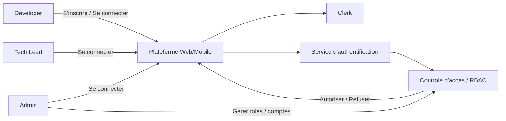

Ce diagramme montre que tous les acteurs passent par une authentification centralisee avant toute action metier. Une fois connecte, le systeme determine le role, synchronise les informations utiles, puis applique les regles de controle d'acces. L'Admin dispose en plus de fonctions de gouvernance sur les comptes et les droits.

#### Description textuelle de cas d'utilisation du sprint 1
| Titre | Gestion de l'authentification et des acces |
|---|---|
| Acteurs principaux | Developer, Tech Lead, Admin |
| Resume | L'utilisateur accede a la plateforme, est authentifie, synchronise, redirige selon son role et autorise sur les ressources qui lui correspondent. |
| Pre-condition | L'utilisateur dispose d'un compte ou d'un mecanisme d'inscription. |
| Scenario nominal | 1. L'utilisateur ouvre l'interface de connexion. 2. Il s'authentifie. 3. Le systeme synchronise les donnees d'identite. 4. Le systeme determine le role. 5. L'utilisateur est redirige vers son espace. 6. Le systeme applique les regles RBAC sur les pages et APIs. |
| Scenarios alternatifs | Echec de connexion, session expiree, role manquant, compte desactive, acces interdit a une ressource. |
| Post-condition | Une session valide et un perimetre d'acces coherent sont etablis. |

### 3.3 Conception des Cas d'Utilisation
#### Diagramme de classes
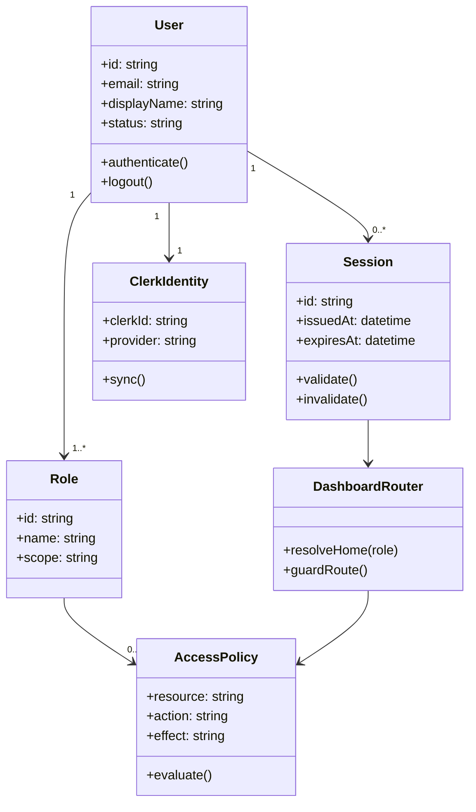

#### Diagramme de sequence
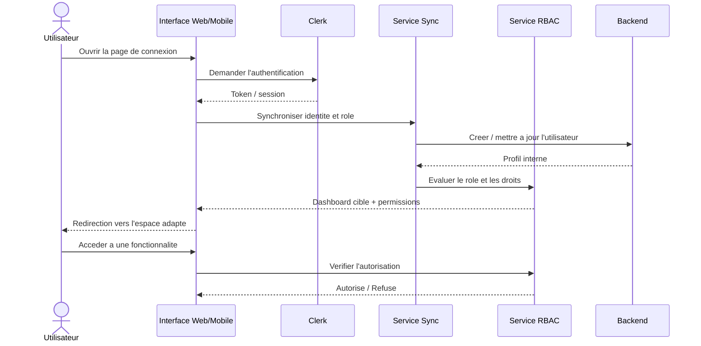

#### Diagramme d'activite
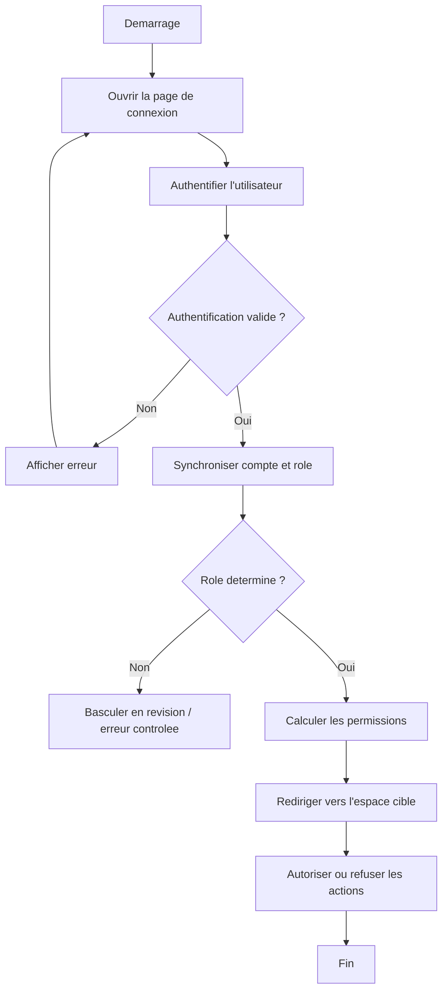

### 3.4 Realisation et Tests
Les interfaces a realiser dans ce sprint sont:
- ecran d'inscription et de connexion
- ecrans d'erreur d'acces et de session expiree
- routage par role
- panneau initial de gestion des comptes et des roles

Tests attendus:
- connexion reussie pour chaque role
- refus d'acces sur route interdite
- session expiree avec redirection
- utilisateur desactive non autorise
- synchronisation correcte des identites backend

### Conclusion
Ce sprint pose le socle d'entree dans la plateforme. Il garantit que chaque acteur accede au bon espace, avec le bon niveau de droit, et dans un cadre securise. Sans cette base, les sprints suivants ne pourraient pas produire des parcours exploitables de bout en bout.

---

## Analyse et mise en oeuvre du Sprint 2
### Gestion du workspace, des organisations et des depots

### Introduction
Apres la mise en place de l'acces, le second sprint a pour objectif de construire l'environnement de travail de la plateforme. Il couvre l'import des depots, la creation des projets, la structuration des organisations et des equipes, ainsi que la navigation centralisee dans le workspace. Ce sprint relie l'identite de l'utilisateur a son perimetre de travail concret.

### 3.1 Specification Fonctionnelle
Fonctionnalites a realiser durant ce sprint:
- importer un depot GitHub
- creer un projet lie a un depot
- gerer les organisations et les equipes
- configurer les branches cibles
- centraliser les projets, equipes et depots dans le workspace

### 3.2 Analyse des Cas d'Utilisation
#### Diagramme de cas d'utilisation du sprint 2
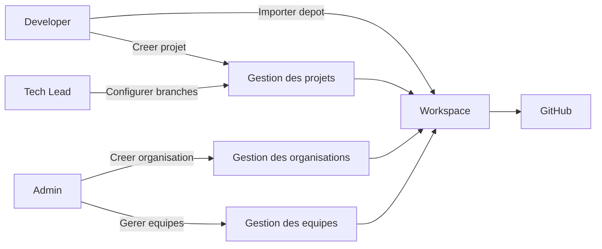

Le systeme permet ici de passer d'une simple identite authentifiee a un environnement structure. Le Developer travaille sur des repos et projets, le Tech Lead parametre le cadre de travail du projet, et l'Admin gouverne les structures globales.

#### Description textuelle de cas d'utilisation du sprint 2
| Titre | Gestion du workspace, des organisations et des depots |
|---|---|
| Acteurs principaux | Developer, Tech Lead, Admin |
| Resume | Le systeme permet d'importer des depots, creer des projets, gerer les organisations et centraliser l'ensemble dans un workspace unique. |
| Pre-condition | Utilisateur authentifie et autorise. |
| Scenario nominal | 1. L'utilisateur ouvre le workspace. 2. Il importe un depot ou cree un projet. 3. Le systeme rattache le projet a une organisation ou une equipe. 4. Le Tech Lead peut definir les branches cibles. 5. Le workspace expose tous les contextes disponibles. |
| Scenarios alternatifs | Depot introuvable, organisation absente, droits GitHub insuffisants, branche cible invalide. |
| Post-condition | Le perimetre de travail est cree, rattache et visible. |

### 3.3 Conception des Cas d'Utilisation
#### Diagramme de classes
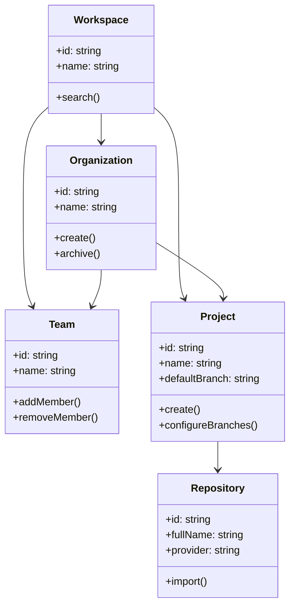

#### Diagramme de sequence
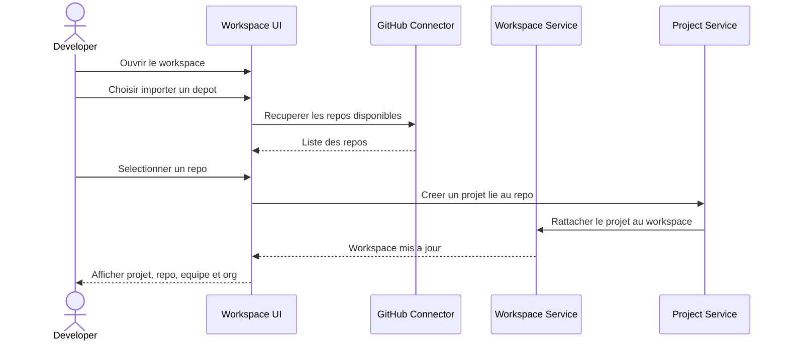

#### Diagramme d'activite
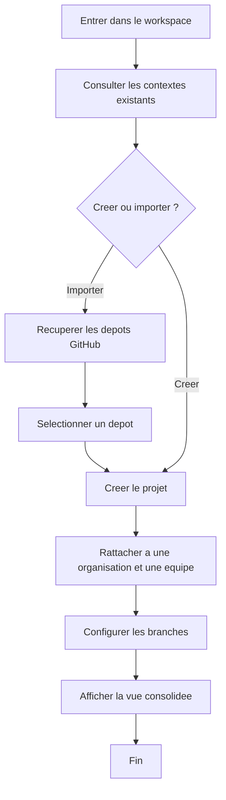

### 3.4 Realisation et Tests
Interfaces a realiser:
- ecran principal du workspace
- assistant d'import de depot
- page projet
- page organisation
- page equipe
- ecran de configuration des branches

Tests attendus:
- import reussi d'un depot
- creation d'un projet a partir d'un repo
- rattachement correct a une organisation
- ajout et retrait d'un membre d'equipe
- affichage coherent du workspace centralise

### Conclusion
Ce sprint transforme la plateforme en environnement de travail structure. Il introduit les objets metier centraux sur lesquels reposent les parcours de PR, d'analyse, de revue et de collaboration.

---

## Analyse et mise en oeuvre du Sprint 3
### Gestion des PRs et de l'espace Developer

### Introduction
Ce sprint se concentre sur l'experience quotidienne du Developer. Il formalise la gestion des Pull Requests, les filtres par etat, la lecture des rapports recents et les liens entre le workspace, les PRs et les analyses. L'objectif est de fournir un poste de travail clair, actionnable et centre sur les taches du developpeur.

### 3.1 Specification Fonctionnelle
Fonctionnalites a realiser:
- page `All PRs`
- filtrage par etat metier
- gestion des statuts `Draft`, `Return`, `Waiting for author`, `Approved`
- acces aux rapports recents
- navigation entre liste, detail et actions

### 3.2 Analyse des Cas d'Utilisation
#### Diagramme de cas d'utilisation du sprint 3
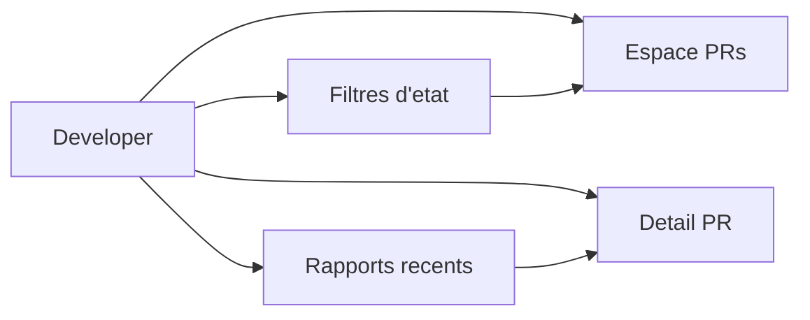

#### Description textuelle de cas d'utilisation du sprint 3
| Titre | Gestion des PRs et de l'espace Developer |
|---|---|
| Acteur principal | Developer |
| Resume | Le developpeur consulte, filtre et suit ses PRs dans un espace unique relie aux analyses et rapports. |
| Pre-condition | Developer authentifie avec projet ou repo existant. |
| Scenario nominal | 1. Le Developer accede a la page All PRs. 2. Il filtre par etat. 3. Il ouvre une PR. 4. Il consulte le rapport ou le detail. 5. Il identifie l'action a effectuer. |
| Post-condition | Le Developer dispose d'une vision centralisee et orientee action. |

### 3.3 Conception des Cas d'Utilisation
#### Diagramme de classes
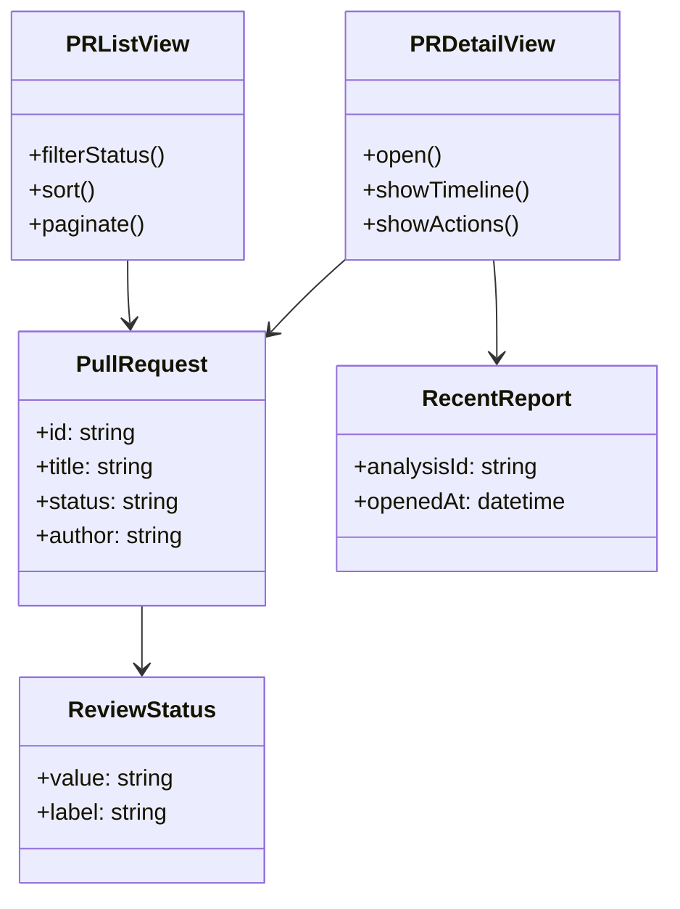

#### Diagramme de sequence
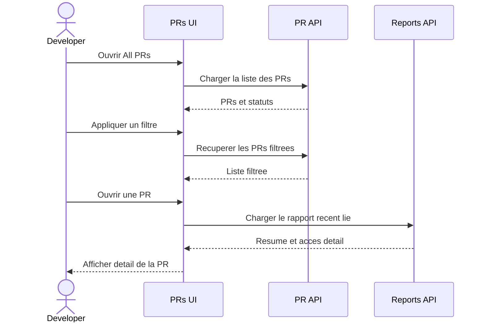

#### Diagramme d'activite
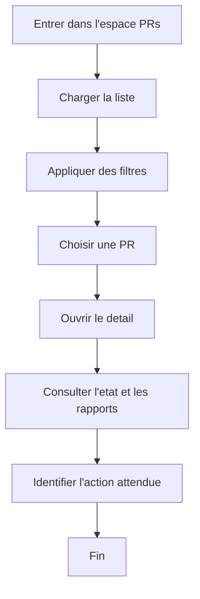

### 3.4 Realisation et Tests
Interfaces a realiser:
- tableau All PRs
- filtre d'etats metier
- detail PR
- panneau des rapports recents

Tests attendus:
- affichage correct de la liste des PRs
- filtrage coherent par etat
- acces detail PR sans rupture
- rapport recent associe a la bonne PR

### Conclusion
Ce sprint met a disposition un poste de travail Developer lisible et orienté action. Il prepare naturellement la transition vers le declenchement des analyses et le suivi de la revue.

---

## Analyse et mise en oeuvre du Sprint 4
### Gestion du declenchement et du suivi des analyses

### Introduction
Ce sprint formalise la relation entre une PR et son analyse visible dans la plateforme. Le but n'est pas de decrire le moteur interne mais de definir comment l'utilisateur declenche l'analyse, observe son etat, consulte son resume et accede au rapport resultant.

### 3.1 Specification Fonctionnelle
Fonctionnalites a realiser:
- lancer une analyse depuis une PR
- suivre le statut de l'analyse
- afficher le resume de resultat
- recevoir les mises a jour en temps reel
- acceder au rapport de sortie

### 3.2 Analyse des Cas d'Utilisation
#### Diagramme de cas d'utilisation du sprint 4
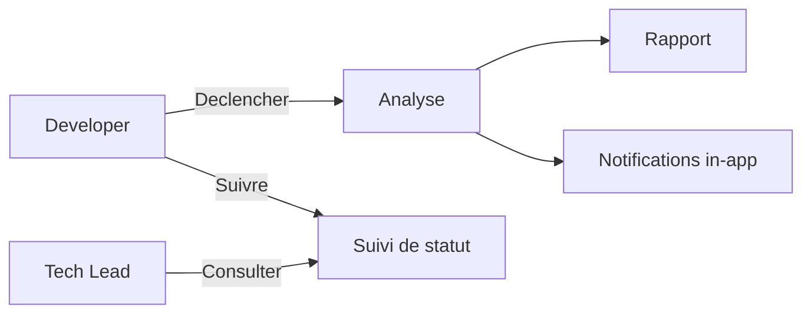

#### Description textuelle de cas d'utilisation du sprint 4
| Titre | Gestion du declenchement et du suivi des analyses |
|---|---|
| Acteurs principaux | Developer, Tech Lead |
| Resume | Une PR peut donner lieu a une analyse visible dont l'etat et le resultat sont exposes dans l'interface. |
| Pre-condition | PR existante et accessible dans le projet. |
| Scenario nominal | 1. Le Developer ouvre une PR. 2. Il declenche l'analyse. 3. Le systeme cree une execution. 4. L'etat evolue. 5. Le resume et le rapport sont disponibles. |
| Post-condition | Une analyse est associee a la PR et consultable. |

### 3.3 Conception des Cas d'Utilisation
#### Diagramme de classes
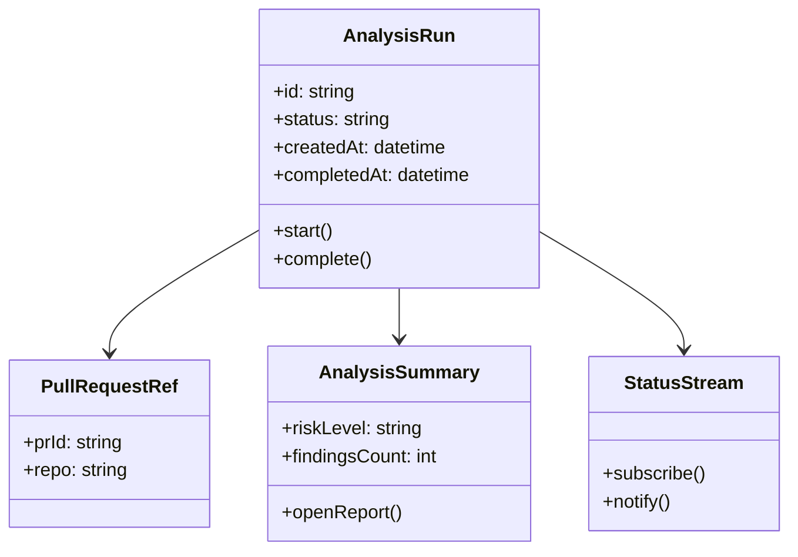

#### Diagramme de sequence
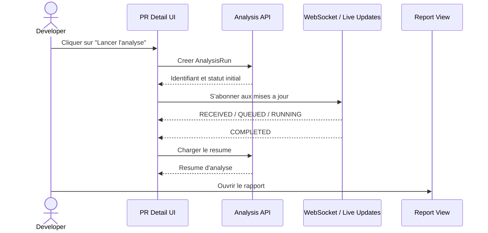

#### Diagramme d'activite
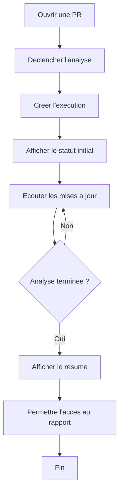

### 3.4 Realisation et Tests
Interfaces a realiser:
- bouton de lancement d'analyse
- widget de statut
- resume d'analyse
- lien d'acces au rapport

Tests attendus:
- declenchement reussi d'une analyse
- affichage correct des changements d'etat
- consultation du resume sans rechargement complet
- lien coherent entre PR, analyse et rapport

### Conclusion
Ce sprint donne de la visibilite au cycle d'analyse. Il fait le pont entre l'espace Developer et l'espace de revue, sans exposer les details techniques internes du traitement.

---

## Analyse et mise en oeuvre du Sprint 5
### Gestion des revues et des decisions Tech Lead

### Introduction
Ce sprint introduit le poste de pilotage du Tech Lead. Il organise la lecture des revues, la priorisation, la consultation du diff annote et l'execution des decisions metier comme l'approbation, le blocage ou l'assignation.

### 3.1 Specification Fonctionnelle
Fonctionnalites a realiser:
- file de revues
- classification des revues
- lecture du diff annote
- decisions de revue
- templates et parametres de revue

### 3.2 Analyse des Cas d'Utilisation
#### Diagramme de cas d'utilisation du sprint 5
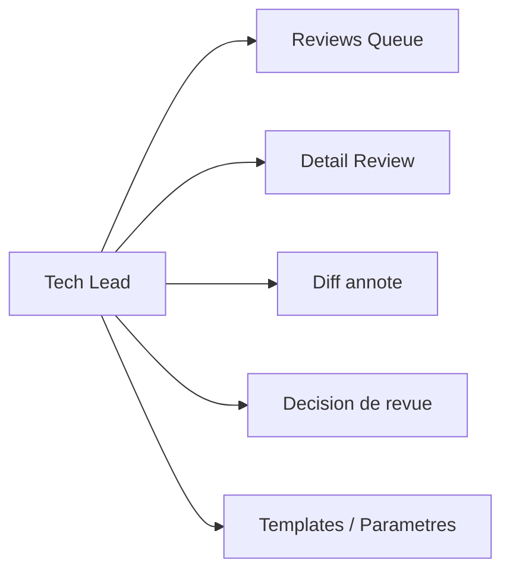

#### Description textuelle de cas d'utilisation du sprint 5
| Titre | Gestion des revues et des decisions Tech Lead |
|---|---|
| Acteur principal | Tech Lead |
| Resume | Le Tech Lead consulte les revues, analyse les elements affiches et prend les decisions necessaires pour faire avancer le workflow. |
| Pre-condition | Analyses disponibles dans le perimetre du Tech Lead. |
| Scenario nominal | 1. Le Tech Lead ouvre la queue. 2. Il choisit une review. 3. Il consulte le detail, le diff et les findings. 4. Il applique une decision. 5. Le systeme met a jour l'etat et l'historique. |
| Post-condition | La review change d'etat et le suivi reste tracable. |

### 3.3 Conception des Cas d'Utilisation
#### Diagramme de classes
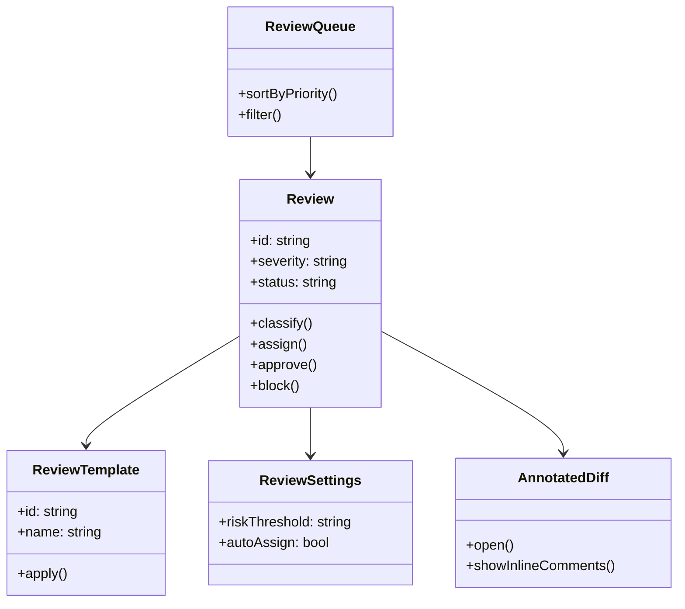

#### Diagramme de sequence
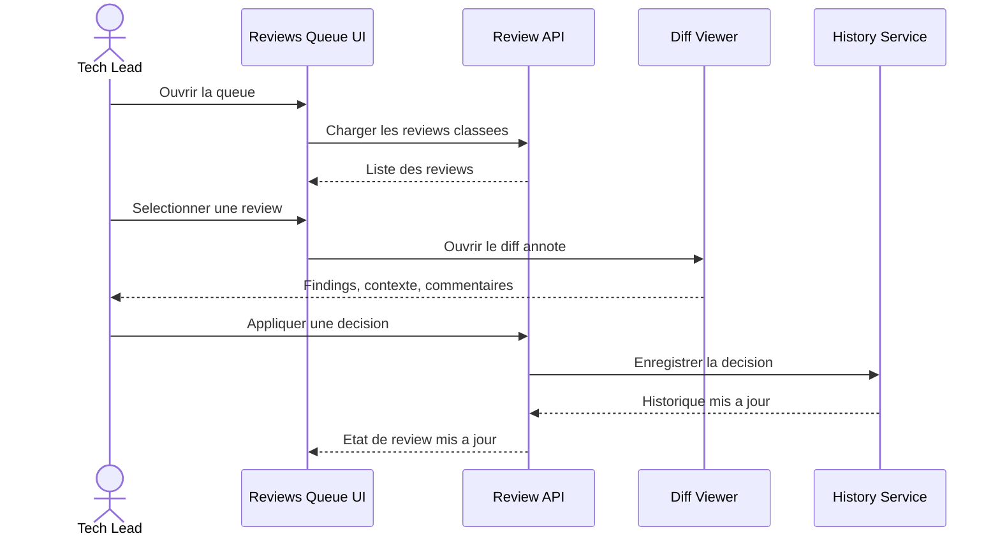

#### Diagramme d'activite
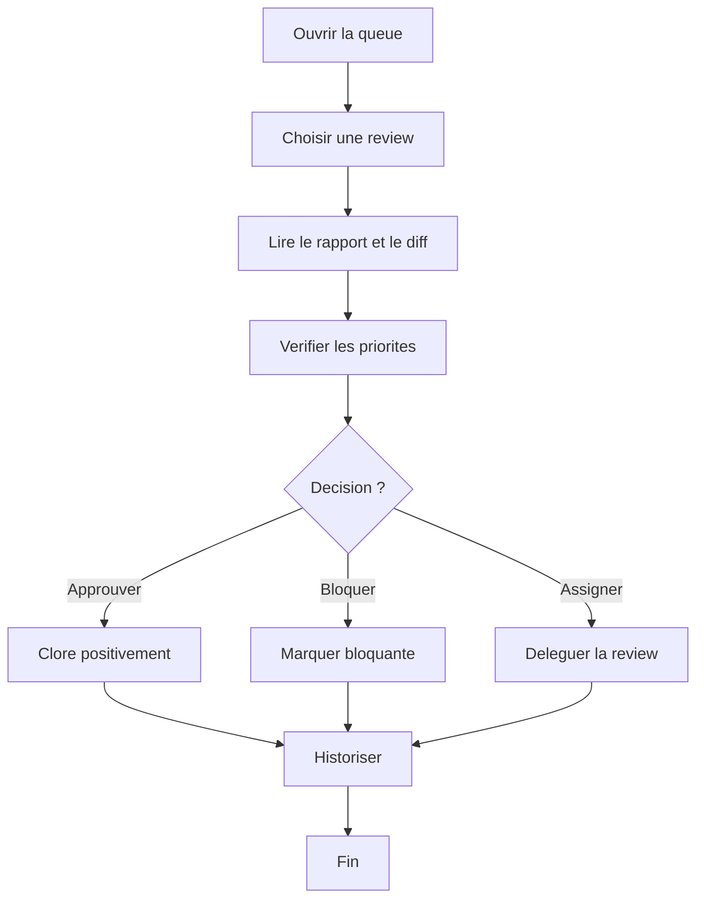

### 3.4 Realisation et Tests
Interfaces a realiser:
- reviews queue
- detail de review
- visualiseur de diff annote
- panneau de decision
- configuration des templates et parametres

Tests attendus:
- affichage ordonne de la queue
- ouverture coherente du detail et du diff
- persistance des decisions
- application correcte des templates

### Conclusion
Ce sprint donne au Tech Lead une veritable station de controle. Il transforme les analyses visibles en processus de decision structuré.

---

## Analyse et mise en oeuvre du Sprint 6
### Gestion des equipes, des affectations, de l'historique et des analytics

### Introduction
Ce sprint consolide la dimension collective de la plateforme. Il couvre la gestion des membres, les affectations, la lecture de l'historique et les analytics individuels, equipes et consolides. Il vise a faire de la plateforme un outil de pilotage et non seulement un outil de consultation.

### 3.1 Specification Fonctionnelle
Fonctionnalites a realiser:
- gestion des membres et des affectations
- consultation de l'historique des reviews
- analytics personnels
- analytics equipes
- vue consolidee de pilotage

### 3.2 Analyse des Cas d'Utilisation
#### Diagramme de cas d'utilisation du sprint 6
```mermaid
flowchart LR
    TechLead["Tech Lead"]
    Developer["Developer"]
    Team["Gestion d'equipe"]
    Assign["Affectations"]
    History["Historique"]
    Analytics["Analytics"]

    TechLead --> Team
    TechLead --> Assign
    TechLead --> History
    TechLead --> Analytics
    Developer --> History
    Developer --> Analytics
```

#### Description textuelle de cas d'utilisation du sprint 6
| Titre | Gestion des equipes, des affectations, de l'historique et des analytics |
|---|---|
| Acteurs principaux | Tech Lead, Developer |
| Resume | Le Tech Lead pilote ses membres, suit l'historique et mesure la performance; le Developer consulte sa progression et son contexte d'equipe. |
| Pre-condition | Organisation et equipes existantes. |
| Scenario nominal | 1. Le Tech Lead consulte son equipe. 2. Il gere les membres et les affectations. 3. Il ouvre l'historique des reviews. 4. Il consulte les analytics. 5. Le Developer consulte ses propres indicateurs. |
| Post-condition | Le suivi collectif et individuel devient exploitable pour le pilotage. |

### 3.3 Conception des Cas d'Utilisation
#### Diagramme de classes
```mermaid
classDiagram
    class TeamMember {
      +id: string
      +role: string
      +workload: int
    }
    class Assignment {
      +id: string
      +reviewId: string
      +assigneeId: string
      +assign()
    }
    class ReviewHistory {
      +id: string
      +eventType: string
      +createdAt: datetime
    }
    class PersonalAnalytics {
      +qualityScore: float
      +findingsRate: float
    }
    class TeamAnalytics {
      +sla: float
      +throughput: float
    }

    TeamMember --> Assignment
    TeamMember --> ReviewHistory
    TeamMember --> PersonalAnalytics
    TeamAnalytics --> TeamMember
```

#### Diagramme de sequence
```mermaid
sequenceDiagram
    actor TL as Tech Lead
    participant TUI as Team UI
    participant TEAM as Team Service
    participant ANA as Analytics Service
    participant HIST as History Service

    TL->>TUI: Ouvrir la vue equipe
    TUI->>TEAM: Charger les membres
    TEAM-->>TUI: Membres et roles
    TL->>TUI: Affecter une review
    TUI->>TEAM: Enregistrer l'affectation
    TEAM-->>TUI: Affectation confirmee
    TL->>TUI: Consulter l'historique
    TUI->>HIST: Charger les evenements
    HIST-->>TUI: Timeline
    TL->>TUI: Consulter les analytics
    TUI->>ANA: Charger les KPIs
    ANA-->>TUI: Donnees individuelles et equipe
```

#### Diagramme d'activite
```mermaid
flowchart TD
    A[Entrer dans la gestion d'equipe] --> B[Charger les membres]
    B --> C[Verifier la charge]
    C --> D[Affecter ou reajuster]
    D --> E[Consulter l'historique]
    E --> F[Analyser les indicateurs]
    F --> G[Prendre une decision de pilotage]
    G --> H[Fin]
```

### 3.4 Realisation et Tests
Interfaces a realiser:
- page equipe
- panneau d'affectation
- timeline historique
- dashboards personnels et equipe

Tests attendus:
- ajout et retrait de membres
- affectation d'une review
- coherence de la timeline
- affichage fiable des indicateurs

### Conclusion
Ce sprint donne une dimension managériale et analytique a la plateforme. Il introduit une lecture plus mature de la performance et de l'organisation du travail.

---

## Analyse et mise en oeuvre du Sprint 7
### Gestion de l'administration, des politiques et des integrations

### Introduction
Ce sprint couvre la gouvernance transverse de la plateforme. Il dote l'Admin d'un espace unifie pour les secrets, les policies, les integrations externes et l'audit. Il fait le lien entre administration technique, regles de gestion et operations fonctionnelles.

### 3.1 Specification Fonctionnelle
Fonctionnalites a realiser:
- gestion des secrets par projet
- gestion des policies et regles de branches
- gestion des integrations GitHub, Jira, Slack et CI
- consultation de la piste d'audit
- liaison des analyses avec Jira

### 3.2 Analyse des Cas d'Utilisation
#### Diagramme de cas d'utilisation du sprint 7
```mermaid
flowchart LR
    Admin["Admin"]
    Secrets["Secrets Projet"]
    Policies["Policies / Branch Rules"]
    Integrations["Integrations"]
    Audit["Audit Trail"]
    Jira["Lien Jira"]

    Admin --> Secrets
    Admin --> Policies
    Admin --> Integrations
    Admin --> Audit
    Admin --> Jira
```

#### Description textuelle de cas d'utilisation du sprint 7
| Titre | Gestion de l'administration, des politiques et des integrations |
|---|---|
| Acteur principal | Admin |
| Resume | L'Admin gouverne les parametres sensibles, les integrations et la traçabilite de la plateforme. |
| Pre-condition | Acces admin valide et projets existants. |
| Scenario nominal | 1. L'Admin ouvre le panneau d'administration. 2. Il configure ou teste une integration. 3. Il ajuste une policy. 4. Il consulte l'audit. 5. Il valide les interactions avec Jira ou GitHub. |
| Post-condition | La plateforme est gouvernee et reliee a ses systemes externes. |

### 3.3 Conception des Cas d'Utilisation
#### Diagramme de classes
```mermaid
classDiagram
    class Secret {
      +id: string
      +scope: string
      +encryptedValue: string
    }
    class Policy {
      +id: string
      +name: string
      +status: string
      +apply()
    }
    class Integration {
      +id: string
      +type: string
      +status: string
      +test()
      +activate()
    }
    class AuditEvent {
      +id: string
      +actor: string
      +action: string
      +timestamp: datetime
    }
    class JiraLink {
      +ticketKey: string
      +analysisId: string
    }

    Policy --> AuditEvent
    Integration --> AuditEvent
    Secret --> AuditEvent
    JiraLink --> AuditEvent
```

#### Diagramme de sequence
```mermaid
sequenceDiagram
    actor A as Admin
    participant UI as Admin UI
    participant CFG as Config Service
    participant EXT as External Integrations
    participant AUD as Audit Service

    A->>UI: Ouvrir le panneau admin
    A->>UI: Modifier une policy ou une integration
    UI->>CFG: Enregistrer la configuration
    CFG->>EXT: Tester l'integration
    EXT-->>CFG: Resultat du test
    CFG->>AUD: Historiser l'action
    AUD-->>UI: Evenement d'audit
    UI-->>A: Afficher l'etat final
```

#### Diagramme d'activite
```mermaid
flowchart TD
    A[Entrer dans l'administration] --> B[Choisir un domaine]
    B --> C{Secrets / Policies / Integrations / Audit}
    C --> D[Effectuer la gestion]
    D --> E[Test ou validation]
    E --> F[Historiser l'action]
    F --> G[Afficher le resultat]
    G --> H[Fin]
```

### 3.4 Realisation et Tests
Interfaces a realiser:
- panneau admin unifie
- pages secrets, policies, integrations, audit
- ecran de liaison Jira

Tests attendus:
- creation et mise a jour de secrets
- activation d'une policy
- test d'une integration externe
- remontée correcte dans l'audit trail

### Conclusion
Ce sprint construit la couche de gouvernance de la plateforme. Il donne a l'Admin un veritable controle sur les regles, les integrations et la tracabilite.

---

## Analyse et mise en oeuvre du Sprint 8
### Gestion des notifications et de l'experience mobile

### Introduction
Ce sprint aligne la plateforme sur une logique multi-canaux et multi-surfaces. Il couvre les notifications email, Slack, navigateur et mobile, ainsi que les ecrans mobiles prioritaires pour Developer et Tech Lead.

### 3.1 Specification Fonctionnelle
Fonctionnalites a realiser:
- notifications email
- notifications Slack
- notifications push navigateur
- notifications push mobile
- authentification mobile
- All PRs mobile
- resume d'analyse mobile
- indicateurs de sante mobile

### 3.2 Analyse des Cas d'Utilisation
#### Diagramme de cas d'utilisation du sprint 8
```mermaid
flowchart LR
    Developer["Developer"]
    TechLead["Tech Lead"]
    Web["Web"]
    Mobile["Mobile"]
    Notif["Notifications"]

    Developer --> Web
    Developer --> Mobile
    Developer --> Notif
    TechLead --> Web
    TechLead --> Mobile
    TechLead --> Notif
```

#### Description textuelle de cas d'utilisation du sprint 8
| Titre | Gestion des notifications et de l'experience mobile |
|---|---|
| Acteurs principaux | Developer, Tech Lead |
| Resume | Le systeme informe les utilisateurs sur les bons canaux et leur permet de prolonger les parcours prioritaires sur mobile. |
| Pre-condition | Utilisateur authentifie, PRs et analyses existantes. |
| Scenario nominal | 1. Le systeme emet une notification. 2. L'utilisateur la recoit sur le canal adapte. 3. Il ouvre l'application web ou mobile. 4. Il consulte l'information ou agit. |
| Post-condition | La plateforme reste utilisable et reactive sur tous les supports prioritaires. |

### 3.3 Conception des Cas d'Utilisation
#### Diagramme de classes
```mermaid
classDiagram
    class Notification {
      +id: string
      +type: string
      +channel: string
      +status: string
      +send()
    }
    class NotificationPreference {
      +emailEnabled: bool
      +pushEnabled: bool
      +slackEnabled: bool
    }
    class MobileSession {
      +deviceId: string
      +token: string
      +authenticate()
    }
    class MobileDashboard {
      +showPRs()
      +showSummary()
      +showHealth()
    }

    Notification --> NotificationPreference
    MobileSession --> MobileDashboard
```

#### Diagramme de sequence
```mermaid
sequenceDiagram
    participant SYS as Systeme
    participant HUB as Notification Hub
    participant WEB as Web Client
    participant MOB as Mobile App
    actor U as Utilisateur

    SYS->>HUB: Publier un evenement
    HUB->>WEB: Push navigateur / in-app
    HUB->>MOB: Push mobile
    HUB-->>U: Email ou Slack si necessaire
    U->>MOB: Ouvrir l'application mobile
    MOB-->>U: Afficher PRs, resume ou health
```

#### Diagramme d'activite
```mermaid
flowchart TD
    A[Evenement plateforme] --> B[Determiner le canal]
    B --> C[Envoyer la notification]
    C --> D[Reception par l'utilisateur]
    D --> E{Ouvrir web ou mobile ?}
    E -- Web --> F[Consulter l'information sur le web]
    E -- Mobile --> G[Consulter l'information sur mobile]
    F --> H[Agir]
    G --> H
    H --> I[Fin]
```

### 3.4 Realisation et Tests
Interfaces a realiser:
- centre de notifications
- ecrans mobiles auth, All PRs, resume d'analyse, health
- parametres d'inscription aux canaux

Tests attendus:
- emission correcte sur chaque canal
- affichage mobile des parcours prioritaires
- coherence entre etat web et etat mobile

### Conclusion
Ce sprint fait entrer la plateforme dans une logique d'usage continue. Il assure que l'information et l'action suivent l'utilisateur au-dela du navigateur.

---

## Analyse et mise en oeuvre du Sprint 9
### Gestion des vues detaillees, de la navigation transversale et de la recherche

### Introduction
Ce sprint augmente la fluidite globale de la plateforme. Il a pour objectif de reduire les frictions de navigation entre les objets metier: depot, projet, PR, analyse, revue et rapport. Il structure aussi la recherche globale et les acces contextuels.

### 3.1 Specification Fonctionnelle
Fonctionnalites a realiser:
- recherche globale
- navigation transversale
- vues detaillees de PR
- liens contextuels et breadcrumbs

### 3.2 Analyse des Cas d'Utilisation
#### Diagramme de cas d'utilisation du sprint 9
```mermaid
flowchart LR
    User["Utilisateur"]
    Search["Recherche globale"]
    Context["Navigation contextuelle"]
    DetailPR["Vue detaillee PR"]
    Entities["Projets / Repos / Analyses / Reviews"]

    User --> Search
    User --> Context
    User --> DetailPR
    Search --> Entities
    Context --> Entities
    DetailPR --> Entities
```

#### Description textuelle de cas d'utilisation du sprint 9
| Titre | Gestion des vues detaillees, de la navigation transversale et de la recherche |
|---|---|
| Acteurs principaux | Developer, Tech Lead, Admin |
| Resume | L'utilisateur se deplace rapidement dans la plateforme et retrouve les bons objets metier sans rupture de contexte. |
| Pre-condition | Les entites metier principales existent dans le workspace. |
| Scenario nominal | 1. L'utilisateur lance une recherche. 2. Il choisit un resultat. 3. Il ouvre le detail. 4. Il navigue vers les objets lies. 5. Il poursuit son parcours sans revenir a zero. |
| Post-condition | Le contexte de navigation reste conserve et exploitable. |

### 3.3 Conception des Cas d'Utilisation
#### Diagramme de classes
```mermaid
classDiagram
    class SearchIndex {
      +query(text)
      +rank()
    }
    class SearchResult {
      +entityType: string
      +entityId: string
      +label: string
    }
    class NavigationContext {
      +source: string
      +breadcrumbs: string[]
      +restore()
    }
    class PRDetail {
      +open()
      +showLinkedEntities()
    }

    SearchIndex --> SearchResult
    SearchResult --> NavigationContext
    PRDetail --> NavigationContext
```

#### Diagramme de sequence
```mermaid
sequenceDiagram
    actor U as Utilisateur
    participant UI as Global Search UI
    participant IDX as Search Service
    participant NAV as Navigation Context
    participant DET as Detail View

    U->>UI: Saisir une recherche
    UI->>IDX: Interroger l'index
    IDX-->>UI: Resultats ordonnes
    U->>UI: Choisir un resultat
    UI->>NAV: Construire le contexte
    NAV->>DET: Ouvrir la vue detaillee
    DET-->>U: Afficher les liens metier associes
```

#### Diagramme d'activite
```mermaid
flowchart TD
    A[Entrer une requete] --> B[Obtenir les resultats]
    B --> C[Selectionner une entite]
    C --> D[Construire le contexte de navigation]
    D --> E[Afficher la vue detaillee]
    E --> F[Naviguer vers une entite liee]
    F --> G[Conserver les breadcrumbs]
    G --> H[Fin]
```

### 3.4 Realisation et Tests
Interfaces a realiser:
- barre de recherche globale
- breadcrumbs
- page detaillee de PR enrichie
- liens croises entre vues

Tests attendus:
- recherche sur plusieurs types d'entites
- conservation du contexte
- detail de PR coherent avec les objets lies

### Conclusion
Ce sprint rend la plateforme plus lisible et plus rapide a exploiter. Il reduit les parcours morts et facilite l'enchainement naturel des actions.

---

## Analyse et mise en oeuvre du Sprint 10
### Gestion des files d'attention, des conversations et de la collaboration

### Introduction
Ce sprint formalise la collaboration entre Developer et Tech Lead. Il introduit les files d'attention, l'inbox de review et les conversations reliees aux objets de revue afin d'ordonner les interactions et d'eviter la dispersion des retours.

### 3.1 Specification Fonctionnelle
Fonctionnalites a realiser:
- inbox de review
- files d'attention par priorite
- conversations et commentaires de revue
- suivi collaboratif des retours

### 3.2 Analyse des Cas d'Utilisation
#### Diagramme de cas d'utilisation du sprint 10
```mermaid
flowchart LR
    Developer["Developer"]
    TechLead["Tech Lead"]
    Inbox["Inbox de review"]
    Priority["Files d'attention"]
    Conversation["Conversations de revue"]

    TechLead --> Inbox
    TechLead --> Priority
    TechLead --> Conversation
    Developer --> Conversation
```

#### Description textuelle de cas d'utilisation du sprint 10
| Titre | Gestion des files d'attention, des conversations et de la collaboration |
|---|---|
| Acteurs principaux | Developer, Tech Lead |
| Resume | Le Tech Lead priorise son travail et les utilisateurs suivent des conversations de revue structurees. |
| Pre-condition | Reviews existantes et visibles dans la plateforme. |
| Scenario nominal | 1. Le Tech Lead ouvre son inbox. 2. Il trie par priorite. 3. Il ouvre une conversation. 4. Il ajoute ou lit des retours. 5. Le Developer consulte et repond. |
| Post-condition | La collaboration reste centralisee et traçable. |

### 3.3 Conception des Cas d'Utilisation
#### Diagramme de classes
```mermaid
classDiagram
    class ReviewInbox {
      +sort()
      +prioritize()
    }
    class AttentionQueue {
      +priority: string
      +age: int
    }
    class ConversationThread {
      +id: string
      +open()
      +close()
    }
    class Comment {
      +authorId: string
      +message: string
      +createdAt: datetime
    }

    ReviewInbox --> AttentionQueue
    ConversationThread --> Comment
    AttentionQueue --> ConversationThread
```

#### Diagramme de sequence
```mermaid
sequenceDiagram
    actor TL as Tech Lead
    actor D as Developer
    participant IN as Inbox UI
    participant RV as Review Service
    participant TH as Thread Service

    TL->>IN: Ouvrir l'inbox
    IN->>RV: Charger les reviews et priorites
    RV-->>IN: File ordonnee
    TL->>IN: Ouvrir une conversation
    IN->>TH: Charger le thread
    TH-->>IN: Messages existants
    TL->>TH: Ajouter un commentaire
    TH-->>D: Rendre le commentaire visible
    D->>TH: Repondre
    TH-->>IN: Thread mis a jour
```

#### Diagramme d'activite
```mermaid
flowchart TD
    A[Ouvrir l'inbox] --> B[Classer les reviews]
    B --> C[Choisir une review prioritaire]
    C --> D[Lire le fil de discussion]
    D --> E[Ajouter ou consulter un commentaire]
    E --> F[Notifier l'autre acteur]
    F --> G[Mettre a jour la file]
    G --> H[Fin]
```

### 3.4 Realisation et Tests
Interfaces a realiser:
- inbox de review
- vue des priorites
- panneau de conversation

Tests attendus:
- ordonnancement par priorite
- lecture et ecriture des commentaires
- coherences entre file, detail et conversation

### Conclusion
Ce sprint rend la plateforme plus collaborative et plus exploitable dans la duree. Il cree une couche d'echange structuree autour de la revue.

---

## Analyse et mise en oeuvre du Sprint 11
### Gestion de l'historisation detaillee, des exports et de la tracabilite utilisateur

### Introduction
Ce sprint approfondit la dimension de traçabilite de la plateforme. Il organise l'historisation detaillee par projet, utilisateur, equipe et review, tout en ajoutant les mecanismes d'export et de partage des rapports.

### 3.1 Specification Fonctionnelle
Fonctionnalites a realiser:
- timeline d'activite detaillee
- historique multi-dimension
- export et partage des rapports
- journal visible des decisions et transitions

### 3.2 Analyse des Cas d'Utilisation
#### Diagramme de cas d'utilisation du sprint 11
```mermaid
flowchart LR
    User["Utilisateur"]
    History["Historique detaille"]
    Export["Export de rapport"]
    Share["Partage"]
    Trace["Tracabilite des decisions"]

    User --> History
    User --> Export
    User --> Share
    User --> Trace
```

#### Description textuelle de cas d'utilisation du sprint 11
| Titre | Gestion de l'historisation detaillee, des exports et de la tracabilite utilisateur |
|---|---|
| Acteurs principaux | Developer, Tech Lead, Admin |
| Resume | Les utilisateurs peuvent retracer les evenements majeurs et partager des rapports exploitables hors de la plateforme. |
| Pre-condition | Activites, revues et rapports existants. |
| Scenario nominal | 1. L'utilisateur ouvre l'historique. 2. Il applique des filtres. 3. Il consulte une timeline. 4. Il exporte un rapport. 5. Il partage le resultat. |
| Post-condition | L'information reste auditible, consultable et transmissible. |

### 3.3 Conception des Cas d'Utilisation
#### Diagramme de classes
```mermaid
classDiagram
    class ActivityEvent {
      +id: string
      +type: string
      +actor: string
      +timestamp: datetime
    }
    class HistoryView {
      +filterByProject()
      +filterByUser()
      +filterByReview()
    }
    class ReportExport {
      +format: string
      +generate()
    }
    class ShareLink {
      +token: string
      +expiresAt: datetime
    }

    HistoryView --> ActivityEvent
    ReportExport --> ShareLink
```

#### Diagramme de sequence
```mermaid
sequenceDiagram
    actor U as Utilisateur
    participant H as History UI
    participant HS as History Service
    participant EX as Export Service

    U->>H: Ouvrir l'historique
    H->>HS: Charger les evenements
    HS-->>H: Timeline
    U->>H: Filtrer la vue
    H->>HS: Recalculer la timeline
    HS-->>H: Resultat filtre
    U->>EX: Exporter un rapport
    EX-->>U: Fichier ou lien de partage
```

#### Diagramme d'activite
```mermaid
flowchart TD
    A[Ouvrir l'historique] --> B[Choisir les filtres]
    B --> C[Consulter la timeline]
    C --> D{Exporter ?}
    D -- Oui --> E[Generer le rapport]
    E --> F[Partager ou telecharger]
    D -- Non --> G[Fin]
    F --> G
```

### 3.4 Realisation et Tests
Interfaces a realiser:
- page historique detaillee
- filtres multi-criteres
- export de rapport
- partage de rapport

Tests attendus:
- filtrage par utilisateur, projet, equipe ou review
- export reussi
- lien de partage coherent

### Conclusion
Ce sprint consolide la mémoire fonctionnelle de la plateforme. Il renforce la traçabilite, la relecture et la diffusion de l'information.

---

## Analyse et mise en oeuvre du Sprint 12
### Gestion des preferences, de la personnalisation et de la continuite web-mobile

### Introduction
Ce sprint vise a harmoniser durablement l'experience de l'utilisateur entre web et mobile. Il introduit les preferences de notification, le centre d'activite synchronise et la reprise de contexte entre devices.

### 3.1 Specification Fonctionnelle
Fonctionnalites a realiser:
- preferences de notification par canal
- centre d'activite synchronise
- personnalisation de l'experience
- continuite web-mobile

### 3.2 Analyse des Cas d'Utilisation
#### Diagramme de cas d'utilisation du sprint 12
```mermaid
flowchart LR
    User["Utilisateur"]
    Pref["Preferences"]
    Activity["Centre d'activite"]
    Sync["Synchronisation web-mobile"]
    Resume["Reprise de contexte"]

    User --> Pref
    User --> Activity
    User --> Sync
    User --> Resume
```

#### Description textuelle de cas d'utilisation du sprint 12
| Titre | Gestion des preferences, de la personnalisation et de la continuite web-mobile |
|---|---|
| Acteurs principaux | Developer, Tech Lead |
| Resume | L'utilisateur configure ses canaux d'information et retrouve ses activites sur toutes les surfaces. |
| Pre-condition | Auth web et mobile disponibles, notifications actives. |
| Scenario nominal | 1. L'utilisateur ouvre ses preferences. 2. Il choisit ses canaux. 3. Le systeme applique les parametres. 4. L'utilisateur ouvre l'autre surface. 5. Il retrouve son activite et son contexte. |
| Post-condition | L'experience reste continue et personnalisee. |

### 3.3 Conception des Cas d'Utilisation
#### Diagramme de classes
```mermaid
classDiagram
    class UserPreference {
      +email: bool
      +push: bool
      +slack: bool
    }
    class ActivityCenter {
      +load()
      +markRead()
    }
    class DeviceContext {
      +deviceType: string
      +lastViewed: string
      +restore()
    }
    class SyncState {
      +updatedAt: datetime
      +merge()
    }

    UserPreference --> ActivityCenter
    ActivityCenter --> SyncState
    DeviceContext --> SyncState
```

#### Diagramme de sequence
```mermaid
sequenceDiagram
    actor U as Utilisateur
    participant WEB as Web App
    participant API as Preferences API
    participant MOB as Mobile App
    participant ACT as Activity Service

    U->>WEB: Modifier ses preferences
    WEB->>API: Enregistrer les parametres
    API-->>WEB: Confirmation
    U->>MOB: Ouvrir l'application mobile
    MOB->>ACT: Charger l'activite et le contexte
    ACT-->>MOB: Etat synchronise
    MOB-->>U: Reprise de contexte
```

#### Diagramme d'activite
```mermaid
flowchart TD
    A[Ouvrir les preferences] --> B[Choisir les canaux]
    B --> C[Enregistrer]
    C --> D[Mettre a jour le centre d'activite]
    D --> E[Ouvrir une autre surface]
    E --> F[Restaurer le contexte]
    F --> G[Fin]
```

### 3.4 Realisation et Tests
Interfaces a realiser:
- page preferences utilisateur
- centre d'activite
- synchronisation web-mobile

Tests attendus:
- preferences appliquees sur tous les canaux
- activite visible sur web et mobile
- reprise de contexte apres changement de device

### Conclusion
Ce sprint finalise la coherence d'usage entre les surfaces. Il ancre la plateforme dans un usage quotidien et personalise.

---

# Release 2 - Intelligence de revue et capitalisation de connaissance

## Analyse et mise en oeuvre du Sprint 13
### Gestion de la base de connaissances et des regles

### Introduction
Ce sprint organise la gestion des connaissances dans la plateforme. Il formalise l'import des documents, leur administration et leur visibilite fonctionnelle dans le cadre des revues.

### 3.1 Specification Fonctionnelle
Fonctionnalites a realiser:
- import de documents
- administration de la base de connaissances
- priorisation des regles d'organisation
- visibilite des regles appliquees

### 3.2 Analyse des Cas d'Utilisation
#### Diagramme de cas d'utilisation du sprint 13
```mermaid
flowchart LR
    Admin["Admin"]
    TechLead["Tech Lead"]
    KB["Base de connaissances"]
    Rules["Regles"]
    Explain["Visibilite des regles appliquees"]

    Admin --> KB
    Admin --> Rules
    TechLead --> Explain
```

#### Description textuelle de cas d'utilisation du sprint 13
| Titre | Gestion de la base de connaissances et des regles |
|---|---|
| Acteurs principaux | Admin, Tech Lead |
| Resume | L'Admin alimente et gouverne les connaissances; le Tech Lead visualise les regles mobilisees dans les revues. |
| Pre-condition | Acces admin disponible. |
| Scenario nominal | 1. L'Admin importe un document. 2. Il l'organise ou le met a jour. 3. Le systeme le rend utilisable. 4. Le Tech Lead voit les regles appliquees dans le contexte de revue. |
| Post-condition | La connaissance devient gouvernee et exploitable. |

### 3.3 Conception des Cas d'Utilisation
#### Diagramme de classes
```mermaid
classDiagram
    class KnowledgeDocument {
      +id: string
      +title: string
      +type: string
    }
    class Rule {
      +id: string
      +name: string
      +priority: int
    }
    class KnowledgeAdmin {
      +import()
      +reindex()
      +edit()
    }
    class AppliedRuleView {
      +show()
    }

    KnowledgeAdmin --> KnowledgeDocument
    KnowledgeDocument --> Rule
    AppliedRuleView --> Rule
```

#### Diagramme de sequence
```mermaid
sequenceDiagram
    actor A as Admin
    actor TL as Tech Lead
    participant UI as KB UI
    participant KBS as Knowledge Service
    participant RV as Review View

    A->>UI: Importer un document
    UI->>KBS: Enregistrer et indexer
    KBS-->>UI: Confirmation
    TL->>RV: Ouvrir une revue
    RV->>KBS: Charger les regles visibles
    KBS-->>RV: Regles appliquees
```

#### Diagramme d'activite
```mermaid
flowchart TD
    A[Importer un document] --> B[Indexer et organiser]
    B --> C[Definir les regles]
    C --> D[Associer les regles au contexte]
    D --> E[Afficher les regles dans la revue]
    E --> F[Fin]
```

### 3.4 Realisation et Tests
Interfaces a realiser:
- ecran d'import KB
- ecran d'administration KB
- bloc de visualisation des regles appliquees

Tests attendus:
- import d'un document
- edition et reindexation
- affichage des regles dans le contexte de revue

### Conclusion
Ce sprint installe la gouvernance de la connaissance dans la plateforme et structure son usage visible dans la revue.

---

## Analyse et mise en oeuvre du Sprint 14
### Gestion de l'intelligence de contexte et de la qualite des revues

### Introduction
Ce sprint renforce la qualite des revues visibles en s'appuyant sur un contexte enrichi et des resultats plus fiables. Il ne decrit pas les mecanismes internes en profondeur, mais formalise leur impact fonctionnel sur la restitution.

### 3.1 Specification Fonctionnelle
Fonctionnalites a realiser:
- amelioration de la qualite de contexte
- fiabilisation des resultats visibles
- suggestions exploitables
- preuves et justifications visibles

### 3.2 Analyse des Cas d'Utilisation
#### Diagramme de cas d'utilisation du sprint 14
```mermaid
flowchart LR
    Developer["Developer"]
    TechLead["Tech Lead"]
    Context["Contexte enrichi"]
    Findings["Resultats visibles"]
    Suggestions["Suggestions exploitables"]
    Evidence["Preuves / justifications"]

    Developer --> Findings
    TechLead --> Findings
    TechLead --> Evidence
    Developer --> Suggestions
    Findings --> Context
```

#### Description textuelle de cas d'utilisation du sprint 14
| Titre | Gestion de l'intelligence de contexte et de la qualite des revues |
|---|---|
| Acteurs principaux | Developer, Tech Lead |
| Resume | Le systeme enrichit les revues visibles et les rend plus fiables, plus justifiees et plus actionnables. |
| Pre-condition | Rapports et revues disponibles. |
| Scenario nominal | 1. L'utilisateur ouvre un rapport. 2. Le systeme presente un contexte enrichi. 3. Les resultats sont justifies. 4. Des suggestions sont consultables. |
| Post-condition | La revue est plus pertinente et plus exploitable. |

### 3.3 Conception des Cas d'Utilisation
#### Diagramme de classes
```mermaid
classDiagram
    class ReviewContext {
      +summary: string
      +evidence: string[]
    }
    class Suggestion {
      +id: string
      +title: string
      +actionable: bool
    }
    class FindingView {
      +showEvidence()
      +showSuggestion()
    }

    ReviewContext --> FindingView
    Suggestion --> FindingView
```

#### Diagramme de sequence
```mermaid
sequenceDiagram
    actor U as Utilisateur
    participant RV as Review UI
    participant CTX as Context Service
    participant SG as Suggestion Service

    U->>RV: Ouvrir un rapport enrichi
    RV->>CTX: Charger le contexte
    CTX-->>RV: Resume et preuves
    RV->>SG: Charger les suggestions
    SG-->>RV: Suggestions exploitables
    RV-->>U: Afficher revue enrichie
```

#### Diagramme d'activite
```mermaid
flowchart TD
    A[Ouvrir la revue] --> B[Charger le contexte enrichi]
    B --> C[Afficher les resultats]
    C --> D[Afficher les preuves]
    D --> E[Afficher les suggestions]
    E --> F[Fin]
```

### 3.4 Realisation et Tests
Interfaces a realiser:
- blocs de contexte enrichi
- vues preuves / justification
- panneau de suggestions

Tests attendus:
- affichage du contexte
- affichage de preuves associees
- suggestions visibles et utilisables

### Conclusion
Ce sprint augmente la valeur fonctionnelle des revues sans casser les parcours deja livres. Il rend la restitution plus credible et plus utile.

---

# Release 3 - Industrialisation technique et exploitation continue

## Analyse et mise en oeuvre du Sprint 15
### Gestion de l'exploitation locale et de la chaine de livraison

### Introduction
Ce sprint structure l'environnement de travail des equipes de developpement et la chaine de livraison. Il ne cree pas de nouvelles surfaces metier visibles mais stabilise le cycle de build, de test et de packaging.

### 3.1 Specification Fonctionnelle
Fonctionnalites a realiser:
- demarrage local standard
- images Docker optimisees
- pipeline CI complet

### 3.2 Analyse des Cas d'Utilisation
#### Diagramme de cas d'utilisation du sprint 15
```mermaid
flowchart LR
    Developer["Developer"]
    Admin["Admin"]
    Local["Exploitation locale"]
    Docker["Images Docker"]
    CI["Pipeline CI"]

    Developer --> Local
    Admin --> Docker
    Admin --> CI
```

#### Description textuelle de cas d'utilisation du sprint 15
| Titre | Gestion de l'exploitation locale et de la chaine de livraison |
|---|---|
| Acteurs principaux | Developer, Admin |
| Resume | Les equipes peuvent demarrer la plateforme, la packager et verifier sa qualite via une chaine de livraison standard. |
| Pre-condition | Depot source disponible. |
| Scenario nominal | 1. Le Developer lance la plateforme localement. 2. L'Admin construit les images. 3. La CI verifie la qualite et le build. |
| Post-condition | La plateforme est executable et livrable de facon reproductible. |

### 3.3 Conception des Cas d'Utilisation
#### Diagramme de classes
```mermaid
classDiagram
    class LocalStack {
      +start()
      +stop()
    }
    class DockerImage {
      +name: string
      +build()
      +push()
    }
    class CIPipeline {
      +runTests()
      +runLint()
      +build()
    }

    LocalStack --> DockerImage
    DockerImage --> CIPipeline
```

#### Diagramme de sequence
```mermaid
sequenceDiagram
    actor D as Developer
    actor A as Admin
    participant LS as Local Stack
    participant DK as Docker
    participant CI as CI Pipeline

    D->>LS: Demarrer la stack locale
    LS-->>D: Plateforme disponible
    A->>DK: Construire les images
    DK-->>A: Images pretes
    A->>CI: Lancer la pipeline
    CI-->>A: Resultat tests, lint, build
```

#### Diagramme d'activite
```mermaid
flowchart TD
    A[Demarrer localement] --> B[Construire les images]
    B --> C[Lancer la CI]
    C --> D{Pipeline valide ?}
    D -- Non --> E[Corriger et relancer]
    E --> C
    D -- Oui --> F[Fin]
```

### 3.4 Realisation et Tests
Elements a realiser:
- scripts de demarrage local
- Dockerfiles
- workflow CI

Tests attendus:
- stack locale reproductible
- build Docker stable
- CI complete sans erreur critique

### Conclusion
Ce sprint apporte la reproductibilite necessaire a l'industrialisation. Il soutient la qualité globale de la plateforme sans modifier les parcours metier.

---

## Analyse et mise en oeuvre du Sprint 16
### Gestion du deploiement et de l'observabilite

### Introduction
Ce dernier sprint porte sur la mise en exploitation continue de la plateforme. Il couvre le deploiement, la supervision et l'alerting afin de rendre la solution exploitable dans la duree.

### 3.1 Specification Fonctionnelle
Fonctionnalites a realiser:
- deploiement VPS
- configuration de la securisation
- dashboards d'observabilite
- alertes de supervision

### 3.2 Analyse des Cas d'Utilisation
#### Diagramme de cas d'utilisation du sprint 16
```mermaid
flowchart LR
    Admin["Admin"]
    TechLead["Tech Lead"]
    Deploy["Deploiement"]
    Grafana["Dashboards"]
    Alert["Alertes"]

    Admin --> Deploy
    Admin --> Grafana
    TechLead --> Grafana
    TechLead --> Alert
```

#### Description textuelle de cas d'utilisation du sprint 16
| Titre | Gestion du deploiement et de l'observabilite |
|---|---|
| Acteurs principaux | Admin, Tech Lead |
| Resume | La plateforme est deployee, supervisee et pilotee via dashboards et alertes. |
| Pre-condition | Chaine de livraison disponible. |
| Scenario nominal | 1. L'Admin deploie la plateforme. 2. Il configure la supervision. 3. Le Tech Lead consulte les dashboards. 4. Les alertes remontent les incidents utiles. |
| Post-condition | La plateforme est exploitable et observable en continu. |

### 3.3 Conception des Cas d'Utilisation
#### Diagramme de classes
```mermaid
classDiagram
    class DeploymentTarget {
      +host: string
      +ssl: bool
      +deploy()
    }
    class MonitoringDashboard {
      +id: string
      +name: string
      +render()
    }
    class AlertRule {
      +metric: string
      +threshold: float
      +trigger()
    }

    DeploymentTarget --> MonitoringDashboard
    MonitoringDashboard --> AlertRule
```

#### Diagramme de sequence
```mermaid
sequenceDiagram
    actor A as Admin
    actor TL as Tech Lead
    participant DEP as Deployment Service
    participant MON as Monitoring Stack
    participant ALT as Alerting

    A->>DEP: Deployer la plateforme
    DEP-->>A: Environnement actif
    A->>MON: Configurer les dashboards
    MON-->>A: Dashboards disponibles
    TL->>MON: Consulter les indicateurs
    MON->>ALT: Surveiller les seuils
    ALT-->>TL: Alerte en cas de derive
```

#### Diagramme d'activite
```mermaid
flowchart TD
    A[Deployer la plateforme] --> B[Valider l'environnement]
    B --> C[Activer les dashboards]
    C --> D[Configurer les alertes]
    D --> E[Surveiller les metriques]
    E --> F[Declencher les alertes si necessaire]
    F --> G[Fin]
```

### 3.4 Realisation et Tests
Elements a realiser:
- scripts ou procedures de deploiement
- dashboards Grafana
- alertes Prometheus

Tests attendus:
- deploiement reussi
- dashboard visible
- alerte declenchee sur seuil simule

### Conclusion
Ce sprint clot le cycle de mise en oeuvre en rendant la plateforme industrialisable et exploitable dans la duree. Il apporte la stabilite attendue pour un usage continu.
