# Plateforme AI Code Review
## Planification Releases & Sprints - Version detaillee

Ce document etend le plan de reference present dans `RELEASE_SPRINT_PLAN_REFACTORED.md`.
Il conserve le meme enchainement de releases et de sprints, puis ajoute pour chaque sprint:

- une introduction
- une specification fonctionnelle
- un diagramme de cas d'utilisation
- un diagramme de classes
- un diagramme de sequence
- un diagramme d'activite
- une conclusion

---

## Release 1 - Plateforme Web & Mobile Operationnelle Complete

### Sprint 1 - Gestion de l'authentification et des acces

**Introduction**

Ce sprint pose l'entree unique de la plateforme. Il couvre l'inscription, la connexion, la synchronisation avec le backend, la redirection par role et les controles d'acces qui conditionnent tout le reste du parcours web et mobile.

**Specification fonctionnelle**

- Acteurs principaux:
  - Developer
  - Tech Lead
  - Admin
- Objectifs:
  - permettre l'acces a la plateforme depuis web et mobile
  - affecter les droits selon le role reel
  - synchroniser l'identite entre Clerk et le backend
  - proteger chaque espace et chaque API
- Interfaces concernees:
  - ecrans sign in / sign up
  - ecrans de redirection post-login
  - ecran de gestion des roles et comptes
  - routes protegees web et mobile
- Regles fonctionnelles:
  - un utilisateur non authentifie ne peut pas acceder aux routes protegees
  - un utilisateur authentifie est redirige selon son role
  - tout role modifie par l'admin est applique aux prochaines sessions
  - la session mobile suit les memes regles de securite que la session web

**Diagramme de cas d'utilisation**

```mermaid
usecaseDiagram
actor Developer
actor "Tech Lead" as TL
actor Admin

rectangle "Sprint 1 - Authentification" {
  Developer --> (S'inscrire)
  Developer --> (Se connecter)
  Developer --> (Acceder a son dashboard)
  TL --> (Se connecter)
  TL --> (Acceder a son dashboard)
  Admin --> (Se connecter)
  Admin --> (Gerer roles)
  Admin --> (Gerer comptes)
  Admin --> (Verifier acces)
}
```

**Diagramme de classes**

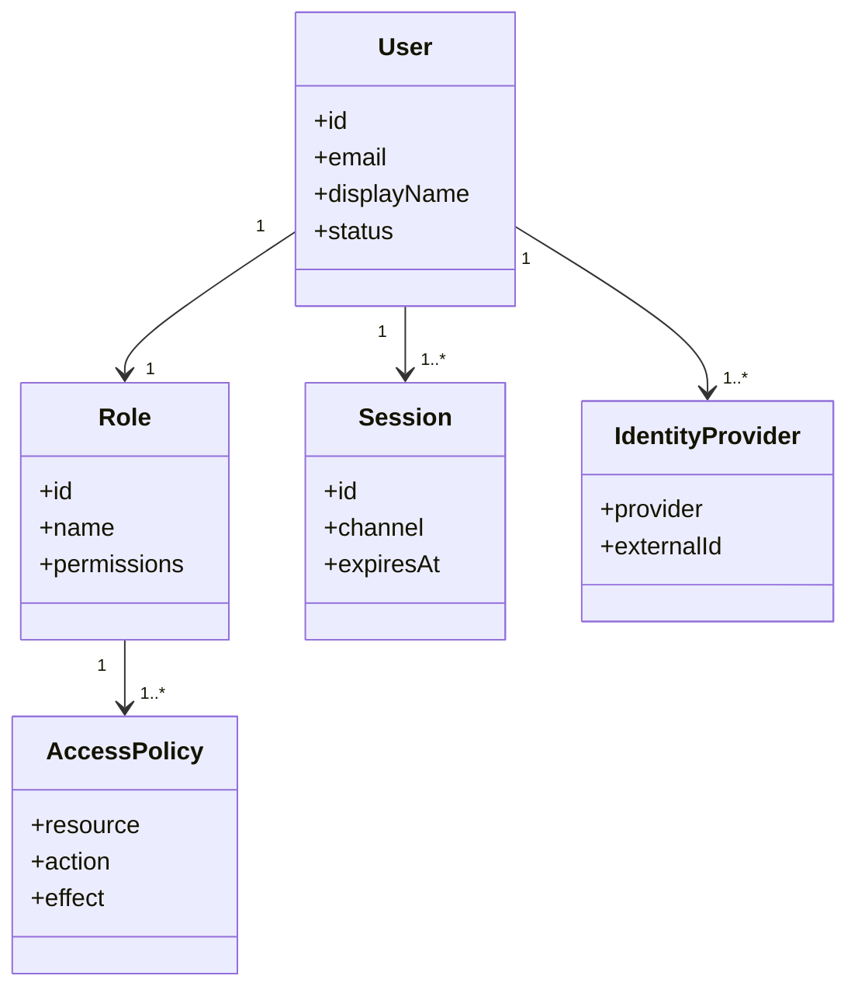

**Diagramme de sequence**

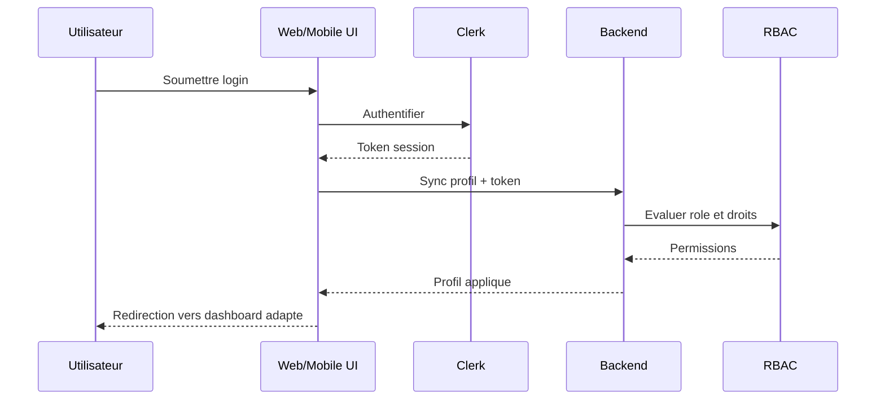

**Diagramme d'activite**

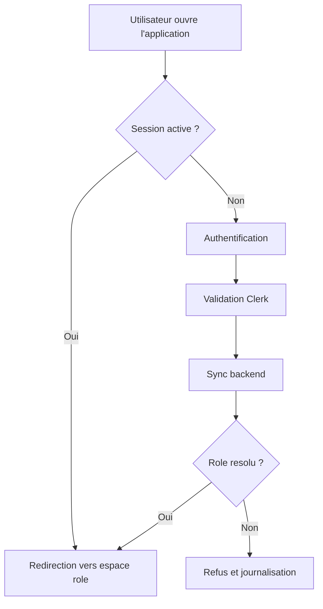

**Conclusion**

Le sprint 1 rend la plateforme accessible et gouvernable. Sans ce socle, ni le workspace, ni les PRs, ni le mobile ne peuvent fonctionner de maniere fiable.

---

### Sprint 2 - Gestion du workspace, des organisations et des depots

**Introduction**

Ce sprint ouvre le perimetre de travail reel des utilisateurs. Il permet de structurer l'espace produit autour des organisations, equipes, projets et depots.

**Specification fonctionnelle**

- Acteurs principaux:
  - Developer
  - Tech Lead
  - Admin
- Objectifs:
  - importer les depots GitHub
  - creer et organiser les projets
  - rattacher les utilisateurs a leurs organisations et equipes
  - definir le contexte de travail des analyses et des revues
- Interfaces concernees:
  - assistant d'import GitHub
  - pages projets, repos, organisations, equipes
  - vue workspace consolidee
- Regles fonctionnelles:
  - un projet est toujours rattache a un depot
  - un utilisateur voit son perimetre selon son organisation et ses equipes
  - un Tech Lead peut definir le cadre des branches a suivre
  - un Admin peut standardiser les regles au niveau organisation

**Diagramme de cas d'utilisation**

```mermaid
usecaseDiagram
actor Developer
actor "Tech Lead" as TL
actor Admin

rectangle "Sprint 2 - Workspace" {
  Developer --> (Importer un depot GitHub)
  Developer --> (Creer un projet)
  Developer --> (Consulter le workspace)
  TL --> (Configurer branches cibles)
  TL --> (Consulter equipes et projets)
  Admin --> (Gerer organisations)
  Admin --> (Gerer equipes)
  Admin --> (Definir politiques de branches)
}
```

**Diagramme de classes**

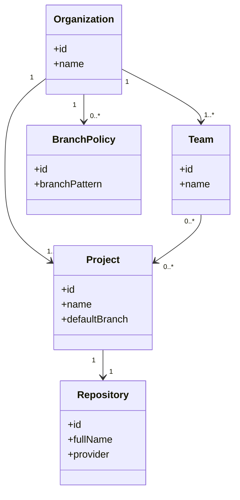

**Diagramme de sequence**

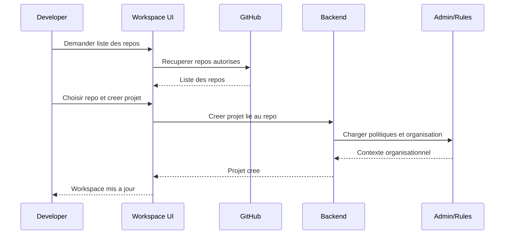

**Diagramme d'activite**

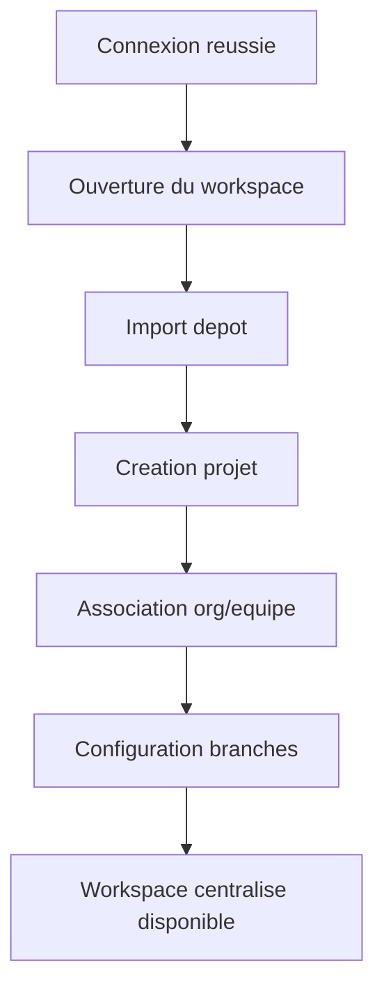

**Conclusion**

Le sprint 2 transforme l'authentification en espace utile. Les utilisateurs ne se contentent plus d'entrer dans la plateforme, ils obtiennent un environnement de travail coherent.

---

### Sprint 3 - Gestion des PRs et de l'espace Developer

**Introduction**

Ce sprint structure l'experience quotidienne du Developer. Il met en place les listes de PRs, les filtres, les etats et l'acces direct aux artefacts de travail.

**Specification fonctionnelle**

- Acteur principal:
  - Developer
- Objectifs:
  - centraliser les PRs
  - exposer les etats utiles a la priorisation
  - permettre la navigation entre PR, analyse et rapport
- Interfaces concernees:
  - page All PRs
  - filtres et badges d'etat
  - liens vers rapports recents
- Regles fonctionnelles:
  - les PRs sont consultables par etat metier
  - les etats doivent etre cohérents entre web et mobile
  - l'utilisateur peut ouvrir une PR et retrouver ses informations de contexte

**Diagramme de cas d'utilisation**

```mermaid
usecaseDiagram
actor Developer

rectangle "Sprint 3 - PRs Developer" {
  Developer --> (Consulter All PRs)
  Developer --> (Filtrer par etat)
  Developer --> (Ouvrir une PR)
  Developer --> (Consulter rapports recents)
}
```

**Diagramme de classes**

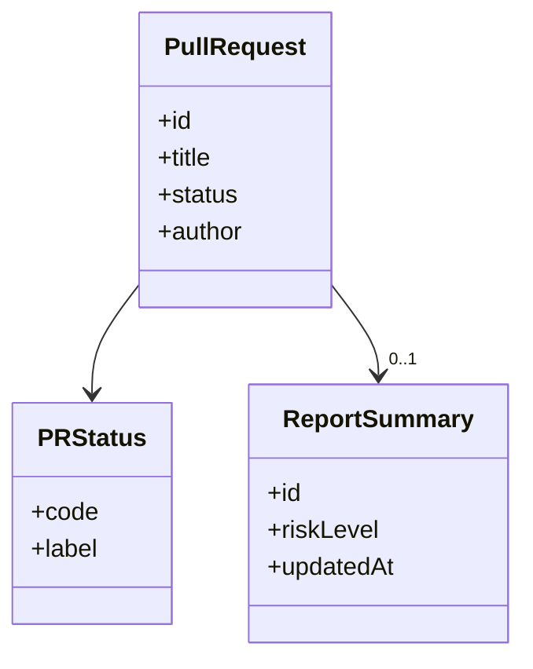

**Diagramme de sequence**

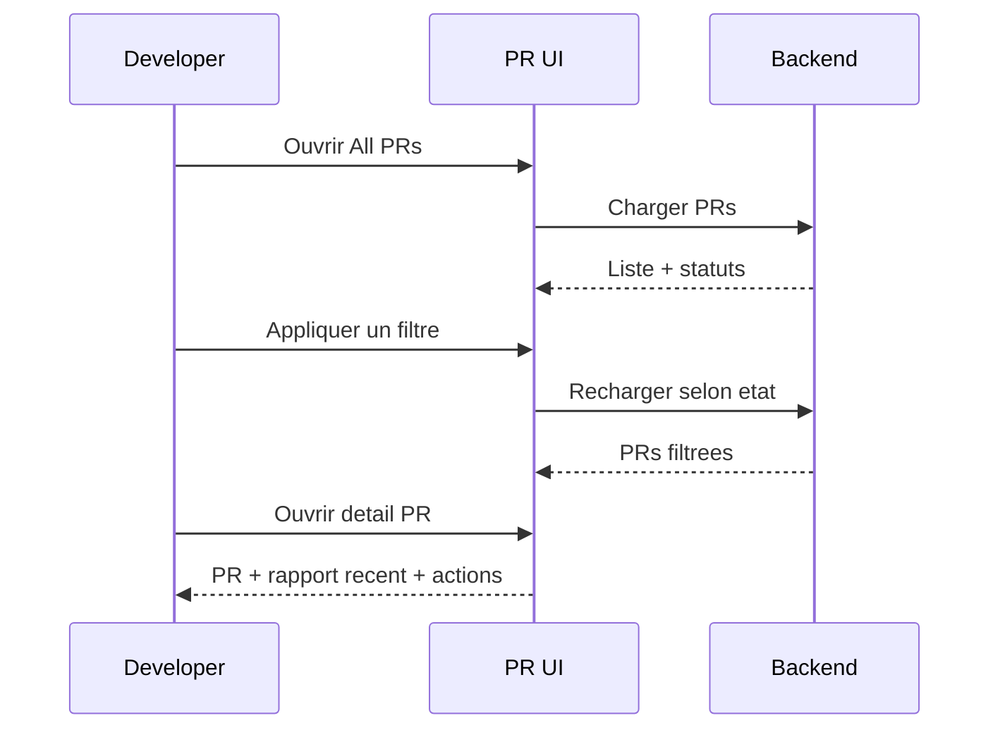

**Diagramme d'activite**

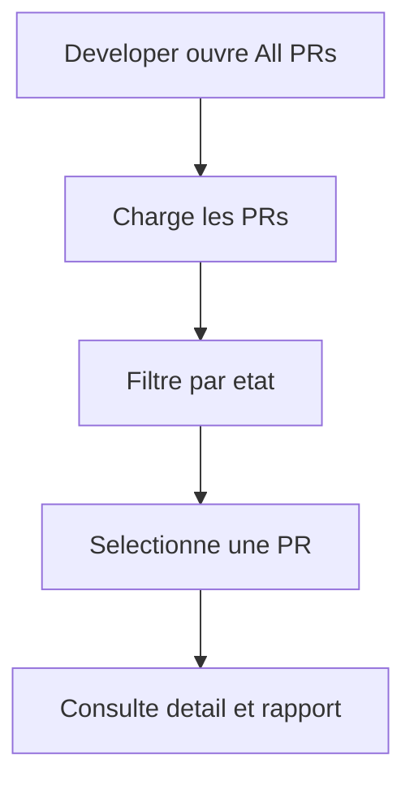

**Conclusion**

Le sprint 3 rend le parcours Developer exploitable au quotidien. Il transforme la simple presence des PRs en outil de priorisation et d'action.

---

### Sprint 4 - Gestion du declenchement et du suivi des analyses

**Introduction**

Ce sprint connecte la PR au cycle d'analyse visible. L'utilisateur peut lancer une analyse, suivre son statut et consulter le resume du resultat sans avoir a connaitre la logique interne du moteur.

**Specification fonctionnelle**

- Acteurs principaux:
  - Developer
  - Tech Lead
- Objectifs:
  - declencher une analyse depuis une PR
  - visualiser l'avancement
  - exposer le resultat de synthese
- Interfaces concernees:
  - action de lancement
  - statuts temps reel
  - cartes d'analyse et vue de synthese
- Regles fonctionnelles:
  - une analyse est reliee a une PR et a un projet
  - l'etat est visible sur toutes les surfaces concernées
  - le rapport devient accessible a la fin du traitement

**Diagramme de cas d'utilisation**

```mermaid
usecaseDiagram
actor Developer
actor "Tech Lead" as TL

rectangle "Sprint 4 - Analyses" {
  Developer --> (Declencher une analyse)
  Developer --> (Suivre le statut)
  Developer --> (Consulter le resume)
  TL --> (Suivre une analyse projet)
  TL --> (Acceder au rapport)
}
```

**Diagramme de classes**

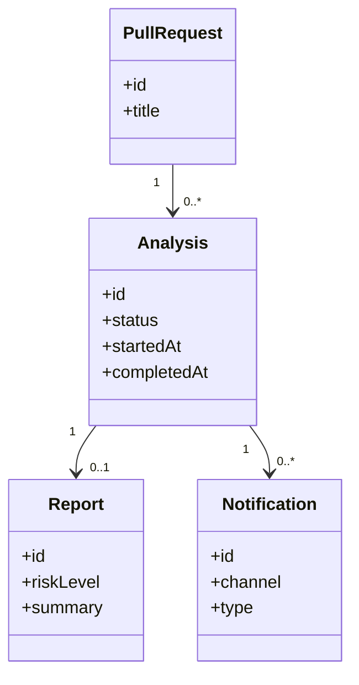

**Diagramme de sequence**

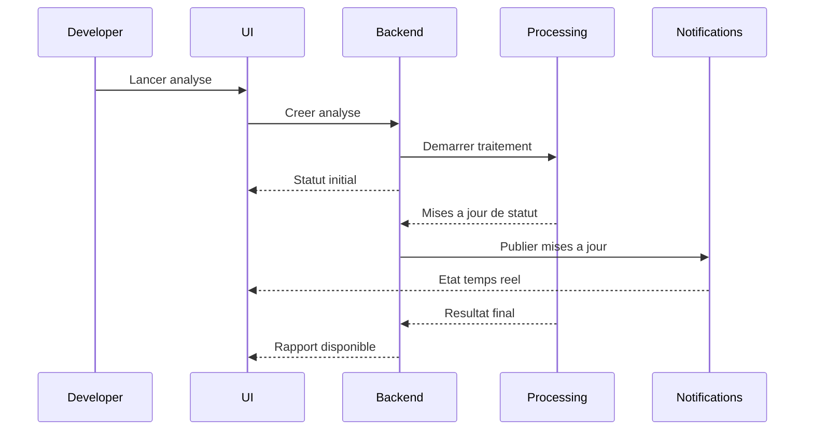

**Diagramme d'activite**

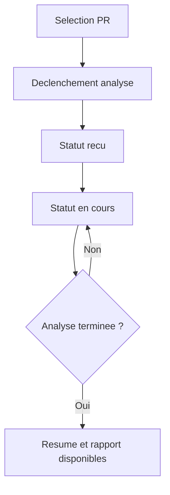

**Conclusion**

Le sprint 4 rend l'analyse visible et pilotable par les utilisateurs. Il introduit le rythme de suivi temps reel qui sert de pivot au reste de l'application.

---

### Sprint 5 - Gestion des revues et des decisions Tech Lead

**Introduction**

Ce sprint installe le poste de pilotage du Tech Lead. Les revues ne sont plus de simples sorties d'analyse; elles deviennent des objets de decision et de gouvernance.

**Specification fonctionnelle**

- Acteur principal:
  - Tech Lead
- Objectifs:
  - prioriser les revues
  - consulter les findings et le diff annote
  - appliquer les decisions de revue
  - parametrer le mode de revue
- Interfaces concernees:
  - reviews queue
  - detail revue
  - diff annote
  - parametres et templates
- Regles fonctionnelles:
  - chaque revue suit un statut visible
  - chaque decision doit etre traçable
  - les parametres de revue influencent le comportement visible du workflow

**Diagramme de cas d'utilisation**

```mermaid
usecaseDiagram
actor "Tech Lead" as TL

rectangle "Sprint 5 - Reviews" {
  TL --> (Consulter la queue)
  TL --> (Classer une revue)
  TL --> (Lire le diff annote)
  TL --> (Approuver une review)
  TL --> (Bloquer une review)
  TL --> (Assigner une review)
  TL --> (Configurer templates et parametres)
}
```

**Diagramme de classes**

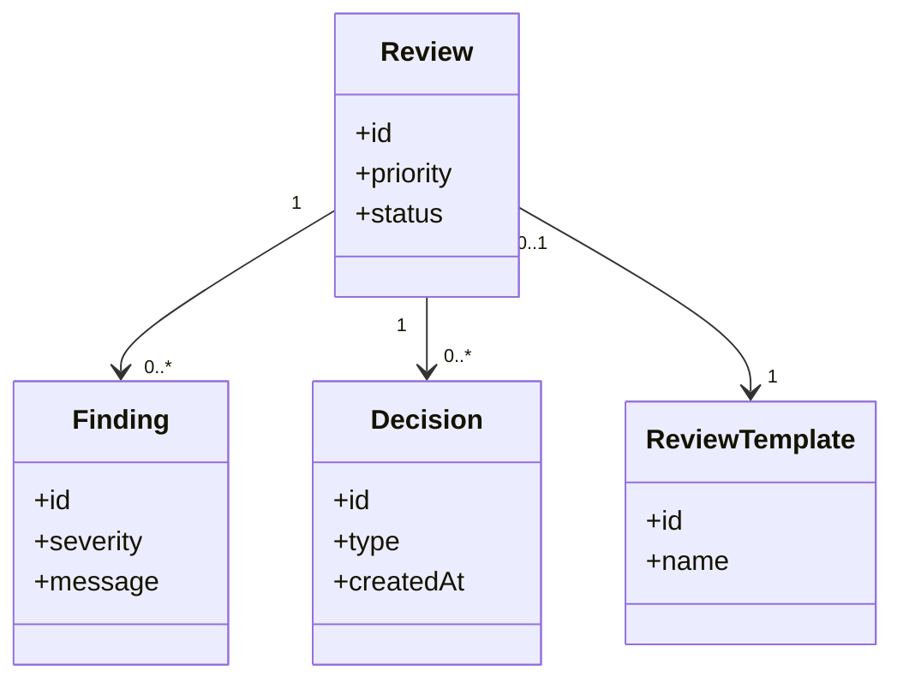

**Diagramme de sequence**

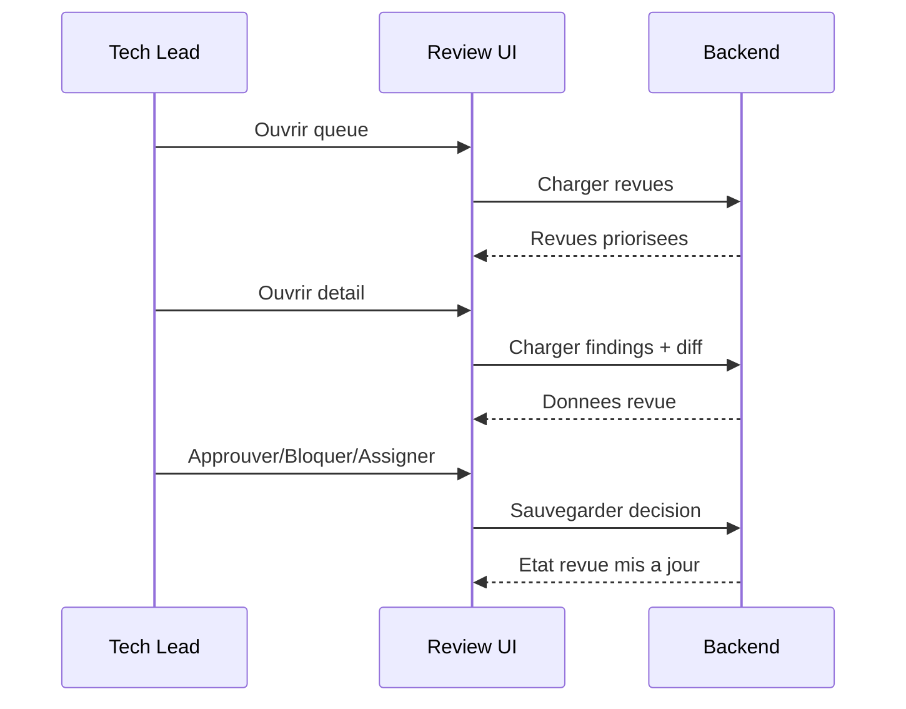

**Diagramme d'activite**

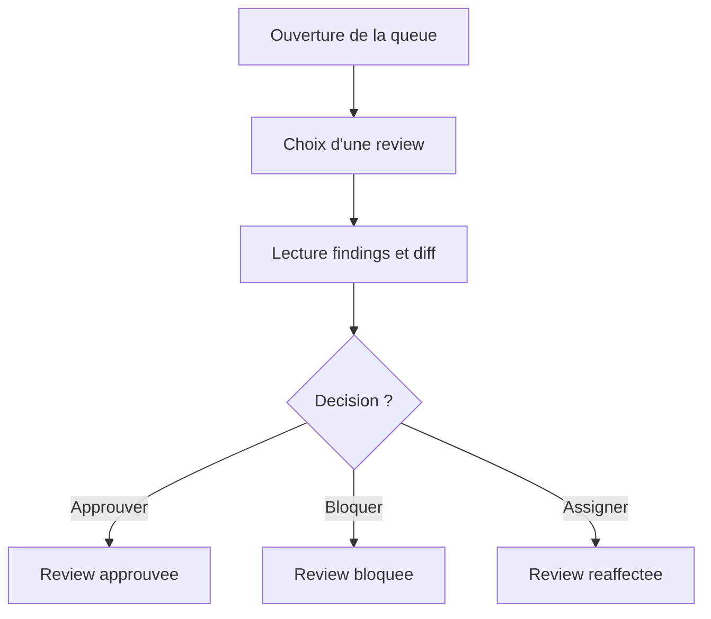

**Conclusion**

Le sprint 5 formalise la revue comme acte de pilotage. Il donne au Tech Lead une capacite de controle explicite sur les analyses et leurs suites.

---

### Sprint 6 - Gestion des equipes, des affectations, de l'historique et des analytics

**Introduction**

Ce sprint relie la performance a l'organisation humaine. Il couvre les equipes, les affectations et les premiers niveaux de lecture analytique et historique.

**Specification fonctionnelle**

- Acteurs principaux:
  - Tech Lead
  - Developer
- Objectifs:
  - administrer les membres et les affectations
  - consulter les analytics personnels et equipe
  - retracer l'historique des reviews
- Interfaces concernees:
  - pages equipe
  - tableaux analytics
  - timeline historique
- Regles fonctionnelles:
  - un membre peut etre affecte a une review
  - un Tech Lead suit la charge et la qualite de son equipe
  - l'historique doit etre filtrable et comprehensible

**Diagramme de cas d'utilisation**

```mermaid
usecaseDiagram
actor Developer
actor "Tech Lead" as TL

rectangle "Sprint 6 - Equipes et analytics" {
  TL --> (Gerer les membres)
  TL --> (Affecter une review)
  TL --> (Consulter les team analytics)
  TL --> (Consulter l'historique des reviews)
  Developer --> (Consulter ses analytics)
  Developer --> (Voir ses equipes)
}
```

**Diagramme de classes**

```mermaid
classDiagram
class Team {
  +id
  +name
}
class TeamMember {
  +id
  +role
}
class ReviewAssignment {
  +id
  +assignedAt
}
class AnalyticsView {
  +scope
  +period
}
class ActivityLog {
  +id
  +eventType
  +occurredAt
}

Team "1" --> "1..*" TeamMember
ReviewAssignment --> TeamMember
AnalyticsView --> Team
ActivityLog --> TeamMember
```

**Diagramme de sequence**

```mermaid
sequenceDiagram
participant TL as Tech Lead
participant UI as Team UI
participant B as Backend
participant A as Analytics

TL->>UI: Ouvrir gestion equipe
UI->>B: Charger membres et affectations
B-->>UI: Donnees equipe
TL->>UI: Affecter une review
UI->>B: Sauvegarder affectation
B-->>UI: Equipe mise a jour
TL->>UI: Ouvrir analytics
UI->>A: Charger KPIs
A-->>UI: Metriques equipe et historique
```

**Diagramme d'activite**

```mermaid
flowchart TD
  A[Ouvrir equipe] --> B[Gerer membres]
  B --> C[Affecter reviews]
  C --> D[Consulter historique]
  D --> E[Analyser les KPIs]
```

**Conclusion**

Le sprint 6 donne une lecture collective de l'activite. Il ancre la plateforme dans le pilotage d'equipe, pas seulement dans l'action individuelle.

---

### Sprint 7 - Gestion de l'administration, des politiques et des integrations

**Introduction**

Ce sprint consolide la gouvernance. Il donne a l'Admin les moyens de configurer le cadre de fonctionnement de la plateforme et ses connexions externes.

**Specification fonctionnelle**

- Acteur principal:
  - Admin
- Objectifs:
  - gerer les secrets projet
  - definir les policies et regles
  - suivre la piste d'audit
  - activer les integrations externes
- Interfaces concernees:
  - panneau d'administration
  - pages policies, audit, secrets, integrations
- Regles fonctionnelles:
  - toute action sensible doit laisser une trace
  - les integrations doivent etre testables depuis l'interface
  - les policies doivent pouvoir s'appliquer aux projets

**Diagramme de cas d'utilisation**

```mermaid
usecaseDiagram
actor Admin

rectangle "Sprint 7 - Administration" {
  Admin --> (Gerer secrets)
  Admin --> (Gerer policies)
  Admin --> (Consulter audit trail)
  Admin --> (Configurer integrations)
  Admin --> (Relier Jira aux analyses)
}
```

**Diagramme de classes**

```mermaid
classDiagram
class SecretStore {
  +id
  +scope
}
class Policy {
  +id
  +name
  +status
}
class AuditEvent {
  +id
  +actor
  +action
}
class Integration {
  +id
  +provider
  +status
}

Policy --> AuditEvent
Integration --> AuditEvent
SecretStore --> AuditEvent
```

**Diagramme de sequence**

```mermaid
sequenceDiagram
participant A as Admin
participant UI as Admin UI
participant B as Backend
participant X as External Service

A->>UI: Configurer integration
UI->>B: Sauvegarder parametres
B->>X: Tester connexion
X-->>B: Resultat
B-->>UI: Statut integration
A->>UI: Consulter audit
UI->>B: Charger evenements
B-->>UI: Piste d'audit
```

**Diagramme d'activite**

```mermaid
flowchart TD
  A[Admin ouvre panneau] --> B[Choisit policies ou integrations]
  B --> C[Configure ou modifie]
  C --> D[Teste la configuration]
  D --> E[Active et journalise]
```

**Conclusion**

Le sprint 7 donne a la plateforme sa gouvernance. Il rend visible et pilotable tout ce qui releve des regles et des dependances externes.

---

### Sprint 8 - Gestion des notifications et de l'experience mobile

**Introduction**

Ce sprint etend la plateforme hors du seul navigateur desktop. Il installe les notifications multi-canaux et les parcours mobiles essentiels.

**Specification fonctionnelle**

- Acteurs principaux:
  - Developer
  - Tech Lead
- Objectifs:
  - avertir au bon moment via le bon canal
  - donner une experience mobile utile et pas seulement consultative
  - aligner les ecrans mobiles avec les parcours critiques web
- Interfaces concernees:
  - centre de notifications
  - app mobile
  - ecrans PRs, resume d'analyse, health
- Regles fonctionnelles:
  - une notification doit etre contextualisee
  - le mobile doit permettre le suivi et la prise d'information prioritaire
  - les etats doivent rester coherents entre web et mobile

**Diagramme de cas d'utilisation**

```mermaid
usecaseDiagram
actor Developer
actor "Tech Lead" as TL

rectangle "Sprint 8 - Notifications et mobile" {
  Developer --> (Recevoir notification email)
  Developer --> (Consulter PRs sur mobile)
  Developer --> (Lire le resume d'analyse mobile)
  TL --> (Recevoir notification Slack)
  TL --> (Consulter health indicators mobile)
}
```

**Diagramme de classes**

```mermaid
classDiagram
class NotificationCenter {
  +id
}
class NotificationChannel {
  +type
  +enabled
}
class MobileApp {
  +platform
  +version
}
class HealthIndicator {
  +name
  +value
}

NotificationCenter --> "1..*" NotificationChannel
MobileApp --> NotificationCenter
MobileApp --> "0..*" HealthIndicator
```

**Diagramme de sequence**

```mermaid
sequenceDiagram
participant B as Backend
participant C as Notification Center
participant W as Web
participant M as Mobile

B->>C: Publier evenement
C-->>W: Notification web
C-->>M: Notification mobile
M->>B: Charger PRs et resumes
B-->>M: Donnees synchronisees
```

**Diagramme d'activite**

```mermaid
flowchart TD
  A[Evenement metier] --> B[Notification creee]
  B --> C[Diffusion web]
  B --> D[Diffusion mobile]
  D --> E[Ouverture de l'app]
  E --> F[Consultation du contenu lie]
```

**Conclusion**

Le sprint 8 assure la continuite d'usage. La plateforme devient multi-surface et capable de toucher l'utilisateur dans son contexte reel de travail.

---

### Sprint 9 - Gestion des vues detaillees, de la navigation transversale et de la recherche

**Introduction**

Ce sprint fluidifie les enchainements entre les objets metier. Il evite les ruptures de navigation et reduit le nombre d'actions necessaires pour retrouver une information.

**Specification fonctionnelle**

- Acteurs principaux:
  - Developer
  - Tech Lead
  - Admin
- Objectifs:
  - traverser rapidement les entites metier
  - rechercher dans le workspace global
  - ouvrir une vue detaillee complete de PR
- Interfaces concernees:
  - recherche globale
  - breadcrumbs
  - vues detaillees PR
- Regles fonctionnelles:
  - toute entite majeure doit etre atteignable depuis la recherche ou un lien contextuel
  - une PR detaillee doit relier son projet, son repo, son analyse et sa review

**Diagramme de cas d'utilisation**

```mermaid
usecaseDiagram
actor Developer
actor "Tech Lead" as TL
actor Admin

rectangle "Sprint 9 - Navigation et recherche" {
  Developer --> (Rechercher une entite)
  Developer --> (Ouvrir le detail d'une PR)
  TL --> (Naviguer de la review au projet)
  Admin --> (Naviguer d'une integration au projet concerne)
}
```

**Diagramme de classes**

```mermaid
classDiagram
class SearchIndex {
  +scope
  +query
}
class NavigationContext {
  +source
  +target
}
class PullRequestDetail {
  +summary
  +links
}

SearchIndex --> NavigationContext
PullRequestDetail --> NavigationContext
```

**Diagramme de sequence**

```mermaid
sequenceDiagram
participant U as Utilisateur
participant UI as Search UI
participant B as Backend

U->>UI: Saisir une recherche
UI->>B: Rechercher dans le workspace
B-->>UI: Resultats multi-entites
U->>UI: Ouvrir une PR
UI->>B: Charger detail enrichi
B-->>UI: PR + contexte complet
```

**Diagramme d'activite**

```mermaid
flowchart TD
  A[Saisie recherche] --> B[Resultats classes]
  B --> C[Choix d'une entite]
  C --> D[Ouverture detail]
  D --> E[Navigation vers objet lie]
```

**Conclusion**

Le sprint 9 reduit la friction cognitive. Il transforme l'accumulation d'ecrans en parcours connecte.

---

### Sprint 10 - Gestion des files d'attention, des conversations et de la collaboration

**Introduction**

Ce sprint ajoute une couche de travail collaboratif. Il structure les files d'attention du Tech Lead et les conversations entre auteurs et reviewers.

**Specification fonctionnelle**

- Acteurs principaux:
  - Developer
  - Tech Lead
- Objectifs:
  - centraliser les revues a traiter
  - rendre les conversations lisibles et suivables
  - aligner la collaboration sur les etats de revue
- Interfaces concernees:
  - inbox de review
  - files d'attention
  - fils de conversation
- Regles fonctionnelles:
  - chaque commentaire doit etre relie a une revue ou un contexte de code
  - la priorite d'attention doit etre explicite
  - les conversations doivent etre visibles pour les acteurs autorises

**Diagramme de cas d'utilisation**

```mermaid
usecaseDiagram
actor Developer
actor "Tech Lead" as TL

rectangle "Sprint 10 - Collaboration" {
  TL --> (Consulter inbox de review)
  TL --> (Prioriser les revues)
  TL --> (Commenter une review)
  Developer --> (Lire les commentaires)
  Developer --> (Repondre aux retours)
}
```

**Diagramme de classes**

```mermaid
classDiagram
class ReviewInbox {
  +id
}
class AttentionQueue {
  +priority
  +age
}
class Conversation {
  +id
  +status
}
class Comment {
  +id
  +author
  +body
}

ReviewInbox --> "1..*" AttentionQueue
AttentionQueue --> "1..*" Conversation
Conversation --> "1..*" Comment
```

**Diagramme de sequence**

```mermaid
sequenceDiagram
participant TL as Tech Lead
participant D as Developer
participant UI as Collaboration UI
participant B as Backend

TL->>UI: Ouvrir inbox
UI->>B: Charger files et priorites
B-->>UI: Files d'attention
TL->>UI: Ouvrir conversation
UI->>B: Charger commentaires
B-->>UI: Fil complet
TL->>UI: Ajouter retour
UI->>B: Enregistrer commentaire
B-->>D: Notifier nouveau retour
```

**Diagramme d'activite**

```mermaid
flowchart TD
  A[Inbox ouverte] --> B[Choisir une review prioritaire]
  B --> C[Lire conversation]
  C --> D[Ajouter commentaire ou decision]
  D --> E[Notifier l'autre acteur]
```

**Conclusion**

Le sprint 10 rend la revue collaborative. Il installe une memoire conversationnelle utile entre Developer et Tech Lead.

---

### Sprint 11 - Gestion de l'historisation detaillee, des exports et de la tracabilite utilisateur

**Introduction**

Ce sprint approfondit la memoire du systeme. Il rend les actions, rapports et decisions auditables, exportables et reutilisables.

**Specification fonctionnelle**

- Acteurs principaux:
  - Developer
  - Tech Lead
  - Admin
- Objectifs:
  - retracer les activites
  - filtrer l'historique par contexte
  - exporter et partager les rapports
- Interfaces concernees:
  - timeline d'activite
  - filtres d'historique
  - export de rapport
- Regles fonctionnelles:
  - l'historique doit etre chronologique et filtrable
  - un rapport exporte doit conserver son contexte metier
  - les droits de consultation restent appliques

**Diagramme de cas d'utilisation**

```mermaid
usecaseDiagram
actor Developer
actor "Tech Lead" as TL
actor Admin

rectangle "Sprint 11 - Historisation" {
  Developer --> (Consulter son historique)
  Developer --> (Exporter un rapport)
  TL --> (Consulter historique equipe)
  TL --> (Partager un rapport)
  Admin --> (Consulter tracabilite globale)
}
```

**Diagramme de classes**

```mermaid
classDiagram
class ActivityTimeline {
  +id
  +scope
}
class ActivityEvent {
  +id
  +type
  +timestamp
}
class ReportExport {
  +id
  +format
  +generatedAt
}

ActivityTimeline --> "1..*" ActivityEvent
ReportExport --> ActivityEvent
```

**Diagramme de sequence**

```mermaid
sequenceDiagram
participant U as Utilisateur
participant UI as History UI
participant B as Backend
participant E as Export Service

U->>UI: Filtrer historique
UI->>B: Charger evenements
B-->>UI: Timeline
U->>UI: Exporter rapport
UI->>E: Demander export
E-->>UI: Fichier pret
UI-->>U: Rapport exporte
```

**Diagramme d'activite**

```mermaid
flowchart TD
  A[Ouverture historique] --> B[Application filtres]
  B --> C[Lecture des evenements]
  C --> D{Exporter ?}
  D -- Oui --> E[Generation export]
  D -- Non --> F[Fin consultation]
```

**Conclusion**

Le sprint 11 donne de la profondeur temporelle a la plateforme. Les usages ne sont plus seulement instantanes, ils deviennent tracables et partageables.

---

### Sprint 12 - Gestion des preferences, de la personnalisation et de la continuite web-mobile

**Introduction**

Ce sprint ferme la boucle d'experience utilisateur. Il permet de personnaliser les notifications, de retrouver son activite et de reprendre le contexte entre web et mobile.

**Specification fonctionnelle**

- Acteurs principaux:
  - Developer
  - Tech Lead
  - Admin
- Objectifs:
  - paramétrer les canaux de notification
  - synchroniser le centre d'activite
  - assurer une experience continue entre appareils
- Interfaces concernees:
  - parametres utilisateur
  - centre d'activite
  - surfaces web et mobile
- Regles fonctionnelles:
  - les preferences s'appliquent sur tous les canaux
  - l'activite recente est la meme sur web et mobile
  - la reprise de contexte doit etre immediate pour les parcours prioritaires

**Diagramme de cas d'utilisation**

```mermaid
usecaseDiagram
actor Developer
actor "Tech Lead" as TL

rectangle "Sprint 12 - Continuite" {
  Developer --> (Configurer notifications)
  Developer --> (Retrouver son activite sur mobile)
  TL --> (Retrouver sa file sur web)
  TL --> (Poursuivre le meme parcours sur mobile)
}
```

**Diagramme de classes**

```mermaid
classDiagram
class UserPreference {
  +id
  +channel
  +enabled
}
class ActivityCenter {
  +id
  +lastSyncAt
}
class DeviceContext {
  +id
  +platform
  +lastViewedEntity
}

UserPreference --> ActivityCenter
ActivityCenter --> DeviceContext
```

**Diagramme de sequence**

```mermaid
sequenceDiagram
participant U as Utilisateur
participant W as Web
participant M as Mobile
participant B as Backend

U->>W: Modifier preferences
W->>B: Sauvegarder parametres
B-->>W: Confirmation
M->>B: Synchroniser activite
B-->>M: Activite et preferences
U-->>M: Reprendre le parcours recent
```

**Diagramme d'activite**

```mermaid
flowchart TD
  A[Changer preferences] --> B[Sauvegarde serveur]
  B --> C[Synchronisation web/mobile]
  C --> D[Centre d'activite mis a jour]
  D --> E[Reprise du contexte recent]
```

**Conclusion**

Le sprint 12 stabilise l'experience utilisateur sur toutes les surfaces. Il renforce la coherence entre usage personnel, notifications et mobilite.

---

## Release 2 - Intelligence de revue et capitalisation de connaissance

### Sprint 13 - Gestion de la base de connaissances et des regles

**Introduction**

Ce sprint introduit la base de connaissances comme source de standardisation et d'explicabilite des revues.

**Specification fonctionnelle**

- Acteurs principaux:
  - Admin
  - Tech Lead
- Objectifs:
  - importer et gerer les documents de reference
  - rendre visibles les regles appliquees
  - centraliser la connaissance organisationnelle

**Diagramme de cas d'utilisation**

```mermaid
usecaseDiagram
actor Admin
actor "Tech Lead" as TL

rectangle "Sprint 13 - Base de connaissances" {
  Admin --> (Importer des documents)
  Admin --> (Gerer la KB)
  Admin --> (Prioriser les regles)
  TL --> (Consulter les regles appliquees)
}
```

**Diagramme de classes**

```mermaid
classDiagram
class KnowledgeDocument {
  +id
  +title
  +type
}
class Rule {
  +id
  +name
  +priority
}
class KnowledgeRepository {
  +id
}

KnowledgeRepository --> "1..*" KnowledgeDocument
KnowledgeDocument --> "0..*" Rule
```

**Diagramme de sequence**

```mermaid
sequenceDiagram
participant A as Admin
participant UI as KB UI
participant B as Backend

A->>UI: Importer document
UI->>B: Sauvegarder document
B-->>UI: Document indexe
A->>UI: Prioriser regles
UI->>B: Mettre a jour regles
B-->>UI: KB active
```

**Diagramme d'activite**

```mermaid
flowchart TD
  A[Importer document] --> B[Indexer]
  B --> C[Creer ou ajuster regles]
  C --> D[Rendre la KB disponible]
```

**Conclusion**

Le sprint 13 structure la connaissance comme actif administrable et consultable.

---

### Sprint 14 - Gestion de l'intelligence de contexte et de la qualite des revues

**Introduction**

Ce sprint vise l'amelioration qualitative des revues sans changer les parcours visibles acquis.

**Specification fonctionnelle**

- Acteurs principaux:
  - Developer
  - Tech Lead
- Objectifs:
  - augmenter la pertinence contextuelle
  - fiabiliser les resultats
  - rendre les suggestions plus exploitables

**Diagramme de cas d'utilisation**

```mermaid
usecaseDiagram
actor Developer
actor "Tech Lead" as TL

rectangle "Sprint 14 - Qualite de revue" {
  Developer --> (Recevoir un contexte de revue plus pertinent)
  TL --> (Verifier une revue plus fiable)
  TL --> (Exploiter des suggestions de meilleure qualite)
}
```

**Diagramme de classes**

```mermaid
classDiagram
class ReviewContext {
  +id
  +relevanceScore
}
class Evidence {
  +id
  +source
}
class Suggestion {
  +id
  +confidence
}

ReviewContext --> "1..*" Evidence
ReviewContext --> "0..*" Suggestion
```

**Diagramme de sequence**

```mermaid
sequenceDiagram
participant B as Backend
participant K as Knowledge
participant R as Review Engine
participant UI as UI

B->>K: Charger contexte
K-->>R: Regles et connaissances
R-->>B: Resultat enrichi
B-->>UI: Revue plus pertinente
```

**Diagramme d'activite**

```mermaid
flowchart TD
  A[Charger contexte] --> B[Appliquer regles]
  B --> C[Renforcer preuves]
  C --> D[Produire resultat plus fiable]
```

**Conclusion**

Le sprint 14 densifie la valeur des revues sans casser les usages deja en place.

---

## Release 3 - Industrialisation technique et exploitation continue

### Sprint 15 - Gestion de l'exploitation locale et de la chaine de livraison

**Introduction**

Ce sprint stabilise la facon de demarrer, construire et verifier la plateforme pour l'equipe produit et technique.

**Specification fonctionnelle**

- Acteurs principaux:
  - Developer
  - Admin
- Objectifs:
  - standardiser le demarrage local
  - fiabiliser les builds
  - automatiser les verifications de livraison

**Diagramme de cas d'utilisation**

```mermaid
usecaseDiagram
actor Developer
actor Admin

rectangle "Sprint 15 - Exploitation locale et CI" {
  Developer --> (Demarrer la stack localement)
  Admin --> (Construire les images)
  Admin --> (Executer le pipeline CI)
}
```

**Diagramme de classes**

```mermaid
classDiagram
class LocalStack {
  +services
}
class DockerImage {
  +name
  +tag
}
class CIPipeline {
  +status
  +lastRun
}

LocalStack --> DockerImage
DockerImage --> CIPipeline
```

**Diagramme de sequence**

```mermaid
sequenceDiagram
participant D as Developer
participant S as Local Stack
participant CI as CI Pipeline

D->>S: Demarrer environnement
S-->>D: Services disponibles
S->>CI: Lancer validations
CI-->>D: Resultats build et tests
```

**Diagramme d'activite**

```mermaid
flowchart TD
  A[Demarrage local] --> B[Build images]
  B --> C[Execution CI]
  C --> D[Validation livraison]
```

**Conclusion**

Le sprint 15 rend la plateforme plus industrialisable en amont du deploiement.

---

### Sprint 16 - Gestion du deploiement et de l'observabilite

**Introduction**

Ce sprint ferme le cycle d'exploitation continue avec le deploiement, la supervision et l'alerte.

**Specification fonctionnelle**

- Acteurs principaux:
  - Admin
  - Tech Lead
- Objectifs:
  - deployer la plateforme dans un environnement stable
  - surveiller la sante globale
  - rendre visibles les indicateurs critiques

**Diagramme de cas d'utilisation**

```mermaid
usecaseDiagram
actor Admin
actor "Tech Lead" as TL

rectangle "Sprint 16 - Deploiement et observabilite" {
  Admin --> (Deployer la plateforme)
  Admin --> (Consulter les dashboards)
  Admin --> (Recevoir les alertes)
  TL --> (Consulter la sante globale)
}
```

**Diagramme de classes**

```mermaid
classDiagram
class Deployment {
  +environment
  +status
}
class MonitoringDashboard {
  +scope
}
class AlertRule {
  +name
  +threshold
}

Deployment --> MonitoringDashboard
MonitoringDashboard --> "1..*" AlertRule
```

**Diagramme de sequence**

```mermaid
sequenceDiagram
participant A as Admin
participant D as Deployment
participant M as Monitoring
participant T as Tech Lead

A->>D: Deployer version
D-->>A: Deploiement termine
D->>M: Exposer indicateurs
M-->>A: Dashboard et alertes
T->>M: Consulter sante globale
M-->>T: Etat plateforme
```

**Diagramme d'activite**

```mermaid
flowchart TD
  A[Deployer] --> B[Verifier disponibilite]
  B --> C[Collecter metriques]
  C --> D[Afficher dashboards]
  D --> E[Declencher alertes si besoin]
```

**Conclusion**

Le sprint 16 finalise la maturite d'exploitation. La plateforme n'est plus seulement livree, elle devient observable et operable dans la duree.

